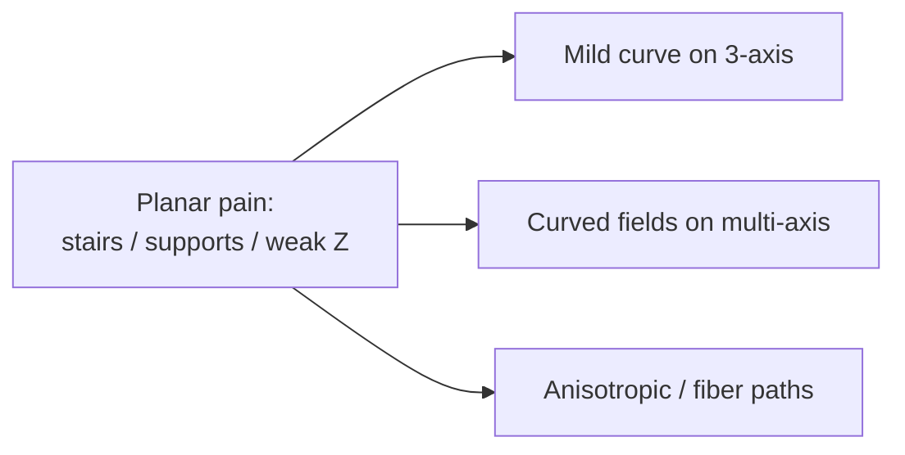
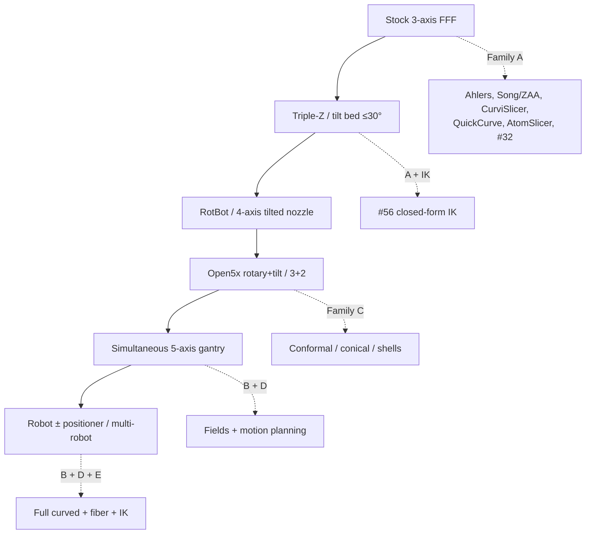
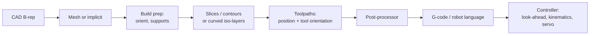
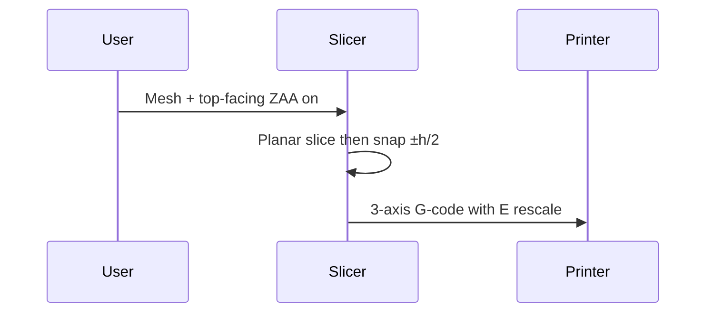
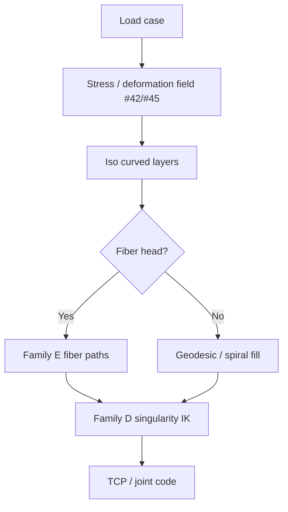

# Slim booklet — Adaptive non-planar for a slicer product

Source: Non-planar & Multi-Axis AM research compendium (72 held papers), compiled 27 Sep 2026 (`paper-01.pdf`, rename-as `compendium-nonplanar-multiaxis-2026`). This booklet is product-facing. Every claim traces to that PDF.

---

## 1. Why adaptive non-planar exists

Planar FFF stacks flat layers. That causes three pains the held papers attack:

1. **Staircase on slopes** — layer edges approximate a curve. Song et al. (#7) snap planar toolpath vertices ±h/2 vertically onto the surface and rescale flow/feed; OrcaSlicer ships this as Z contouring (ZAA), top-facing only.
2. **Supports for overhangs** — planar layers need sacrificial material. Multi-axis curved layers (Dai #66, geodesic #16/#69, S3 #45) grow or deform so the local surface stays printable without supports.
3. **Weak Z bonds** — strength follows bead direction. Reinforced FDM (#42) makes stress-aligned iso-surfaces *be* the layers; continuous-fiber papers (#15, #10, #52) put fibers on those paths.

An adaptive slicer picks how far to leave the plane: a little on 3-axis (family A), a lot on robots (B–D), or along fibers (E).

---

## 2. Hardware ladder

Climb only as far as the part needs. Part F lists modes: 3-axis → 3+2 indexed → 4-axis → simultaneous 5-axis. Printer variants: rotary+tilt bed (Open5x #33), triple-Z tilt bed (#56, ≤30°), rotating tilted nozzle (RotBot, cited Part B), robot + positioner.

**Clearance rule (3-axis):** nozzle/heater cone limits slope — Ahlers: 8° at 50 mm clearance or 45° at 7.5 mm (Part F). If the part needs steeper local slopes, escalate hardware or switch to B/C.

**Pitfalls when you climb the ladder (Part F):** two IK solutions; pole singularity at zero tilt; C-axis wrap; nonlinear motion between blocks if TCP is off; angle vs vector interpolation. Calibrate rotation-center offsets and nozzle length — errors grow with tilt. Always check collisions against part, fixture, and gantry.

**Controller note:** FANUC G43.4/G43.5, Haas G234, Siemens TRAORI, Heidenhain TCPM, LinuxCNC switchable TRT, Marlin2ForPipetBot G43.4 TCP. Upstream Marlin/RRF/Klipper: multiple axes but no TCP — run IK in the post-processor.

---

## 3. Data chain (Part F)

Keep a **per-point record**: position, tool vector, local thickness and width, flow, speed, feature type, sequence index. Write adapters for 3-axis G-code, joint-space 5-axis, TCP vector code, and robot languages (Part F rule of thumb).

Bead area (Slic3r): \(A = (w-h)h + \pi(h/2)^2\). Extrusion per segment \(E = A\cdot L / (\pi D^2/4)\). On non-planar paths **h varies** — compute E per segment. Extrusion must follow nozzle-tip speed relative to the part, not axis speed. Dense 3D polylines can starve look-ahead; fit arcs/splines or use high-throughput firmware.

---

## 4. Decision chapters: situation → approach → expect → I/O

Use the large flowchart in `cheatsheets/decision-map.md`. Condensed chapters:

### 4.1 Cosmetic tops, stock printer
- **Approach:** Song #7 / OrcaSlicer ZAA (family A).
- **Expect:** Top-facing only; stairs reduced where Z can reach ±h/2.
- **I/O:** Mesh in → 3-axis G-code with per-segment E out.

### 4.2 Mild freeform skin, still 3-axis
- **Approach:** Ahlers lift-and-project (#4/#5), CurviSlicer QP warp (#13), QuickCurve / Double QuickCurve height fields (#41/#71), or AtomSlicer (#65).
- **Expect:** Slope inside clearance cone; collision-filtered patches.
- **I/O:** Mesh + cone params → projected curved skins + planar fill.

### 4.3 Support-free volume, robot / 5-axis
- **Approach:** Dai growing field (#66), geodesic / heat (#16/#69/#26), S3 deformation (#45), Neural / INF (#29/#18).
- **Expect:** Curved layers; need collision-free global order and smooth tool vectors.
- **I/O:** Volume + kinematics → ordered layers + TCP/joint code (then family D).

### 4.4 Strength-first or continuous fiber
- **Approach:** Reinforced FDM (#42) for stress layers; fiber fields (#15/#10/#52/#27) on top (family E).
- **Expect:** Bend-radius and packing limits; hardware with fiber feed.
- **I/O:** FEA field + layers → fiber + matrix paths → D for poses.

### 4.5 Cut the part into printable directions
- **Approach:** RoboFDM (#43), GA cuts (#70), RoMEX cones (#37), ACAP patches (#73), double shells (#30), Open5x (#33).
- **Expect:** Seams between chunks; indexed orientations often enough.
- **I/O:** Mesh → ordered sub-bodies + orientations.

---

## 5. Chaining examples (worked)

### Scenario 1 — Phone stand cosmetics on a stock Prusa-class printer

**Argument.** User has only 3-axis FFF. Goal is smoother top slopes, not support-free arches.

**Proof sketch.** Part F cone rule + Part A Song/Ahlers: if facet slopes stay inside the clearance cone, vertical snap (±h/2) or lift-and-project skins are valid; OrcaSlicer ZAA implements Song for top-facing surfaces. Escalating to Dai/S3 would require hardware the user does not have.

**Conclusion.** Pipeline: F optional adaptive thickness (#2/#3) → A Song/ZAA or Ahlers → 3-axis G-code. Stop. Do not invoke B/D.

### Scenario 2 — Bracket with load path + overhangs on a 5-axis cell

**Argument.** Overhangs defeat planar supports budget; principal stress should drive bead direction.

**Proof sketch.** Reinforced FDM (#42) builds a stress-aligned governing field whose iso-surfaces are layers (family B). S3 (#45) or Neural (#29) can co-target support-free + strength + surface. Singularity-aware planning (#49) and FRIK (#64) turn TCP paths into reachable joint motion (family D). If continuous fiber is available, #15/#52 place stress-weighted or 2-RoSy fibers on those layers (E).

**Conclusion.** Pipeline: G optional self-support TO (#48/#47) → B Reinforced/S3/Neural → optional E fiber → D IK/TCP → machine code.

### Scenario 3 — Thin architectural shell, deposit continuously

**Argument.** Part is a thin double shell; full volume fields waste motion. Need continuous deposition patches.

**Proof sketch.** ACAP (#73) decomposes thin shells into continuously depositable patches; #30 builds transversal U/V standing shells plus ribs from strip-decomposable quad meshes (family C). Each patch can use A-style fill or geodesic contour paths; robot links between patches need D (#63/#49). Open5x (#33) or robot hardware matches conformal shells.

**Conclusion.** Pipeline: strip quad / shell prep → C ACAP or #30 → per-patch fill → D motion → conformal/robot code.

---

### Multi-axis layer checklist (before you emit code)

From Part F, treat these as gates on family B/C/E output:

| Gate | Fail means |
| --- | --- |
| Thickness band | Local h outside printable bead window → recompute field or split layer |
| Bounded curvature | Layer folds too hard for nozzle / fiber → smooth field or subdivide |
| Local overhang | Instant tip angle still needs support → rotate tool vector or add #51-style tree support |
| Smooth orientation field | Flickering tool vectors → filter before IK |
| Collision-free global order | Later layer blocks nozzle → Reeb/skeleton reorder (#68/#16) or family D replan |
| Fiber bend radius | Path tighter than fiber allows → widen spacing or cut/restart |

## 6. Rules of thumb (Part F)

1. **3-axis slope:** clearance cone — Ahlers 8° @ 50 mm or 45° @ 7.5 mm.
2. **Multi-axis layers:** respect thickness band, bounded curvature, local overhang, smooth orientation field, collision-free global order, fiber bend radius.
3. **Per-point record + adapters:** position, tool vector, thickness, width, flow, speed, feature, sequence → adapters for 3-axis, joint 5-axis, TCP vector, robot languages.
4. **Varying h ⇒ per-segment E**; tip-relative speed for extrusion.
5. **Prefer portable TCP** (tool-tip + orientation) over joint-only when the controller supports it; else IK in post (Marlin/RRF/Klipper).

---

## 7. Open gaps (Part G)

**Inventory ambiguities (flag for maintainers):**
- #12 mines identically to #7 — likely duplicate; intended paper probably Jin et al. 2017.
- 2015 saliency-preserving slicing: 8 ALGORITHMS.md entries, no PAPERS.md row.
- #46 and #72 absent from the table; `11b` is a placeholder.
- #52 listed under 2024 but DOI is Composites Part B 2025.
- AtomSlicer stripe step attributed to Lichtenberg 2018 in registry; root method is Knöppel et al. 2015.
- Review-survey category has no non-planar review yet (add from Part B).
- Metal multi-axis (WAAM/DED) nearly absent — scope decision needed.

**Field gaps:**
- 3MF Toolpath Extension v1.0.0 is laser/PBF oriented; extrusion fit untested.
- STEP-NC Part 17 still lacks FDM and LMD entities.
- Hobby firmware mostly lacks TCP.
- No standard test artefact for non-planar surface quality or multi-axis print accuracy.

For the slicer product: treat 3MF toolpath and STEP-NC as *exchange targets to watch*, not as the only runtime format. Ship the per-point record first; add 3MF/STEP-NC adapters when extrusion entities mature.

---

## 8. Where to go next

| Need | File |
| --- | --- |
| Situation flowchart | `cheatsheets/decision-map.md` |
| Per-family cards (A–G) | `cheatsheets/approach-cards.md` |
| Full paper list + standards | `papers/paper-01.pdf` / `.txt` |
| This booklet index | `booklet/INDEX.md` |
