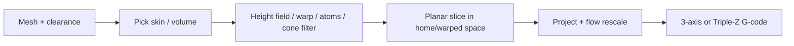
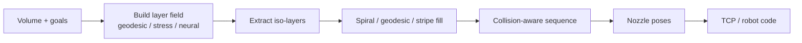
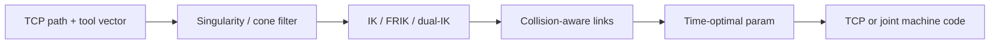
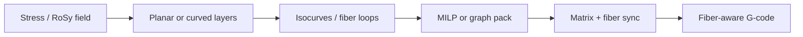
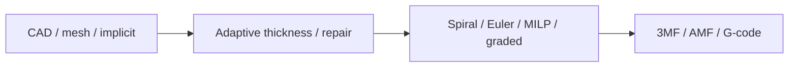
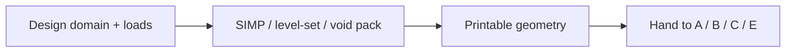

# Approach cards — Part A families for an adaptive slicer

One card per major approach family from the held-paper groupings in `paper-01.pdf` (Part A). Paper numbers are PAPERS.md IDs from the compendium. Software anchors from Part D.

---

## A. 3-axis slightly non-planar FFF

**Name:** 3-axis slightly non-planar / slope-limited skins and mild curves  
**Key papers:** Ahlers #4/#5/#6; Song anti-aliasing #7 (OrcaSlicer Z contouring); CurviSlicer #13; QuickCurve #41; Double QuickCurve #71; Atomizer #67; AtomSlicer #65; mixed planar/non-planar #32; Triple-Z #56. (#12 is flagged in Part G as a likely duplicate of #7.)

**One-sentence core idea:** Stay on Cartesian hardware; bend only as far as the nozzle clearance cone and a height-field / warp / atom partition allow.

**When to use (adaptive slicer product):**
- Stock 3-axis printer; cosmetic tops or mild freeform skins.
- User wants ZAA-style tops without buying a robot.
- Mixed planar core + non-planar shell (#32).
- Triple-Z tilt bed up to ~30° (#56) as a bridge toward multi-axis.

**Algorithm sketch (plain language):**
1. Detect target region (top facets, shell, or whole volume).
2. Build a printable surface: collision-cone filter (Ahlers), QP volume warp (CurviSlicer), least-squares height field with slope clamp (QuickCurve), dual top/bottom fields (Double QuickCurve), or atom frames (Atomizer → AtomSlicer).
3. Slice / fill in the warped or home space; project back with cosine / per-segment flow correction (Song snaps vertices ±h/2).
4. For AtomSlicer: partition atoms into constant-thickness field-aligned layers; continuous stripe paths (geometry-central stripes / Knöppel 2015 root).
5. For #32: offset shell by vertex normals, boolean out, planar-slice the rest.
6. For #56: closed-form IK for three independent Z motors (≤30° on RatRig-class machine).

**Constraints / what to expect:**
- Clearance cone limits slope (Ahlers: 8° at 50 mm or 45° at 7.5 mm clearance) — Part F rule of thumb.
- OrcaSlicer ZAA is top-facing only.
- Slight curves only; steep overhangs need B/C hardware.
- Dense 3D polylines can starve firmware look-ahead — fit arcs/splines or use high-throughput firmware.

**Data in / data out:**
- **In:** mesh (STL/3MF), nozzle/heater clearance, max slope, layer height band, optional stress/feature masks.
- **Out:** 3-axis G-code (or Triple-Z joint code); per-point XYZ, local h/w, E, F, feature type, sequence index.

**How to chain:**
- After F adaptive planar thickness (#2/#3) → A skin.
- A shell (#32) over planar core → optional E fiber on shell.
- Escalate to B/C when cone check fails (see decision map).

**Software:** OrcaSlicer ZAA; GCodeZAA; AtomSlicer (`github.com/iota97/AtomSlicer`); BambuStudio-ZAA fork.

---

## B. Multi-axis curved-layer field / deformation

**Name:** Multi-axis curved-layer slicing (field and deformation based)  
**Key papers:** Dai Support-Free #66; Xu geodesic #69; heat-method geodesic #16; lattice geodesic #26; Reinforced FDM #42; S3-Slicer #45; Neural Slicer #29; INF-3DP #18; implicit neural #20; topological curved layers #68; curved-layer supports #51.

**One-sentence core idea:** Build a scalar / deformation / neural field whose iso-surfaces *are* the layers, then fill and pose-plan for a multi-axis nozzle.

**When to use:**
- Robot or 5-axis; support-free volumes.
- Strength and surface goals together (S3, Reinforced, Neural).
- Self-supporting lattice infill (#26).
- Tunnel/branch topology that needs Reeb-aware ordering (#68, INF-3DP).

**Algorithm sketch:**
1. Choose field type: voxel growing convex front (Dai); geodesic / heat-method on tets (#16, Xu #69); three orthogonal geodesics for lattice (#26); stress-aligned governing field (#42); quaternion deformation (S3 #45); SIREN / implicit neural (#29, #18, #20).
2. Extract iso-surfaces as curved layers; enforce thickness band and curvature bounds.
3. Fill: Fermat spirals (Dai), contour-parallel geodesics (Xu), Eulerian lattice tour (#26), or continuous stripes.
4. Sequence layers with collision awareness (skeleton-tree #16; Reeb #68/#18; Dijkstra poses Dai).
5. Optimize nozzle orientation; emit TCP or joint paths.

**Constraints / what to expect:**
- Needs multi-axis kinematics and collision checks (part, fixture, gantry).
- Multi-axis layer constraints from Part F: thickness band, bounded curvature, local overhang, smooth orientation field, collision-free global order.
- Supports still sometimes needed (#51 tree-skeleton on curved layers).

**Data in / data out:**
- **In:** tet/hex/voxel or implicit volume; load case (for #42); robot/5-axis kinematics; clearance model.
- **Out:** ordered curved layers + tool vectors; TCP G-code / robot language; optional residual support tree.

**How to chain:**
- G topology opt (#48/#47) → B field.
- B layers → E fiber (#10/#15/#52).
- B layers → D singularity-aware / FRIK motion (#49/#64).

**Software:** S3-Slicer (`S3_DeformFDM`); ReinforcedFDM; geometry-central (geodesics, vector heat); NeuralTOMO (related co-opt).

---

## C. Multi-directional decomposition / shells / hardware

**Name:** Multi-directional decomposition, shells, and multi-axis hardware paths  
**Key papers:** RoboFDM #43; near support-free multi-directional #70; METU spiral TNB #28; RoMEX conical #37; ACAP #73; double shells #30; Open5x #33; conformal multi-material #1. (RotBot Wüthrich 2021 cited in Part B — warp by distance from rotation axis, slice, back-transform.)

**One-sentence core idea:** Cut or wrap the part into directions or thin shells that each print nearly planar or continuously, on a rotating platform / conical stack / 5-axis retrofit.

**When to use:**
- Part has large overhangs but you prefer decomposition over a full curved field.
- Thin shells / architectural skins (ACAP, double shells).
- Open5x-style rotary+tilt or toolchanger conformal work (#33, #1).
- Helical / spiral guides (#28).

**Algorithm sketch:**
1. Decompose: rotating-platform planar parts (RoboFDM); GA + simulated annealing on cutting planes (#70); strip-decomposable quad meshes → U/V shells + ribs (#30); continuously depositable patches (ACAP).
2. Or hardware-native: stacked 45° conical shell+core (RoMEX); Grasshopper conformal slicer on Open5x; RotBot pre-deform → normal slice → back-transform G-code.
3. Order sub-parts for access and support reduction.
4. Post-process to indexed 3+2 or simultaneous orientations.

**Constraints / what to expect:**
- Seams between directions / patches; plan bonding or continuous transitions.
- Indexed modes are simpler than simultaneous 5-axis but less freeform.
- Calibration of rotation centers and nozzle length matters (Part F).

**Data in / data out:**
- **In:** mesh; preferred cut normals or guide curve; machine kinematic type (table-table, head-table, rotary+tilt).
- **Out:** ordered sub-bodies or shell patches + per-patch orientation; indexed or conformal G-code.

**How to chain:**
- C decomposition → A planar fill inside each chunk.
- C shells → E fiber along shell geodesics.
- C → D for robot trajectories between chunks.

**Software:** Open5x + Grasshopper; Rep5x; Fractal 5 Pro; slicer4rtn (conic); P3D (commercial robot).

---

## D. Motion planning / kinematics / robots

**Name:** Motion planning, kinematics, robots  
**Key papers:** Singularity-aware planning #49; FRIK redundant IK #64; environment-aware path generation #63; printing-while-moving #39; cooperative robotics review #54; indexed rotary GRBL post #38.

**One-sentence core idea:** After layers exist, make the robot or 5-axis *reach* them without singularities, collisions, or starved timing.

**When to use:**
- Any B/C toolpath on a robot / redundant arm / mobile base.
- Rotary singular cone problems (#49).
- Online replan vs classical A*/Dijkstra/RRT/PRM (#63).
- Multi-robot cells (#54); stop-and-rotate 4th axis on GRBL (#38).

**Algorithm sketch:**
1. Take tool-tip path + preferred tool vectors from A/B/C/E.
2. Push orientations out of rotary singular cone; dual-IK Dijkstra (#49).
3. Solve IK with free tool roll / damped Halley (FRIK #64) or machine-specific closed form (Triple-Z #56).
4. Environment-aware vertex-to-vertex links (#63); EKF+MPC if mobile base (#39).
5. Time with TOPP-RA-class parameterization; emit TCP (G43.4/G43.5, TRAORI, …) or joint coordinates.

**Constraints / what to expect:**
- Two IK solutions, pole singularity at zero tilt, C-axis wrap, nonlinear motion without TCP (Part F).
- Upstream Marlin / RRF / Klipper: no TCP — do IK in the post-processor. Marlin2ForPipetBot has G43.4 TCPC.
- Extrusion must follow nozzle-tip speed relative to the part, not axis speed.

**Data in / data out:**
- **In:** TCP polyline + tool vectors; kinematic model; environment mesh; feed/jerk limits.
- **Out:** joint or TCP machine code; timed trajectory; collision report.

**How to chain:**
- Always downstream of B/C/E (or A on Triple-Z).
- Pair with Part C timing methods (TOPP-RA).

**Software:** Marlin2ForPipetBot; LinuxCNC xyzac-trt / xyzbc-trt; TOPP-RA; RWTH IGMR notes.

---

## E. Continuous fiber / anisotropic strength

**Name:** Continuous fiber and anisotropic strength  
**Key papers:** Field-based CFRTPC #15; spatial continuous fiber #10; high-density spatial fiber #52; multi-layer CF MILP #27; non-planar CFRC review #31; learning-based graph planner #22.

**One-sentence core idea:** Align continuous fiber (or anisotropic beads) with stress or geometric fields, often on curved layers, under bend-radius and packing constraints.

**When to use:**
- Continuous-fiber hardware; load paths matter more than cosmetics.
- Holes that need fiber loops (#10).
- Dense evenly spaced spatial fibers (2-RoSy + periodic scalar #52).
- Layer-wise fiber loop packing (#27).

**Algorithm sketch:**
1. Obtain stress or design field (#15 stress-weighted scalar; #52 2-RoSy + periodic scalar).
2. Optionally print on PSL-guided / curved layers (#10) from family B.
3. Extract adaptive-density isocurves or evenly spaced fiber paths; loop around holes.
4. Pack multi-layer loops with MILP (#27) or Deep-Q local graph planner (#22).
5. Enforce fiber bend radius (Part F multi-axis constraint); sync extrusion of matrix + fiber.

**Constraints / what to expect:**
- Fiber bend radius and cut/restart hardware limits dominate.
- #52 DOI year listed 2024 in inventory but journal is 2025 (Part G ambiguity).
- Strength gains depend on alignment; not a drop-in for stock FFF.

**Data in / data out:**
- **In:** FEA stress or user field; curved or planar layers; fiber width / bend radius; hole loops.
- **Out:** fiber polylines + matrix fill; machine code with fiber feed commands.

**How to chain:**
- B (Reinforced / geodesic layers) → E fiber.
- G TO orientation field → E de-homogenized paths.
- E → D for robot poses on spatial fiber.

**Software:** ReinforcedFDM (field layers); geometry-central / stripe tools for evenly spaced curves.

---

## F. General toolpath / planar-adaptive / mesh formats

**Name:** General toolpath planning, adaptive planar slicing, mesh and data formats  
**Key papers:** Continuous sparse infill #9; thermal MILP toolpaths #34; topology-preserving spiral #53; implicit graded toolpaths #21; FullControl #17; Image2Gcode #19; adaptive contour #2; Hamburg adaptive #3; optimal mesh slicing #35; adaptive lattices #23; STL half-edge #58; AM data survey #57. (2015 saliency-preserving slicing: in ALGORITHMS.md but missing PAPERS.md row — Part G.)

**One-sentence core idea:** Improve planar or format-level foundations — thickness, continuous fill, spirals, and file representations — that every non-planar pipeline still rests on.

**When to use:**
- Pure planar jobs that need smarter thickness or continuous sparse fill.
- Graded materials / OpenVCAD fields (#21).
- Direct G-code design without STL (#17) or image-conditioned keypoints (#19).
- Choosing STL vs AMF vs 3MF vs CLI vs STEP (#57).

**Algorithm sketch:**
1. Adaptive planar: medial-axis constant-thickness contours (#2); volumetric error + B-spline height editor (#3); incremental sweep + hash contour chaining (#35).
2. Toolpath: Euler lattice tour (#9); MILP under temperature (#34); conformal slit-map spiral (#53); gradient-informed implicit slice (#21).
3. Mesh hygiene: half-edge on STL soup (#58); pick exchange format (#57).
4. Export through Part F data chain toward post-processor.

**Constraints / what to expect:**
- Does not by itself remove supports or staircase on steep freeform — hand off to A/B.
- 3MF Toolpath Extension v1.0.0 is laser/PBF-oriented; extrusion fit untested (Part G).

**Data in / data out:**
- **In:** mesh or implicit/OpenVCAD; thickness policy; thermal bounds; format choice.
- **Out:** planar contours / continuous fills / spirals; 3MF/AMF/CLI or G-code; clean topology queries.

**How to chain:**
- F adaptive thickness → A Song/ZAA tops.
- F continuous fill (#9/#53) inside B/C layers.
- F formats → all families' I/O adapters.

**Software:** FullControl; COMPAS Slicer; 3MF toolpath spec repo; PrusaSlicer 3 alpha (Lua plugins).

---

## G. Topology optimization / DfAM (slicer-relevant)

**Name:** Topology optimization and DfAM for printability  
**Key papers:** Self-supporting TO #48; self-support TO with distortion #47; support-free hollowing Voronoi ellipses #50.

**One-sentence core idea:** Change the *part* so overhangs and voids are already printable before the adaptive slicer chooses A/B/C layers.

**When to use:**
- Design stage: want fewer supports before multi-axis spend.
- Couple inherent-strain / distortion with overhang constraints (#47).
- Hollow parts with support-free elliptic voids (#50).

**Algorithm sketch:**
1. SIMP with quadratic overhang constraint (#48) or level-set with overhang + inherent-strain (#47).
2. Or pack elliptic voids that are self-supporting (#50).
3. Export printable geometry to the slicer; optionally pass orientation field into B (#42) or E.

**Constraints / what to expect:**
- Optimizes geometry, not toolpath; still needs a family A–E to manufacture.
- Self-support assumptions are usually *planar-layer* unless re-posed for multi-axis.

**Data in / data out:**
- **In:** design domain, loads, overhang angle, process distortion model.
- **Out:** optimized mesh / density; optional orientation field for Reinforced / fiber.

**How to chain:**
- G → B Reinforced / Neural / S3.
- G → C decomposition if still multi-directional.
- G → A if only mild skins remain.

**Software:** NeuralTOMO (neural co-optimization of topology, layers, path orientations — Part B / D related).

---

## Cross-family chaining cheat

| From → To | Typical handoff |
| --- | --- |
| F → A | Adaptive planar base + ZAA / Ahlers skin |
| A → B/C | Cone check failed → escalate hardware + field/decomp |
| G → B | Orientation / self-support volume → curved layers |
| B → E | Curved layers → stress fiber |
| B/C/E → D | TCP paths → singularity-aware IK |
| C → A | Each chunk planar-filled |
