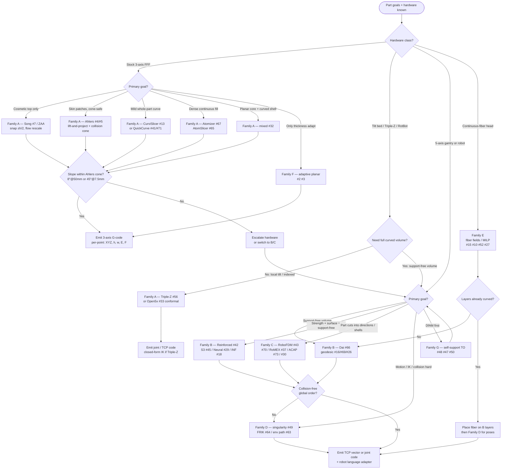

# Decision map — which non-planar / multi-axis family to use

Product guide for an adaptive slicer. Pick the manufacturing situation, follow the flowchart, land on an approach family from Part A of the compendium (`paper-01.pdf`). Claims below are grounded in that source.

## Quick hardware ladder

| Hardware | What you can do | Typical Part A family |
| --- | --- | --- |
| Stock 3-axis FFF | Slope-limited skins and mild curves | A (Ahlers, Song/ZAA, CurviSlicer, QuickCurve, AtomSlicer, #32) |
| Triple-Z / tilt bed (≤30°) | Local bed tilt; still mostly Cartesian | A (#56) + A/B hybrids |
| RotBot / rotating tilted nozzle | 4-axis overhangs without supports (cited Wüthrich 2021) | C + A warp-slice-unwarp |
| Open5x / rotary+tilt retrofit | Conformal shells, indexed 3+2 | C (#33, #1) |
| 5-axis gantry or robot | Full curved layers, support-free volumes | B, C, D |
| Continuous-fiber head | Stress-aligned fiber on curved layers | E (+ B for layers) |

## Situation → family (short table)

| Situation | Prefer | Why (from held papers) |
| --- | --- | --- |
| Cosmetic tops on a stock printer | A: Song #7 / OrcaSlicer ZAA | Snap planar vertices ±h/2 to surface; top-facing only |
| Mild freeform skin, collision cone | A: Ahlers #4/#5 | Cone-filtered lift-and-project with cosine flow |
| Whole-part slight curve on 3-axis | A: CurviSlicer #13, QuickCurve #41/#71 | Warp or height-field so planar slice stays collision-free |
| Layer-free dense fill on 3-axis / 3Z | A: Atomizer #67, AtomSlicer #65 | Atoms → constant-thickness field-aligned stripe layers |
| Mixed planar core + non-planar shell | A: #32 | Vertex-normal offset shell booleaned out before planar slice |
| Support-free volume on robot/5-axis | B: Dai #66, geodesic #16/#69/#26, S3 #45, Neural #29, INF-3DP #18 | Growing / geodesic / deformation / neural layer fields |
| Strength-critical curved layers | B: Reinforced FDM #42 (+ E if fiber) | Stress-aligned governing field → iso-surfaces = layers |
| Part must be cut into printable directions | C: RoboFDM #43, #70, RoMEX #37, ACAP #73, #30 | Decomposition / conical shells / depositable patches |
| Singularity, IK, mobile base, multi-robot | D: #49, FRIK #64, #63, #39, #54 | Pose planning after layers exist |
| Continuous fiber / anisotropy | E: #15, #10, #52, #27 | Field or MILP fiber paths; often on B layers |
| Adaptive planar thickness / mesh hygiene | F: #2, #3, #35, #57 | Contour / volumetric error / data formats |
| Design for self-supporting before slice | G: #48, #47, #50 | TO with overhang / void packing → feeds A–C |

## Software anchors (Part D)

- **OrcaSlicer ZAA** — Song-style top surfaces (`zaa_enabled`); top-facing only.
- **AtomSlicer** — `github.com/iota97/AtomSlicer` (3-axis and 3Z 5-axis G-code).
- **S3-Slicer** — `github.com/zhangty019/S3_DeformFDM`.
- **ReinforcedFDM** — `github.com/GuoxinFang/ReinforcedFDM`.
- **geometry-central** — stripes, flip geodesics, vector heat (feeds AtomSlicer stripe step / geodesic paths).
- **Marlin2ForPipetBot** — G43.4 TCP with TRT / head-table / head-head; upstream Marlin/RRF/Klipper need IK in the post-processor.

## Large decision flowchart

## How to use with approach cards

1. Run the flowchart → get a family letter (A–G).
2. Open `approach-cards.md` for that family: algorithm sketch, I/O, chaining.
3. Keep the Part F per-point record (position, tool vector, thickness, width, flow, speed, feature, sequence) so adapters stay swappable.
