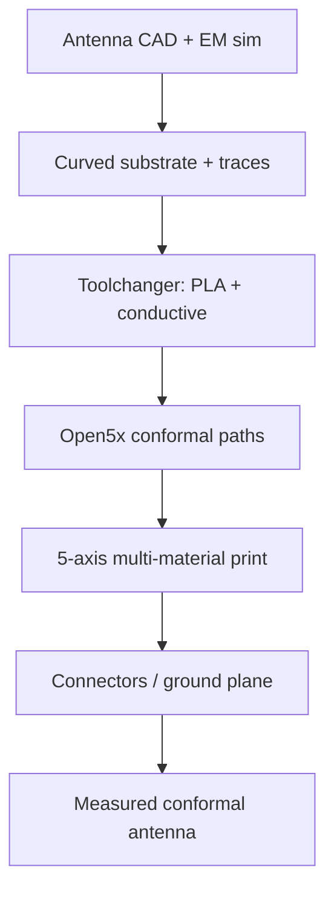

# #1 — 5-axis multi-material conformal antennas (2025)

- **Family:** C
- **Link:** arxiv.org/abs/2509.01448
- **Source:** compendium `paper-01.pdf` / `held-papers.json`

## When to use (adaptive slicer product)
Use when fabricating functional conformal RF antennas (patch, UWB, curved traces) that need conductive + dielectric beads on a curved substrate, on an Open5x-style rotary+tilt bed with a toolchanger. Choose this over planar-printed antennas when z-axis conductivity anisotropy and staircase on curves hurt impedance matching, or when conformal geometry is the design intent.

## Core idea (one sentence)
Conformal multi-material printing on an Open5x-style toolchanger deposits dielectric and conductive filaments along surface-aligned paths for functional curved antennas.

## Algorithm (plain steps)
1. Design antenna geometry in EM CAD (e.g. Ansys HFSS) and Rhino; project/tune patch or UWB layouts onto curved substrates with frequency-dependent material models (PLA, Electrifi, etc.).
2. Mount an Open5x-style rotary+tilt platform on a toolchanger (e.g. E3D) with long nozzles for tilt clearance.
3. Assign tools: dielectric (PLA) on one head, conductive filament (Electrifi) on another — distinct temps and feeds.
4. Generate conformal paths with the Open5x Rhino/Grasshopper path and G-code generators so beads follow substrate normals rather than stacked XY layers.
5. Print multi-material conformal samples; for baselines, print planar dual-extruder counterparts from a conventional slicer.
6. Post-process: ground planes, SMA connectors (copper tape / silver epoxy as needed).
7. Characterize: dimensional error, S11 / return loss vs simulation, and functional tests (e.g. UWB ranging nodes).

## Constraints / what to expect
- Conductive filament process window is narrow (low temp, slow speed vs PLA); toolchanging and purge matter.
- Anisotropic conductivity of extruded conductive traces dominates RF discrepancy vs isotropic sims — multi-axis can align traces with current flow better than planar Z-stacking.
- Complex double-curvature parts show larger dimensional error than simpler curved patches; high-frequency UWB is tolerance-sensitive.
- Held paper reports (do not invent beyond these): conformal patch ~28% less time and ~10% less material vs planar; closer S11 to sim (notably ~10 dB better match at a higher-order mode in their comparison); UWB conformal ~50% time and ~43% material reduction with better surface finish — while UWB S11 still deviated non-trivially from sim for both methods.
- Requires Open5x-class kinematics + multi-material hardware; not a pure software slicer feature.

## Data in
- Antenna EM design + curved substrate mesh; material RF models; Open5x kinematic calibration; toolchanger profiles (temps, speeds, nozzle Ø); post-processing BOM (SMA, tape, epoxy).

## Data out
- Conformal multi-material G-code (dielectric + conductive); fabricated antenna samples; S11 / dimensional / functional test records; comparison bundle vs planar prints and HFSS.

## Argument → proof sketch → conclusion
**Argument.** Planar ME of conductive filaments suffers Z-axis conductivity limits and geometric staircasing on curved antennas; conformal 5-axis multi-material deposition aligns beads with the surface and current paths, improving manufacturing efficiency and impedance behavior.
**Proof sketch.** (From arXiv 2509.01448 + held core idea.) Open5x IK places the bed so extrusion follows substrate geodesics; separate tools avoid mixing dielectric/conductor process params; S11 and microscope comparisons vs planar controls isolate the benefit of conformal deposition and anisotropy management. Functional UWB node tests show end-to-end usefulness despite sim–measure gaps at high frequency.
**Conclusion.** Family-C conformal hardware plus multi-material path planning enables low-cost desktop fabrication of curved antennas that planar FFF struggles to match electrically and economically.

## Chaining
- Before: #33 Open5x hardware + Grasshopper conformal slicer; F material/process profiles; EM design outside the slicer.
- After: D only if porting the same paths to a robot cell; optional E is usually N/A (RF traces ≠ structural fiber) unless reinforcing the substrate shell.
- Do not chain with: B volumetric curved fields that ignore toolchanger material channels; avoid pure A ZAA tops — they do not solve conductive Z-anisotropy on antennas.

## Notes / inventory flags
- Link present: `arxiv.org/abs/2509.01448` (Revenga Riesco, Lampret, Myant, Boyle — Imperial College).
- Explicitly builds on Open5x (#33). Metrics above are from the paper’s reported comparisons; do not extrapolate new numbers.
