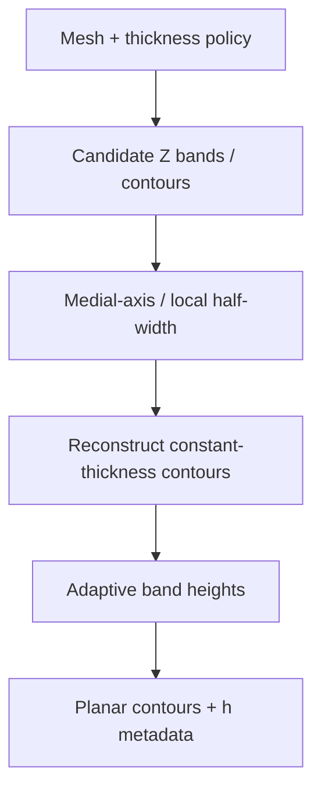

# #2 — Adaptive slicing via contour reconstruction (2021)

- **Family:** F-planar (adaptive slicing / mesh formats)
- **Link:** doi.org/10.14733/cadaps.2021.1425-1447
- **Source:** compendium `paper-01.pdf` / `held-papers.json`

## When to use (adaptive slicer product)
- Planar FFF job where fixed layer height leaves staircase or overfill on slopes, but the user stays on stock 3-axis hardware.
- Product needs adaptive *thickness* before any A skin (Song/ZAA, Ahlers) or B curved field.
- Contours must keep roughly constant wall/skin thickness while height steps vary.

## Core idea (one sentence)
Reconstruct medial-axis-driven contours so each adaptive band keeps approximately constant thickness.

## Algorithm (plain steps)
1. Import the mesh and choose a thickness / cusp-height policy for adaptive planar bands.
2. Extract candidate contours at candidate Z bands (or rebuild from solid/offset geometry).
3. Build or sample a medial-axis / skeleton of each slice region to measure local half-width.
4. Reconstruct contours so wall/skin thickness stays near the target while Z spacing adapts to geometry error.
5. Emit ordered planar contours with per-band height metadata for fill and extrusion.
6. Hand off to planar fill (or to A for top skins) with the per-point thickness record.

## Constraints / what to expect
- Still planar layers — does not remove supports or fix steep freeform stairs; escalate to A/B when cone/overhang fail.
- Medial-axis quality depends on clean slice topology; dirty STL soup should be repaired first (#58).
- Expect variable Z steps and per-band E; firmware look-ahead must tolerate height changes.

## Data in
- Mesh (STL/3MF) or solid suitable for contouring
- Target wall/skin thickness and cusp / volumetric error budget
- Nozzle width and min/max layer-height band

## Data out
- Ordered adaptive planar contours with per-band height
- Thickness metadata for extrusion / fill
- Ready handoff into planar fill or family A skin

## Argument → proof sketch → conclusion
**Argument.** Adaptive slicer products often need smarter *planar* thickness before spending multi-axis budget.
**Proof sketch.** Approach-card F and decision-map route “only thickness adapt” to #2/#3; booklet scenario 1 chains F adaptive thickness → A Song/ZAA on 3-axis.
**Conclusion.** Use #2 as the planar thickness stage; then A skins if cosmetic tops remain, else emit 3-axis G-code.

## Chaining
- Before: Mesh hygiene / format choice (#58/#57); optional G self-support TO if geometry still needs redesign.
- After: Planar fill; A Song/ZAA or Ahlers tops; or escalate to B/C if slope exceeds clearance cone.
- Do not chain with: Do not treat as a substitute for B curved fields or E fiber placement — thickness adapt alone does not reorient beads.

## Notes / inventory flags
- Held as F-planar; core idea from `efg-owned.json` / paper-01: medial-axis contour at constant thickness.
- Pair with #3 (volumetric-error + B-spline editor) when the product needs an interactive height UI.
