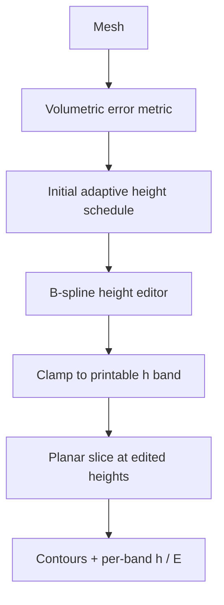

# #3 — Adaptive slicing for FDM revisited (Hamburg 2017)

- **Family:** F-planar (adaptive slicing / mesh formats)
- **Link:** —
- **Source:** compendium `paper-01.pdf` / `held-papers.json`

## When to use (adaptive slicer product)
- User wants interactive control of adaptive planar heights (not only automatic cusp heuristics).
- Product UI needs a volumetric-error metric plus an editable height schedule (B-spline editor).
- Stock 3-axis FDM; keep planar layers but reduce volumetric deviation on slopes.

## Core idea (one sentence)
Drive adaptive FDM layer heights with a volumetric error metric and a B-spline height editor.

## Algorithm (plain steps)
1. Load mesh and compute a volumetric error / cusp proxy vs candidate layer heights.
2. Propose an initial adaptive height schedule within printable min/max h.
3. Expose a B-spline (or similar) editor so users reshape the height function along Z.
4. Re-evaluate volumetric error after edits; clamp illegal heights.
5. Slice at the edited heights; emit planar contours and per-band h.
6. Feed fill / extrusion with per-segment E from local h.

## Constraints / what to expect
- Interactive editor implies a UI surface; batch cloud slicing may keep only the automatic metric.
- Still planar — steep freeform needs A/B.
- Empty link in inventory; cite via Hamburg 2017 / paper-01 row only.

## Data in
- Mesh
- Volumetric error / quality target
- Min/max layer height, nozzle width
- Optional user-edited height spline

## Data out
- Adaptive planar height schedule (B-spline + samples)
- Contours at those heights
- Per-band thickness for E computation

## Argument → proof sketch → conclusion
**Argument.** Automatic adaptive slicing alone is hard to steer; operators need an editable height schedule tied to a true volumetric error.
**Proof sketch.** paper-01 / approach-card F list #3 as volumetric error metric plus B-spline height editor alongside #2 for family F planar adapt.
**Conclusion.** Ship #3 when the product needs human-in-the-loop planar thickness; otherwise prefer automatic #2/#35.

## Chaining
- Before: Clean mesh (#58); choose exchange format (#57).
- After: Planar fill → optional A ZAA/Ahlers skin → 3-axis G-code.
- Do not chain with: Do not chain directly into D IK or E fiber; those need curved layers / fiber hardware first.

## Notes / inventory flags
- Link empty in held-papers / paper-01 → use `—`.
- Strip trailing em-dash from title per clean-title rule.
- Hamburg 2017; inventory family F-planar.
