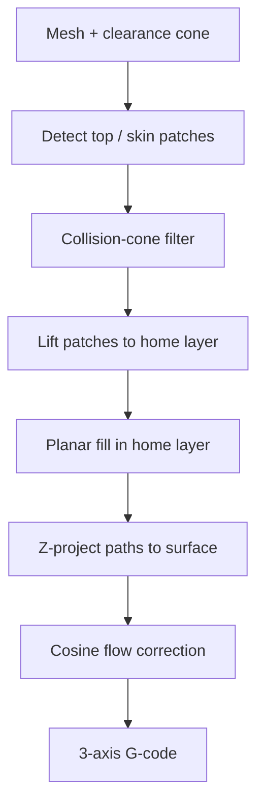

# #4 — Ahlers MSc thesis (2018)

- **Family:** A
- **Link:** tams.informatik.uni-hamburg.de/publicati
- **Source:** compendium `paper-01.pdf` / `held-papers.json`

## When to use (adaptive slicer product)
- Stock 3-axis FFF; cosmetic or structural top skins that stay inside the nozzle clearance cone.
- Prefer a Slic3r-style pipeline (planar fill in a home layer, then project) over whole-volume warps.
- Product mode: “ZAA-like tops / freeform skins” without multi-axis hardware.

## Core idea (one sentence)
Slic3r fork: cone-filtered top patches lifted to home layer, planar fill, Z-projected with cosine flow correction.

## Algorithm (plain steps)
1. Identify top (or skin) surface patches on the input mesh.
2. Filter patches by the nozzle/heater collision cone so remaining slopes are printable on 3-axis.
3. Lift each accepted patch to a planar home layer.
4. Compute planar fill (perimeters/infill) in that home layer using a Slic3r-style engine.
5. Z-project the filled paths back onto the original surface.
6. Apply cosine flow correction so extruded volume matches local surface inclination.
7. Emit standard 3-axis G-code.

## Constraints / what to expect
- Slope limited by clearance cone (Part F: ~8° at 50 mm or ~45° at 7.5 mm clearance).
- Targets top/skin patches, not arbitrary overhangs or support-free arches.
- Requires per-segment flow rescale after projection; naive Z lifts starve or over-extrude.
- Dense projected polylines may stress firmware look-ahead — arc/spline fit helps.

## Data in
- Triangle mesh (STL/3MF).
- Nozzle/heater clearance model (cone angle / clearance distance).
- Layer height / extrusion width; optional max-slope clamp.

## Data out
- 3-axis G-code with projected XYZ toolpaths.
- Per-segment flow (E) and feed after cosine correction; feature labels for skin vs core.

## Argument → proof sketch → conclusion
**Argument.** On stock Cartesian FFF, top-surface stairsteps hurt cosmetics; the user will not buy a robot for mild freeform skins.
**Proof sketch.** Part A (#4) and Part F cone rule: cone-filtered patches can be lifted, filled planarly, and Z-projected with cosine flow so beads stay on the surface without nozzle–heater collision. Escalating to family B/C is unnecessary when slopes stay inside the cone.
**Conclusion.** Ship as a 3-axis skin mode after optional F adaptive thickness (#2/#3): cone filter → lift → planar fill → project + cosine flow → G-code. Escalate to B/C only if the cone check fails.

## Chaining
- Before: F adaptive planar thickness (#2/#3) on the core; optional mesh cleanup (#58).
- After: optional E fiber only on remaining planar regions; otherwise stop at 3-axis G-code.
- Do not chain with: full multi-axis field slicers (B) or decomposition (C) when the cone already passes; avoid stacking with Song ZAA (#7) on the same skin (redundant projection).

## Notes / inventory flags
- Foundational lift-and-project skin method; #5 is the conference write-up of the collision-cone algorithm; #6 is mid-thesis slides.
- Software lineage: Slic3r fork; product analogue is OrcaSlicer ZAA / GCodeZAA for related top contouring.
