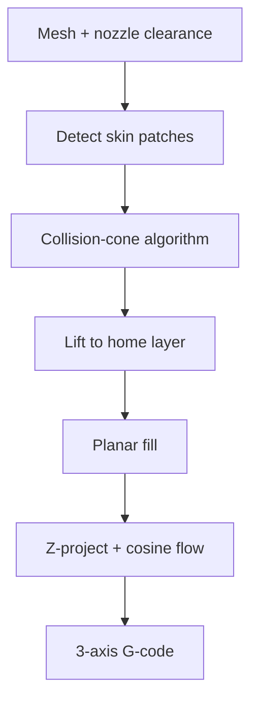

# #5 — Ahlers CASE (2019)

- **Family:** A
- **Link:** doi.org/10.13140/RG.2.2.34888.26881
- **Source:** compendium `paper-01.pdf` / `held-papers.json`

## When to use (adaptive slicer product)
- Same product slot as #4: 3-axis freeform top skins with an explicit collision-cone gate.
- Need a citable conference reference for the cone algorithm in docs / decision UI.
- Prefer published algorithm description over the thesis narrative.

## Core idea (one sentence)
Conference version of #4 with the collision-cone algorithm.

## Algorithm (plain steps)
1. Detect candidate top/skin patches on the mesh.
2. Apply the collision-cone algorithm: reject or clip regions whose local slope would collide the nozzle/heater with the printed body.
3. Lift accepted patches to a planar home layer.
4. Planar-fill in the home layer.
5. Z-project paths onto the surface with cosine flow correction.
6. Emit 3-axis G-code.

## Constraints / what to expect
- Same cone limits as #4 / Part F (≈8° @ 50 mm or ≈45° @ 7.5 mm clearance).
- Conference paper focuses the cone gate; does not expand hardware beyond 3-axis.
- Only slight non-planar skins — steep geometry still needs B/C.

## Data in
- Mesh; clearance cone parameters; layer height / width.

## Data out
- Cone-safe projected skin toolpaths as 3-axis G-code; rejection/clip masks for UI feedback.

## Argument → proof sketch → conclusion
**Argument.** Product docs and the adaptive-slicer decision tree need a crisp, published collision check—not only the thesis narrative.
**Proof sketch.** Part A states #5 is the conference version of #4 featuring the collision-cone algorithm; Part F quotes Ahlers cone numbers as the 3-axis slope rule of thumb. That gate is the product’s “stay on family A vs escalate” test.
**Conclusion.** Implement #5’s cone as the shared Family-A admissibility check; reuse #4’s lift-fill-project pipeline behind it.

## Chaining
- Before: same as #4 (optional F adaptive thickness).
- After: 3-axis G-code; if cone rejects large regions, escalate to CurviSlicer/QuickCurve (#13/#41) or B/C.
- Do not chain with: duplicate Ahlers pipelines (#4/#6) as separate product modes — treat as one skin stack with #5 as the cone reference.

## Notes / inventory flags
- Prefer citing #5 for the collision-cone algorithm; #4 for full Slic3r-fork implementation detail; #6 for design slides.
