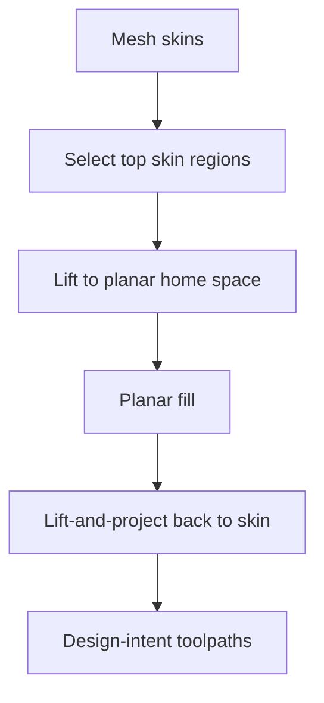

# #6 — Ahlers colloquium slides (2018)

- **Family:** A
- **Link:** —
- **Source:** compendium `paper-01.pdf` / `held-papers.json`

## When to use (adaptive slicer product)
- Internal design / onboarding reference for the lift-and-project skin method while implementing #4/#5.
- Not a primary shipping algorithm source — use when explaining mid-thesis design choices.

## Core idea (one sentence)
Mid-thesis design of the lift-and-project skin method.

## Algorithm (plain steps)
1. Select top skin regions intended for non-planar finish.
2. Lift those regions into a planar home working space (design intent of the slides).
3. Planar-fill in the home space.
4. Project filled paths back (lift-and-project) onto the 3D skin.
5. Plan flow correction for inclined deposition (as later formalized in #4/#5).

## Constraints / what to expect
- Slides only — no stable DOI/link in the registry (Part A dash).
- Design snapshot mid-thesis; prefer #4/#5 for implementable detail and cone math.
- Same 3-axis slope limits eventually stated via Ahlers cone in Part F.

## Data in
- Mesh / skin selection (as in the later thesis pipeline).

## Data out
- Conceptual projected skin paths; not a standalone G-code emitter in the registry.

## Argument → proof sketch → conclusion
**Argument.** Implementers need the design rationale for lift-and-project before reading the full thesis.
**Proof sketch.** Part A positions #6 as mid-thesis design of the lift-and-project skin method that #4/#5 later publish; product logic still rests on the cone + project pipeline, not on slide-only claims.
**Conclusion.** Keep #6 as inventory/design notes behind the #4/#5 skin mode; do not expose a separate user-facing algorithm.

## Chaining
- Before: n/a (supporting material).
- After: implement via #4/#5.
- Do not chain with: treating slides as a second slicer path in the product UI.

## Notes / inventory flags
- No link in held-papers.json / Part A.
- Bundle with #4/#5 in the Family A Ahlers cluster.
