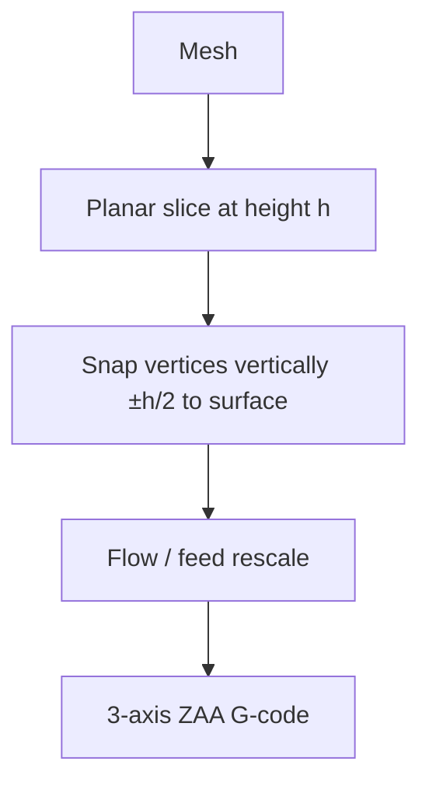

# #7 — Anti-aliasing for fused filament deposition (Song et al. 2017)

- **Family:** A
- **Link:** arxiv.org/abs/1609.03032
- **Source:** compendium `paper-01.pdf` / `held-papers.json`

## When to use (adaptive slicer product)
- Cosmetic improvement of top-facing slopes on stock 3-axis FFF.
- Fast “Z contouring / ZAA” product mode already familiar from OrcaSlicer.
- Prefer minimal change to planar toolpaths (vertex snap) over patch lift or volume warp.

## Core idea (one sentence)
Snaps planar toolpath vertices ±h/2 vertically to the surface with flow/feed rescale. Now shipped as Z contouring in OrcaSlicer.

## Algorithm (plain steps)
1. Slice the model with a standard planar slicer at layer height h.
2. For toolpath vertices on (top) surface-adjacent segments, snap each vertex vertically by at most ±h/2 onto the mesh surface.
3. Rescale extrusion flow and feed to match the new segment length and local inclination.
4. Leave XY topology of the planar path otherwise unchanged.
5. Emit 3-axis G-code (ZAA / Z contouring).

## Constraints / what to expect
- Effective mainly on top-facing surfaces (OrcaSlicer ZAA is top-facing only — approach cards).
- Snap amplitude bounded by ±h/2; cannot invent large freeform skins.
- Still subject to clearance cone if snaps create steep local moves.
- Must rescale flow/feed or bead width/volume drifts.

## Data in
- Mesh; planar layer height h; extrusion width; optional top-surface mask.

## Data out
- Planar-topology toolpaths with modified Z and rescaled E/F; 3-axis G-code.

## Argument → proof sketch → conclusion
**Argument.** User has only 3-axis FFF and wants smoother top slopes, not support-free arches or multi-axis motion.
**Proof sketch.** Part A (#7) + booklet chaining example: vertical snap ±h/2 with flow/feed rescale anti-aliases stairsteps; OrcaSlicer Z contouring ships this. Part F cone rule still bounds safe slope. Family B hardware is out of scope.
**Conclusion.** Default cosmetic-top pipeline: optional F adaptive thickness → Song/ZAA (#7) → 3-axis G-code. Use Ahlers (#4/#5) when larger cone-filtered patches are needed.

## Chaining
- Before: F adaptive planar (#2/#3); standard planar perimeters/infill.
- After: stop (3-axis G-code); optional post arc-fit for firmware look-ahead.
- Do not chain with: Ahlers lift-and-project on the same top skin (double projection); B/C when cone already OK.

## Notes / inventory flags
- Shipped as Z contouring / ZAA in OrcaSlicer; related forks GCodeZAA, BambuStudio-ZAA.
- Part G: #12 registry content mines identically — treat #12 as likely duplicate of #7.
