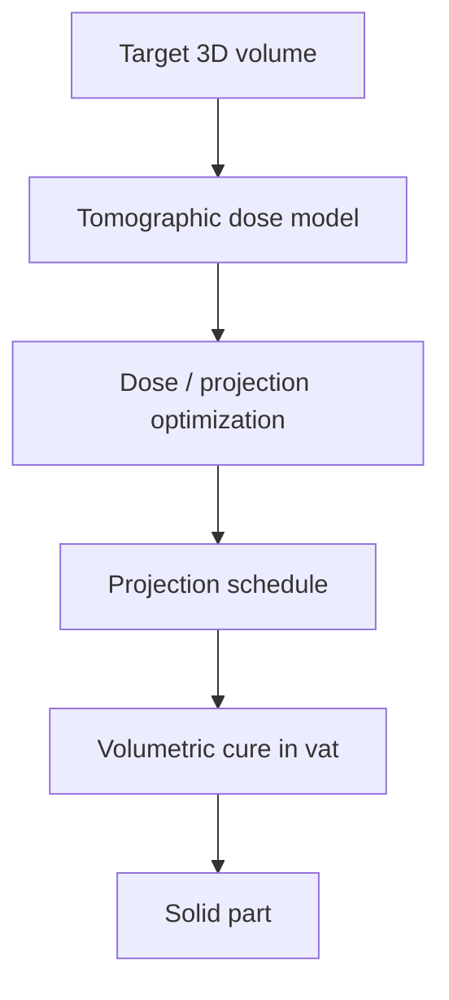

# #8 — Computed Axial Lithography (2017)

- **Family:** VPP (vat / volumetric / multi-axis DLP)
- **Link:** arxiv.org/abs/1705.05893
- **Source:** compendium `paper-01.pdf` / `held-papers.json`

## When to use (adaptive slicer product)
- Volumetric vat photopolymerization (CAL) instead of layer-by-layer VPP.
- Product line exploring tomographic dose as the “slice” — no FFF toolpath.
- When layer stairs are unacceptable and a rotating-vat volumetric process is available.

## Core idea (one sentence)
Optimize tomographic dose projections so a resin volume cures as the target 3-D body.

## Algorithm (plain steps)
1. Represent the target volume occupancy / dose threshold.
2. Model projection/ray dose accumulation through the rotating vat (tomographic forward model).
3. Optimize projection images / dose schedule (inverse tomography).
4. Enforce resin inhibition / dose constraints to avoid stray cure.
5. Play optimized projections into the CAL hardware.
6. Wash / post-cure the volumetrically formed part.

## Constraints / what to expect
- Requires CAL/VAM hardware — not a MEX adaptive-slicer path.
- Dose optimization is ill-conditioned; expect resolution and material limits.
- Domain primer: VPP toolpaths are masks/vectors; CAL breaks layers entirely.

## Data in
- Target voxel/volume model
- Resin optical / cure parameters
- Projector / rotation hardware limits

## Data out
- Optimized projection / dose sequence
- As-cured volumetric part

## Argument → proof sketch → conclusion
**Argument.** Volumetric VPP removes the planar-layer concept; the slicer’s job becomes inverse dose design.
**Proof sketch.** paper-01 VPP: Computed Axial Lithography — tomographic dose optimization (arxiv 1705.05893); ISO primer lists volumetric CAL under VPP.
**Conclusion.** Treat #8 as the VPP volumetric foundation; later #36/#44 extend overprint and roll-to-roll.

## Chaining
- Before: Resin characterization; volume CAD.
- After: #36 overprinting around inserts; #44 continuous-web CAL; not FFF A–E chains.
- Do not chain with: Do not chain into FFF families A–E or G-code extrusion adapters.

## Notes / inventory flags
- arXiv 1705.05893.
- Anchor paper for tomographic VAM cluster (#36, #44).
