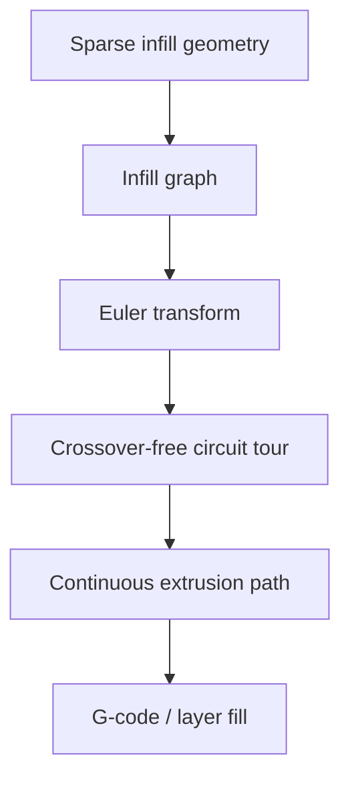

# #9 — Continuous toolpaths for sparse infill (2020)

- **Family:** F-toolpath (general toolpath planning)
- **Link:** doi.org/10.1016/j.cad.2020.102880
- **Source:** compendium `paper-01.pdf` / `held-papers.json`

## When to use (adaptive slicer product)
- Sparse lattice/infill where travel moves and crossovers hurt surface or strength.
- Product wants a single continuous (or few-travel) Euler tour on an infill graph.
- Works inside planar layers or as fill inside B/C curved layers.

## Core idea (one sentence)
Transform the sparse infill into an Eulerian lattice and tour it with a crossover-free circuit.

## Algorithm (plain steps)
1. Build the sparse infill as a graph (edges = printable segments).
2. Euler-transform the graph (add minimal duplicate edges) so all degrees are even.
3. Compute a circuit tour that covers every edge.
4. Order the tour to avoid crossovers / unfavorable crossings where the method allows.
5. Convert the tour to extrusion moves with minimal travel.
6. Emit G-code or per-point paths with continuous E where possible.

## Constraints / what to expect
- Eulerization may duplicate some edges (extra bead or intentional double-pass).
- Primarily a *fill* method — still needs contours/walls from slicing.
- Graph must be connected per region; islands need separate tours or travels.

## Data in
- Sparse infill geometry or lattice graph per layer/region
- Nozzle width, allowed double-pass policy

## Data out
- Continuous (few-travel) infill toolpath
- Optional edge-duplication map

## Argument → proof sketch → conclusion
**Argument.** Sparse infills waste time and create scars when fragmented; continuous Euler tours fix the path layer of family F.
**Proof sketch.** paper-01 and approach-card F cite Euler-transformed lattice with crossover-free circuit tour (#9); chaining F continuous fill inside B/C layers.
**Conclusion.** Use #9 for sparse continuous fill after contours exist; combine with #53 when a spiral boundary-conforming fill is preferred.

## Chaining
- Before: Contours from #35/#2/#3; or curved layer boundaries from B/C.
- After: Post-processor → 3-axis or TCP G-code; optional thermal ordering #34 on segments.
- Do not chain with: Do not use as a layer-field generator — it does not create support-free curved layers.

## Notes / inventory flags
- DOI 10.1016/j.cad.2020.102880.
- Software neighbors: COMPAS Slicer / general path planners in approach-card F.
