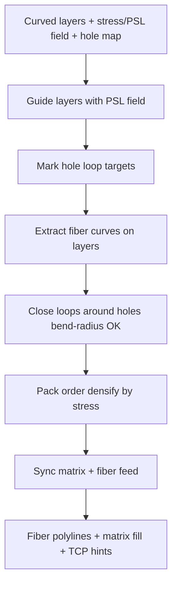

# #10 — Spatial printing with continuous fiber (2024)

- **Family:** E (continuous fiber / anisotropy)
- **Link:** arxiv.org/abs/2311.17265
- **Source:** compendium `paper-01.pdf` / `held-papers.json`

## When to use (adaptive slicer product)
- Continuous-fiber head on multi-axis / robot hardware; load paths matter more than cosmetics.
- Parts with holes or cutouts that need fiber loops for reinforcement (not just straight aligned tows).
- You already have (or will build) curved / PSL-style layers from family B and want fiber laid on them.
- Spatial (non-planar) fiber placement where planar CFRTPC paths would leave weak interlayer bonds.

## Core idea (one sentence)
PSL-guided curved layers with fiber loops around holes.

## Algorithm (plain steps)
1. Build or import printable curved layers guided by a PSL (print-surface / principal-stress–aligned) field — typically from family B (geodesic / stress / deformation).
2. Identify holes and stress concentrators on each layer; mark loop targets around hole boundaries.
3. Extract fiber candidate curves along the layer field; force closed or U-turn loops that encircle holes within the fiber bend-radius limit.
4. Space and order loops so packing density follows local stress intensity without fiber crossover conflicts.
5. Sync matrix (thermoplastic) fill with continuous-fiber feed; insert cut/restart only where hardware requires.
6. Emit fiber-aware toolpaths (polylines + tool vectors) and hand off to family D for singularity-aware poses.

## Constraints / what to expect
- Fiber bend radius and cut/restart hardware dominate feasibility; steep loops may be illegal.
- Needs multi-axis kinematics for truly spatial paths; 3-axis only approximates planar CFRTPC.
- Strength gains depend on alignment and loop continuity around holes — not a drop-in for stock FFF.
- Multi-axis layer gates still apply: thickness band, bounded curvature, local overhang, collision-free order.

## Data in
- Curved or PSL-guided layers (mesh/iso-surfaces); FEA or design stress/PSL field; hole/feature map; fiber width and minimum bend radius; matrix + fiber feed rates.

## Data out
- Ordered fiber polylines (including hole loops) + matrix fill; per-point XYZ, tool vector, fiber-on/off, E/F; fiber-aware G-code or TCP path for family D.

## Argument → proof sketch → conclusion
**Argument.** Continuous fiber on planar layers underuses multi-axis capability and leaves hole boundaries poorly reinforced; spatial placement on curved layers with explicit hole loops should raise anisotropic strength where loads concentrate.
**Proof sketch.** Method class: PSL-guided curved layers (family B style) plus fiber loop generation around holes under bend-radius packing — the held core idea for #10. Approach-cards place #10 with #15/#52 as field/spatial fiber on B layers, then D for poses.
**Conclusion.** Product takeaway: when the user has a fiber head and holes or freeform load paths, run B layers → #10-style spatial fiber with hole loops → D IK; do not offer this on stock 3-axis without a clear planar fallback.

## Chaining
- Before: B curved / stress layers (#42 Reinforced, geodesic #16/#69, S3 #45); optional G TO orientation field (#48/#47) de-homogenized into the stress/PSL input.
- After: D singularity-aware / FRIK motion (#49/#64) for robot TCP; optional C shell geodesics if fiber rides on thin shells (#30/#73).
- Do not chain with: pure F planar adaptive thickness alone (#2/#3) expecting spatial fiber; A clearance-cone skins without a fiber head.

## Notes / inventory flags
- Held entry and paper-01.txt agree on title, link, and core idea; no PDF abstract beyond that in corpus.
- PSL interpreted as print-surface / principal-stress–aligned guidance consistent with family E + B chaining in approach-cards; full paper may name a specific PSL algorithm.
- Related family E peers: #15 (stress isocurves), #52 (2-RoSy dense spacing), #27 (MILP loop pack), #22 (Deep-Q graph planner).
