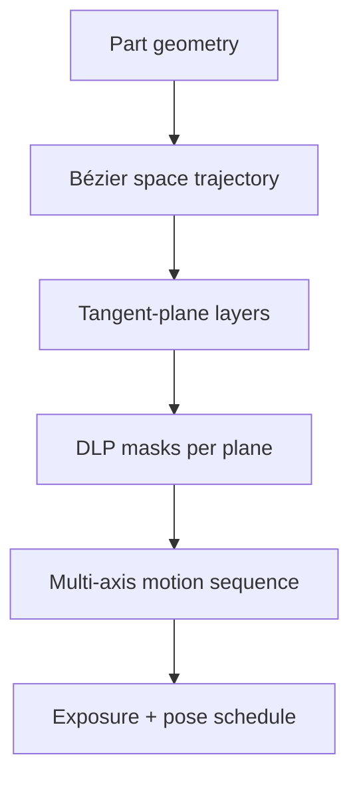

# #11 — Curve-based slicer for multi-axis DLP (2025, SIGGRAPH Asia Best Paper)

- **Family:** VPP (vat / volumetric / multi-axis DLP)
- **Link:** doi.org/10.1145/3763352
- **Source:** compendium `paper-01.pdf` / `held-papers.json`

## When to use (adaptive slicer product)
- Multi-axis DLP where layers are not global Z planes but local tangent planes along a space curve.
- Vat/DLP hardware with oriented projector / multi-axis motion.
- Research-grade curved-layer VPP competing with FFF family B ideas on resin systems.

## Core idea (one sentence)
Drive multi-axis DLP with a Bézier trajectory whose tangent planes define the layers.

## Algorithm (plain steps)
1. Design a space curve (Bézier) that visits the part with printable tangent-plane orientations.
2. Sample tangent planes along the trajectory as candidate “layers.”
3. Intersect / mask the part with each tangent plane for DLP images.
4. Sequence exposures with multi-axis motion between planes.
5. Control cure per mask (including possible grayscale if hardware allows).
6. Emit motion + mask schedule for the multi-axis DLP cell.

## Constraints / what to expect
- SIGGRAPH Asia Best Paper 2025 — VPP-specific; not FFF G-code.
- Trajectory must keep projector/vat collisions and focus valid.
- DOI set; also arXiv 2509.00040 for open access.

## Data in
- Resin part geometry
- Multi-axis DLP kinematics / projector model
- Bézier trajectory seeds / constraints

## Data out
- Ordered tangent-plane layers + DLP masks
- Multi-axis motion / exposure schedule

## Argument → proof sketch → conclusion
**Argument.** Multi-axis DLP needs a first-class curve-based slicing abstraction analogous to FFF curved layers, but outputting masks not beads.
**Proof sketch.** paper-01 / clean-title rule: Bézier trajectory whose tangent planes define the layers; DOI 10.1145/3763352; arXiv 2509.00040.
**Conclusion.** Use #11 as the multi-axis DLP slicer core; pair with #25 for automotive curved iso + grayscale depth.

## Chaining
- Before: VPP hardware calibration; optional volume TO outside FFF G.
- After: #25 grayscale cure-depth; inspection; not MEX post-processors.
- Do not chain with: Do not emit RepRap E-axis G-code from these tangent planes.

## Notes / inventory flags
- DOI https://doi.org/10.1145/3763352 (stored as doi.org/10.1145/3763352).
- arXiv 2509.00040 noted for open access (per task clean-title / core_idea instructions).
- Title normalized to include SIGGRAPH Asia Best Paper.
