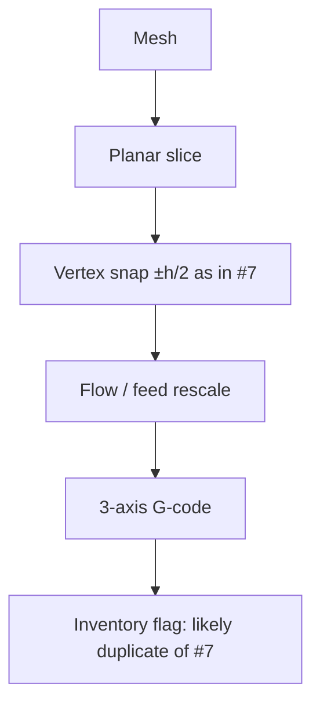

# #12 — 'Curved Layer Based Process Planning 2017'

- **Family:** A
- **Link:** —
- **Source:** compendium `paper-01.pdf` / `held-papers.json`

## When to use (adaptive slicer product)
- Do not offer as a distinct product algorithm until the PDF identity is resolved.
- If forced to map the registry row, treat behavior as identical to Song anti-aliasing (#7) per Part G.

## Core idea (one sentence)
Registry content identical to #7: likely a mislabeled duplicate.

## Algorithm (plain steps)
1. (Per registry identity with #7.) Planar-slice the model.
2. Snap planar toolpath vertices vertically within ±h/2 toward the surface.
3. Rescale flow/feed on modified segments.
4. Emit 3-axis G-code.
5. Do not invent a separate curved-layer planner from the title string alone — Part G says content matches #7.

## Constraints / what to expect
- No link in registry; Part G: mines identically to #7 anti-aliasing — probably a duplicate PDF.
- Intended paper is likely Jin et al. 2017 (Part G) — not confirmed in held corpus.
- Until replaced, expect Song/#7 behavior only; do not claim Jin-style curved layers.

## Data in
- Same as #7 if using registry content: mesh, layer height h.

## Data out
- Same as #7: Z-adjusted planar toolpaths / 3-axis G-code — or hold output until inventory fix.

## Argument → proof sketch → conclusion
**Argument.** Shipping a second “curved layer 2017” mode would confuse users if the held file is Song’s anti-aliasing.
**Proof sketch.** Part A and Part G both state registry content is identical to #7 and flag a likely mislabeled duplicate; intended work may be Jin et al. 2017, which is not validated here.
**Conclusion.** Alias #12 → #7 in the product catalog; quarantine the row until the correct PDF is filed. Do not build a distinct pipeline from the title alone.

## Chaining
- Before/After: identical to #7 if aliased; otherwise none.
- Do not chain with: presenting #12 and #7 as two alternative Family-A methods.

## Notes / inventory flags
- **Likely duplicate of #7** (Part G inventory). Probably duplicate PDF; intended paper likely Jin et al. 2017.
- No link in held-papers.json. Resolve inventory before citing in user-facing docs.
