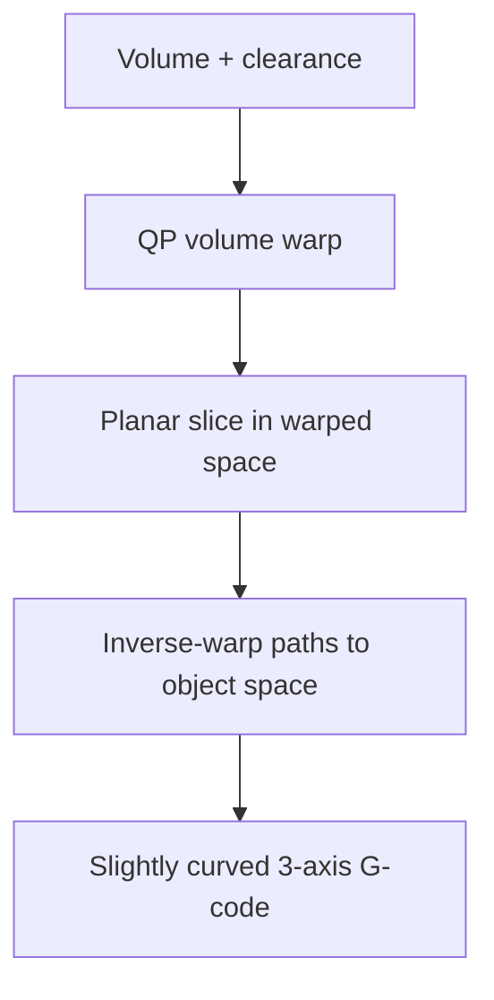

# #13 — CurviSlicer (2019)

- **Family:** A
- **Link:** doi.org/10.1145/3306346.3323022
- **Source:** compendium `paper-01.pdf` / `held-papers.json`

## When to use (adaptive slicer product)
- Whole-part (or large-region) slight curvature on stock 3-axis, beyond local ZAA snaps.
- Need collision-free mildly curved paths without multi-axis kinematics.
- Prefer a volume warp so the existing planar slicer stays the fill engine.

## Core idea (one sentence)
QP volume warp so planar slicing yields collision-free, slightly curved 3-axis paths.

## Algorithm (plain steps)
1. Take the input volume/mesh and nozzle clearance constraints.
2. Solve a quadratic program (QP) that warps the volume so desired surfaces become flatter in warped space while respecting collision limits.
3. Planar-slice the warped volume with a standard slicer.
4. Map toolpaths back through the inverse warp to object space (slightly curved 3-axis paths).
5. Emit collision-aware 3-axis G-code.

## Constraints / what to expect
- Curves remain slight — warp is collision-limited for 3-axis nozzles.
- Fill quality depends on warp smoothness; extreme warps hurt planar-slicer assumptions.
- Still Cartesian hardware; steep overhangs need B/C.
- Dense curved polylines → firmware look-ahead pressure (Part F).

## Data in
- Volume/mesh; clearance / collision model; layer height band; QP objective weights (surface vs fidelity).

## Data out
- Ordered slightly curved 3-axis toolpaths (XYZ, E, F); warp field optional for debug.

## Argument → proof sketch → conclusion
**Argument.** User wants mild freeform shape on 3-axis where vertex-snap ZAA is too local and robots are unavailable.
**Proof sketch.** Part A (#13): QP warp makes planar slices correspond to collision-free slight curves after inverse map — Family A “whole-part slight curve” slot in the decision map. Cone/collision limits still apply (Part F).
**Conclusion.** Offer CurviSlicer when Song/Ahlers skins are insufficient but hardware stays 3-axis; escalate to B if the QP cannot meet collision + shape goals.

## Chaining
- Before: optional F adaptive thickness on a pre-warp planar baseline; mesh repair.
- After: 3-axis G-code; optional arc/spline fit; do not require D robot IK.
- Do not chain with: Atomizer layer-free atoms (#67) as a simultaneous layer model; avoid double-warping with QuickCurve (#41) unless explicitly compared.

## Notes / inventory flags
- Classic SIGGRAPH-family reference for 3-axis curved slicing via deformation.
- Decision map: pair with QuickCurve (#41/#71) under “mild whole-part curve.”
