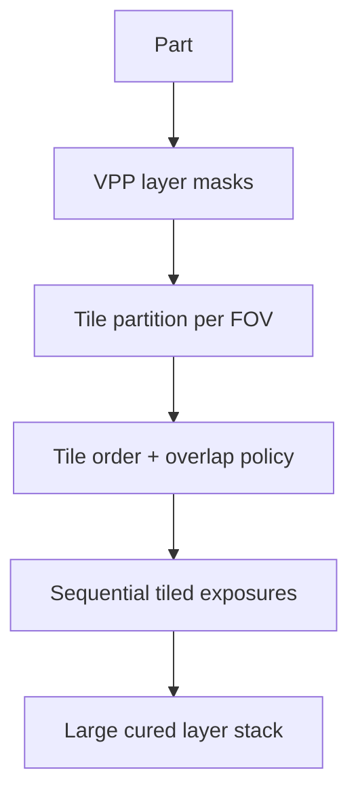

# #14 — Delta DLP with large size (2016)

- **Family:** VPP (vat / volumetric / multi-axis DLP)
- **Link:** —
- **Source:** compendium `paper-01.pdf` / `held-papers.json`

## When to use (adaptive slicer product)
- Large DLP builds where a single projector FOV cannot cover the slice.
- Product needs tiled projection covering per layer on delta/large-format DLP.
- Layered VPP (not necessarily volumetric CAL).

## Core idea (one sentence)
Cover each large slice by tiling multiple DLP projections.

## Algorithm (plain steps)
1. Slice the part into conventional VPP layers (masks).
2. Partition each layer into tiles matching projector FOV / delta workspace.
3. Plan tile order and overlaps/blends to avoid seams in cure.
4. Move delta/large stage (or projector) to each tile pose.
5. Expose tile masks sequentially per layer.
6. Advance Z (or equivalent) and repeat.

## Constraints / what to expect
- Seam/blend artifacts at tile boundaries are the main quality risk.
- Empty link in inventory.
- Still layered VPP — use #8/#11 when leaving global planes.

## Data in
- Part geometry
- Projector FOV, delta/stage kinematics
- Overlap / dose-blend parameters

## Data out
- Per-layer tile masks + poses
- Exposure schedule for large-format DLP

## Argument → proof sketch → conclusion
**Argument.** Scale-up DLP without a larger projector means tiling; the slicer must own coverage planning.
**Proof sketch.** paper-01 VPP: Delta DLP with large size — tiled projection covering of each slice.
**Conclusion.** Use #14 for large layered DLP coverage; escalate to #11/#8 for multi-axis or volumetric.

## Chaining
- Before: Layer mask generation; projector calibration.
- After: Post-cure; optional #60-like inspection analogues for resin parts.
- Do not chain with: Do not apply FFF Euler fill (#9) to DLP masks.

## Notes / inventory flags
- Link empty → `—`.
- Title cleaned (no trailing em-dash).
