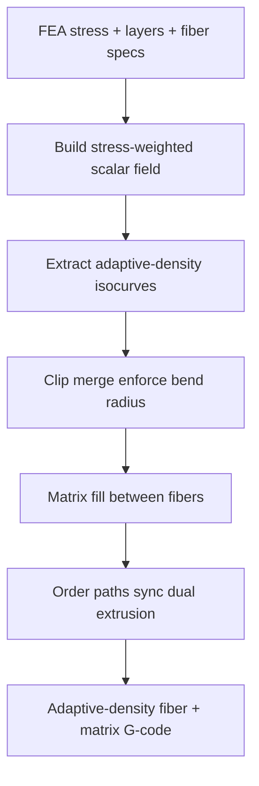

# #15 — Field-based toolpaths for CFRTPC (2021)

- **Family:** E (continuous fiber / anisotropy)
- **Link:** doi.org/10.1016/j.addma.2021.102470
- **Source:** compendium `paper-01.pdf` / `held-papers.json`

## When to use (adaptive slicer product)
- Continuous fiber–reinforced thermoplastic composite (CFRTPC) hardware; principal stress should drive fiber density and direction.
- Adaptive-density fiber: denser tows in high-stress regions, sparser where loads are low (material/time save).
- Planar or mildly curved layers where a scalar field on the layer is enough (escalate to #10/#52 for full spatial/high-density).
- Upstream of MILP packing (#27) or learning-based sequencing (#22) when you need good candidate curves first.

## Core idea (one sentence)
Stress-weighted scalar isocurves give adaptive-density fiber paths.

## Algorithm (plain steps)
1. Run or import FEA (or a user design field) on the part / per layer; extract principal stress magnitude and direction.
2. Build a stress-weighted scalar field on each printable layer so isocurve spacing tightens where stress is high.
3. Extract isocurves as fiber centerlines; clip to printable region and merge short fragments.
4. Enforce minimum fiber bend radius and minimum spacing; drop or smooth illegal segments.
5. Assign matrix fill between fiber curves; sync dual extrusion (matrix + continuous fiber).
6. Order paths (greedy or hand off to #27/#22) and emit fiber-aware toolpaths.

## Constraints / what to expect
- Density follows the scalar weighting — garbage FEA in means garbage fiber out.
- Bend radius and cut/restart limits still dominate; very tight stress swirls may be unprintable.
- Primarily layer-wise; for fully spatial high-density packing prefer #52 (2-RoSy + periodic scalar) or #10 (PSL + hole loops).
- Strength gains require alignment with load; cosmetics are secondary.

## Data in
- FEA stress tensor or principal directions/magnitudes; planar or curved layers; fiber width, min bend radius, min/max spacing; matrix material params.

## Data out
- Adaptive-density fiber polylines + matrix fill; optional stress-density map for UI; fiber-aware G-code with feed sync.

## Argument → proof sketch → conclusion
**Argument.** Uniform fiber spacing wastes material in low-stress zones and under-reinforces hotspots; a stress-weighted scalar whose isocurves are the fibers should match density to demand.
**Proof sketch.** Classic field-based fiber planning: weight a scalar by stress, take isocurves as paths — exactly the held core idea. Approach-cards list #15 as the stress-weighted scalar entry point for family E, often on B layers.
**Conclusion.** Product takeaway: default E path for FEA-driven CFRTPC — stress field → #15 isocurves → optional #27/#22 packing → D if multi-axis. Pair with B Reinforced (#42) when layers themselves should follow stress.

## Chaining
- Before: FEA / design field; B stress-aligned layers (#42) or planar F layers; optional G orientation field from TO (#48/#47).
- After: #27 MILP multi-layer loop packing or #22 Deep-Q graph planner; D for robot poses; #10 if holes need explicit loops on curved layers.
- Do not chain with: A Song/ZAA cosmetics-only pipelines; VPP/tomographic families (wrong process).

## Notes / inventory flags
- Journal DOI Addit. Manuf. 2021; title and core idea stable across efg-owned.json, held-papers.json, and paper-01.txt.
- CFRTPC = continuous fiber–reinforced thermoplastic composite (process context from title).
- No full-text algorithm constants in corpus — bend-radius / spacing numbers must come from hardware profile, not this card.
