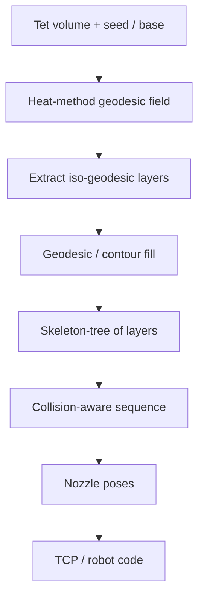

# #16 — Geodesic distance field curved-layer decomposition (2020)

- **Family:** B (multi-axis curved-layer field / deformation)
- **Link:** arxiv.org/abs/2003.05938
- **Source:** compendium `paper-01.pdf` / `held-papers.json`

## When to use (adaptive slicer product)
- Robot or 5-axis cell; support-free volume where layers should follow geodesic distance from a base/seed.
- Parts whose collision-free print order is not a simple stack — need skeleton-tree sequencing of curved layers.
- Same HKUST geodesic lineage as Xu #69 and lattice #26; prefer this when tet heat-method iso-geodesics + collision-aware ordering are the fit.
- Escalate here from family A when the clearance cone fails and hardware can tilt/orient the nozzle.

## Core idea (one sentence)
Heat-method iso-geodesic surfaces on a tetrahedral volume become the curved layers; a collision-aware skeleton-tree sequences them for multi-axis deposition.

## Algorithm (plain steps)
1. Tet-mesh (or equivalent volumetric discretization of) the input solid; choose seed set (base / build plate / growing front).
2. Compute a geodesic distance field on the tets via the heat method (vector-heat / heat-method family; Part C anchors geometry-central vector heat).
3. Extract iso-geodesic surfaces as candidate curved layers; enforce Part F thickness band and bounded curvature.
4. Fill each layer (contour-parallel or related geodesic paths; see also Xu #69).
5. Build a skeleton tree of the layer arrangement; sequence layers with collision awareness so later layers do not block the nozzle.
6. Assign nozzle orientations; emit TCP / joint paths (hand off to family D if singularities or IK dominate).

## Constraints / what to expect
- Needs multi-axis kinematics and collision checks against part, fixture, and gantry (Part F).
- Multi-axis layer gates: thickness band, bounded curvature, local overhang, smooth orientation field, collision-free global order.
- Tet quality affects heat-method accuracy; poor meshes distort iso-surfaces.
- If local overhang still fails after orientation, residual supports (#51) may be required.
- Dense 3D polylines: fit arcs/splines or use high-throughput firmware (Part F).

## Data in
- Watertight volume suitable for tet meshing; seed/base region.
- Layer height / thickness band; nozzle clearance model; robot or 5-axis kinematics.

## Data out
- Ordered curved iso-geodesic layers with tool vectors.
- Per-point record: position, tool vector, local thickness/width, flow, speed, feature type, sequence index.
- TCP G-code or robot language via adapters (Part F).

## Argument → proof sketch → conclusion
**Argument.** Planar stacks force supports on overhangs; for a robot/5-axis cell the layer geometry itself should stay locally printable and globally orderable.
**Proof sketch.** Compendium Part A lists #16 as heat-method iso-geodesic surfaces on tets with collision-aware skeleton-tree sequencing. Approach-card B and the decision map place geodesic #16/#69/#26 under support-free volume on robot/5-axis. Part F requires collision-free global order — the skeleton tree is the held mechanism for that gate on this paper.
**Conclusion.** Use #16 when geodesic iso-layers + skeleton-tree order match the part; chain to D for hard IK, or to #51 if residual supports remain. Do not invent numeric success rates beyond what the compendium states.

## Chaining
- **Before:** Optional family G self-support TO (#48/#47/#50); mesh/tet prep (family F hygiene).
- **After:** Family D singularity-aware / FRIK / env paths (#49/#64/#63); optional family E fiber on curved layers (#15/#10/#52).
- **Do not chain with:** Stock 3-axis-only pipelines that cannot orient the nozzle (stay in A or escalate hardware first).
- **Siblings:** Xu #69 (contour-parallel geodesic paths); lattice #26 (three orthogonal geodesics → Eulerian lattice).

## Notes / inventory flags
- Part G: #16 is among rows that previously lacked a link and now has arXiv 2003.05938.
- Same HKUST group as #16/#26/#69 (noted under Li et al. 2022 vector-field curved layer work in Part B).
- Software anchor for geodesics / vector heat: geometry-central (Part D).
