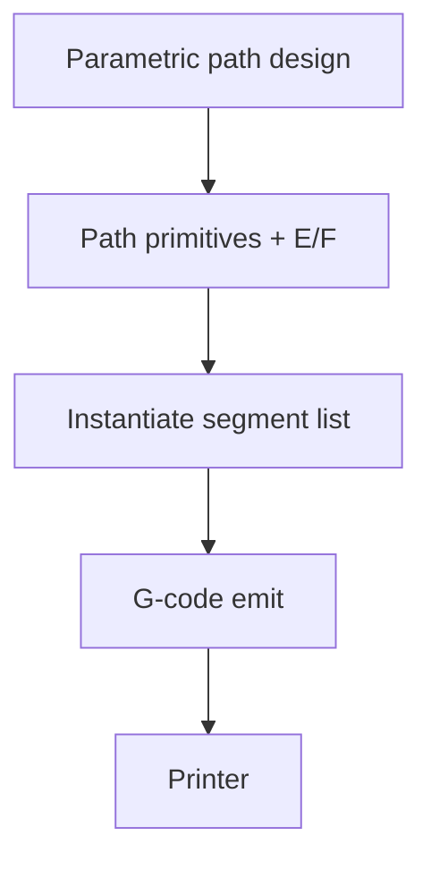

# #17 — FullControl G-code Designer (2021)

- **Family:** F-toolpath (general toolpath planning)
- **Link:** —
- **Source:** compendium `paper-01.pdf` / `held-papers.json`

## When to use (adaptive slicer product)
- Research or power-user workflows that design extrusion geometry directly as G-code primitives.
- Bypass CAD → STL → slicer when the artifact *is* the toolpath (nonstandard lattices, calibration artefacts).
- Teaching / scripting continuous paths that commercial slicers fight.

## Core idea (one sentence)
Design G-code directly without going through CAD, STL, or a conventional slicer.

## Algorithm (plain steps)
1. Describe geometry as parametric path primitives (segments, arcs, lattices, functions of layer index).
2. Assign extrusion, speed, and temperature annotations per primitive.
3. Instantiate the design into an ordered point/segment list.
4. Emit flavor-specific G-code (RepRap E axis, temperatures, etc.).
5. Optionally visualize / dry-run the path before print.
6. Print without an intermediate mesh slice.

## Constraints / what to expect
- No automatic support/overhang solving — designer owns printability.
- Empty link in inventory; FullControl is the named software anchor in approach-card F.
- Not a drop-in replacement for mesh-based product slicing of arbitrary STL.

## Data in
- Parametric design script / notebook
- Printer kinematics limits, filament, temperatures

## Data out
- Direct G-code
- Optional path visualization

## Argument → proof sketch → conclusion
**Argument.** Some adaptive-slicer research paths (nonstandard beads, ZigZagZ-style) are easier to author as G-code than to recover from STL.
**Proof sketch.** paper-01 F-toolpath: Design G-code directly without CAD/STL/slicer; approach-card F software lists FullControl.
**Conclusion.** Offer #17-style direct path design as an expert mode beside the mesh pipeline—not as the default consumer path.

## Chaining
- Before: Process calibration; optional image/keypoint ideas from #19 as inspiration inputs.
- After: Machine print; or re-import paths into analysis (#24 digital twin mesh).
- Do not chain with: Do not expect #17 to consume arbitrary customer STL assemblies.

## Notes / inventory flags
- Link empty → `—`.
- Related corpus mention: Allum ZigZagZ via FullControl site (Part B cite) — do not invent extra claims beyond direct G-code design.
