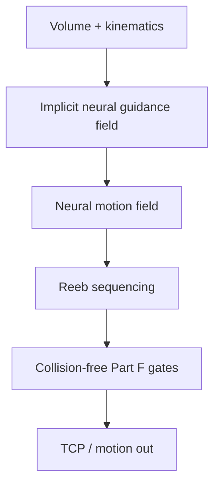

# #18 — INF-3DP (2025)

- **Family:** B
- **Link:** doi.org/10.1145/3763354
- **Source:** compendium `paper-01.pdf` / `held-papers.json`

## When to use (adaptive slicer product)
- Multi-axis volumes where both a guidance field for layers and a motion field for the nozzle should be implicit neural.
- Part topology (tunnels/branches) needs Reeb-graph sequencing for collision-free order.
- Product wants a 2025-era neural B pipeline that closes the loop from field → Reeb order → collision-free motion.
- Escalation when classical geodesic + skeleton tree (#16) is too rigid and S3 deformation (#45) lacks Reeb awareness.
- Prefer when collision-free motion must be co-designed with the layer field, not bolted on only in family D.
- Companion arXiv 2509.05345 for preprint access.

## Core idea (one sentence)
Use implicit neural guidance and motion fields with Reeb sequencing to produce collision-free multi-axis curved-layer plans.

## Algorithm (plain steps)
1. Fit implicit neural guidance fields that define candidate curved layers / growth directions.
2. Fit or couple motion fields that propose nozzle trajectories consistent with the guidance field.
3. Build a Reeb-graph view of layer topology (tunnels, branches) and label printable order.
4. Sequence layers via Reeb labels so the nozzle never enters a blocked cavity.
5. Enforce Part F gates (thickness, curvature, local overhang, smooth orientation, collision-free order).
6. Emit collision-checked TCP / motion for family D finishing (IK / timing / machine dialect).

## Constraints / what to expect
- Multi-axis cell; Part F gates — Reeb step specifically targets collision-free global order.
- Neural fields need careful sampling near thin features; validate thickness band after extraction.
- Still may need residual supports (#51) where local overhang gate fails.
- Companion arXiv: 2509.05345 (held-papers / Part A row).
- Part B cites volume-peeling and scalar-field multi-axis AM as related prior work cited by INF-3DP.

## Data in
- Volume / implicit occupancy; kinematic & environment meshes; thickness / overhang limits.

## Data out
- Neural guidance + motion fields; Reeb-ordered curved layers; collision-free TCP trajectories.

## Argument → proof sketch → conclusion
**Argument.** INF-3DP wins when the product needs neural fields *and* topology-aware (Reeb) collision-free sequencing in one B pipeline.
**Proof sketch.** Held core idea: implicit neural guidance and motion fields, Reeb sequencing, collision-free; arXiv 2509.05345. Approach card B names Reeb #68/#18 for tunnel/branch ordering; booklet checklist cites Reeb/skeleton reorder when global order fails.
**Conclusion.** Prefer #18 for neural+Reeb collision-free planning; prefer #68 when Reeb labeling on classical curved layers (no neural) is enough; prefer #20 for dual SIREN layer/path fields with differentiable collision as the CAD-process-planning sibling.

## Chaining
- Before: optional G TO; classical geodesic field can warm-start guidance.
- After: D for machine-specific IK / TOPP timing; optional E fiber if bend radius allows; #51 for residual overhang.
- Do not chain with: pure 3-axis A on Cartesian-only hardware.

## Notes / inventory flags
- DOI 10.1145/3763354; also arXiv 2509.05345.
- No dedicated Part D code URL listed in the software table for INF-3DP.
