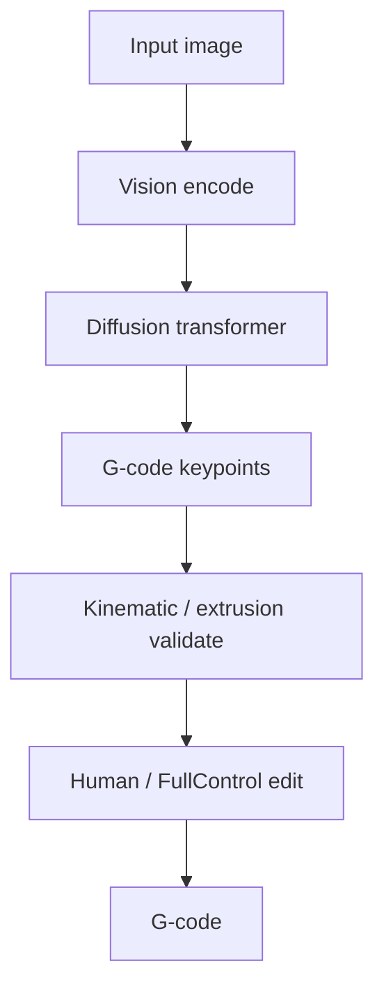

# #19 — Image2Gcode (2025)

- **Family:** F-toolpath (general toolpath planning)
- **Link:** arxiv.org/abs/2511.20636
- **Source:** compendium `paper-01.pdf` / `held-papers.json`

## When to use (adaptive slicer product)
- Generate draft toolpath keypoints from images (sketches, photos of targets) for expert editing.
- Research demo / assistive path ideation—not certified production slicing of engineering meshes.
- Pair with human or FullControl-style refinement before print.

## Core idea (one sentence)
Use a diffusion transformer to generate G-code keypoints from images.

## Algorithm (plain steps)
1. Encode an input image (sketch / photo) with the model’s vision front-end.
2. Run a diffusion transformer that proposes G-code keypoints / path tokens.
3. Decode keypoints into ordered polyline segments.
4. Validate kinematics limits (bounds, max segment length, extrusion sanity).
5. Export draft G-code or hand to an editor (#17-style) for cleanup.
6. Print only after human/process checks.

## Constraints / what to expect
- Learned draft — not a geometric guarantee of watertight parts or correct E.
- Unsuitable as sole path for load-bearing products without verification.
- Stays in family F toolpath ideation.

## Data in
- Image (sketch/photo)
- Optional printer workspace bounds and style conditioning

## Data out
- Draft G-code keypoints / polylines
- Candidate G-code after validation

## Argument → proof sketch → conclusion
**Argument.** Image-conditioned path drafts accelerate expert tooling when CAD is absent, but the product must keep a verification gate.
**Proof sketch.** paper-01 / efg-owned: diffusion transformer generating G-code keypoints from images (arxiv 2511.20636).
**Conclusion.** Ship as assistive draft → mandatory edit/validate; never silent auto-print for engineering parts.

## Chaining
- Before: User image; workspace calibration.
- After: #17-style cleanup; #24 twin meshing for FEA sanity; print.
- Do not chain with: Do not chain raw keypoints into D multi-axis IK without explicit layer/pose structure.

## Notes / inventory flags
- arXiv 2511.20636.
- Inventory family F-toolpath.
