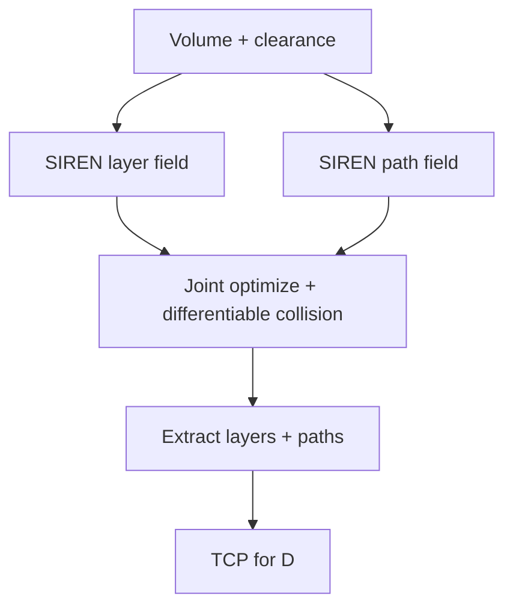

# #20 — Implicit neural field process planning (2026, accepted CAD)

- **Family:** B
- **Link:** arxiv.org/abs/2511.17578v2
- **Source:** compendium `paper-01.pdf` / `held-papers.json`

## When to use (adaptive slicer product)
- CAD-integrated process planning where both layers and in-layer paths are SIREN fields.
- Differentiable collision must sit inside the optimizer (not only as a post-check).
- Product roadmap: neural B sibling to Neural Slicer (#29) and INF-3DP (#18) with explicit dual layer/path representation.
- Accepted CAD 2026 track — use when citing the newest dual-field process-planning formulation.
- Prefer when manufacturing process planning is posed as a continuous optimization over two coupled implicits.
- Part B notes scalar-field multi-axis AM cited by INF-3DP and #20.

## Core idea (one sentence)
Represent layers and paths as dual SIREN fields and optimize them under differentiable collision constraints.

## Algorithm (plain steps)
1. Define a SIREN layer field whose iso-surfaces are candidate curved layers.
2. Define a coupled SIREN path field that lives on / between those layers for continuous fill.
3. Add differentiable collision penalties (nozzle vs part/fixture/prior layers) into the loss.
4. Jointly optimize both fields under thickness, overhang, and collision objectives.
5. Extract discrete layers + polylines; smooth orientations; verify Part F gates after discretization.
6. Emit TCP for family D machine adapters; fail closed if post-discretization collisions appear.

## Constraints / what to expect
- Multi-axis hardware; Part F gates — differentiable collision targets the collision-free order / access gate during optimize, still verify after discretization.
- Dual-network training cost; need robust iso-extraction for manufacturing tolerances.
- Tunnel cases may still benefit from explicit Reeb labeling (#68 / #18) if the collision loss alone under-constrains order.
- arXiv 2511.17578v2; accepted CAD (held title).
- No Part D software repo listed yet for this paper.

## Data in
- Implicit or meshed volume; clearance / kinematics model; thickness and overhang bounds; loss weights.

## Data out
- Dual SIREN fields; extracted curved layers + path polylines; tool vectors; TCP for D.

## Argument → proof sketch → conclusion
**Argument.** #20 wins when process planning itself is posed as dual neural fields (layers *and* paths) with collision inside the gradient loop.
**Proof sketch.** Held core idea: dual SIREN layer/path fields with differentiable collision. Approach card B groups SIREN / implicit neural (#29, #18, #20); Part B notes scalar-field multi-axis AM cited by INF-3DP and #20.
**Conclusion.** Prefer #20 for CAD-facing dual-field neural planning; prefer #29 when a single deformation SIREN + print-direction losses suffice; prefer #18 when Reeb sequencing + guidance/motion fields are the priority.

## Chaining
- Before: optional G TO / FEA to shape objectives; mesh sampling for SIREN training.
- After: D IK / timing; optional E fiber on extracted paths under bend-radius limits; #68 if topology order still fails; #51 for residual overhang.
- Do not chain with: pure 3-axis A on Cartesian-only hardware.

## Notes / inventory flags
- arXiv abs/2511.17578v2; accepted CAD 2026 per held-papers title.
- No Part D software repo listed yet for this paper.
