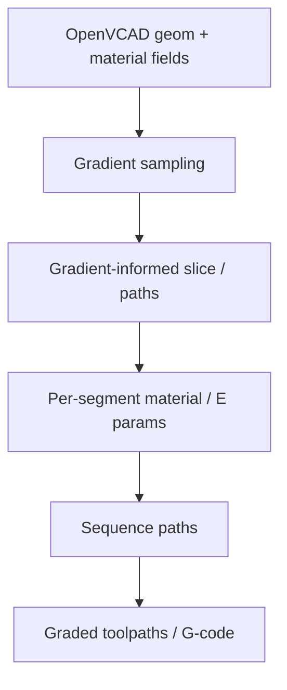

# #21 — Implicit toolpaths for functionally graded AM (2025)

- **Family:** F-toolpath (general toolpath planning)
- **Link:** arxiv.org/abs/2505.08093
- **Source:** compendium `paper-01.pdf` / `held-papers.json`

## When to use (adaptive slicer product)
- Parts defined as OpenVCAD (or similar) geometry *and* material fields, not a single STL solid.
- Functionally graded materials need gradient-informed slice/path density or composition.
- Product multi-material / graded MEX roadmap.

## Core idea (one sentence)
Slice OpenVCAD geometry and material fields with gradients informing the toolpaths.

## Algorithm (plain steps)
1. Load implicit OpenVCAD geometry plus material/property fields.
2. Sample gradients to steer local path spacing, composition, or slice emphasis.
3. Extract iso-contours / paths consistent with geometry and grade fields.
4. Assign per-segment material mix or extrusion parameters from field values.
5. Sequence paths with printable continuity constraints.
6. Emit multi-material / graded G-code or per-point records.

## Constraints / what to expect
- Requires implicit/graded CAD, not plain STL-only customers.
- Hardware must support the graded/multi-material strategy claimed by the fields.
- Complements but does not replace B stress fields (#42) for structural anisotropy.

## Data in
- OpenVCAD (or equivalent) geometry + material fields
- Gradient policy / printable mix limits

## Data out
- Gradient-informed paths with material annotations
- Per-point record including composition proxies

## Argument → proof sketch → conclusion
**Argument.** Graded AM fails if the slicer only sees a boundary mesh; fields must drive paths.
**Proof sketch.** approach-card F when-to-use: graded materials / OpenVCAD fields (#21); paper-01 core idea matches.
**Conclusion.** Use #21 when ingest is field-based; keep STL pipelines on #35/#2.

## Chaining
- Before: Field CAD authoring; optional G TO for shape (#48/#47) then re-embed as fields.
- After: Print graded MEX; or map structural grades toward E fiber if hardware exists.
- Do not chain with: Do not discard material fields by exporting only STL before slicing.

## Notes / inventory flags
- arXiv 2505.08093.
- Neighbor: #23 streaming lattices when the graded object is lattice-like.
