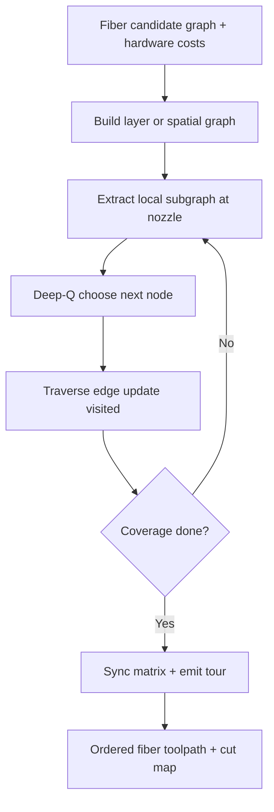

# #22 — Learning-based toolpath planner on graphs (2024)

- **Family:** E (continuous fiber / anisotropy)
- **Link:** arxiv.org/abs/2408.09198
- **Source:** compendium `paper-01.pdf` / `held-papers.json`

## When to use (adaptive slicer product)
- Fiber or anisotropic bead graphs where combinatorial next-node choice (coverage, continuity, cut cost) is hard to hand-tune.
- Local subgraph decisions beat global MILP when layers are large or online replan is needed.
- Downstream of field extraction (#15/#52/#10): you have candidate nodes/edges and need a tour policy.
- Continuous-fiber hardware where restart/cut penalties make learned sequencing valuable.

## Core idea (one sentence)
Deep-Q next-node planner on local subgraphs.

## Algorithm (plain steps)
1. Build a graph on each layer (or spatial fiber network): nodes = waypoints / junctions; edges = printable fiber segments with costs (length, turn angle, cut need).
2. For the current nozzle/fiber state, extract a local subgraph (k-hop or radius neighborhood).
3. Encode local state (visited mask, fiber-on flag, heading, remaining coverage) and query a Deep-Q policy for the next node.
4. Advance along the chosen edge; update visited set; apply cut/restart if the policy or hardware requires it.
5. Repeat until coverage targets are met; fall back to greedy / MILP (#27) on residual islands.
6. Sync matrix extrusion with the fiber tour and emit ordered toolpaths.

## Constraints / what to expect
- Policy quality depends on training distribution; exotic hole patterns may need fine-tune or MILP fallback (#27).
- Local subgraph horizon can miss globally better cuts — monitor residual islands.
- Still must respect fiber bend radius and machine cut/feed limits encoded in edge costs.
- Inference is fast; training / reward design is the product engineering cost.

## Data in
- Candidate fiber graph (from #15/#52/#10 isocurves or loops); edge cost model (length, turn, cut); coverage mask; fiber-on state and bend-radius legality.

## Data out
- Ordered node/edge tour; cut/restart events; fiber-aware G-code sequence; optional Q-value / confidence for UI.

## Argument → proof sketch → conclusion
**Argument.** Exact global fiber tours (MILP) scale poorly; a learned next-node policy on local subgraphs can approximate good continuous-fiber sequences under cut and turn costs.
**Proof sketch.** Method class: Deep-Q learning over local graph neighborhoods for sequential path decisions — the held core idea. Approach-cards list #22 alongside #27 as the packing/sequencing step after field isocurves.
**Conclusion.** Product takeaway: use #22 when graphs are large or must replan; keep #27 as exact packer for small multi-layer loop sets. Always upstream-field (#15/#52) then graph planner, then D if robot.

## Chaining
- Before: E field paths #15 / #52 / #10 (build the graph); optional B layers under those paths.
- After: D motion (#49/#64) for TCP; optional thermal-aware ordering ideas from F #34 if temperature couples to fiber pauses.
- Do not chain with: G TO alone (no toolpath graph yet); pure A cosmetic skins without fiber candidates.

## Notes / inventory flags
- arXiv 2408.09198; core idea only — network architecture, reward, and dataset not in corpus.
- Flag under Notes if product needs reproducible training: inventory has no model weights or hyperparams.
- Complements #27 (exact MILP) rather than replacing it for small instances.
