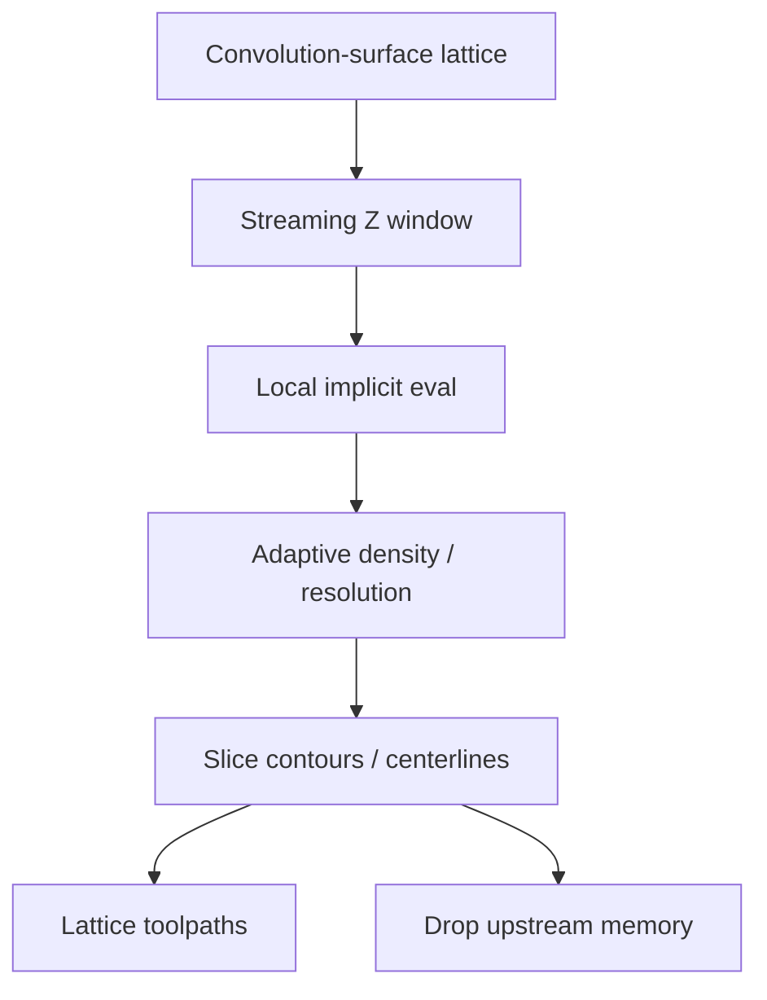

# #23 — Memory-efficient adaptive lattices (2021)

- **Family:** F-planar (adaptive slicing / mesh formats)
- **Link:** arxiv.org/abs/2101.05031
- **Source:** compendium `paper-01.pdf` / `held-papers.json`

## When to use (adaptive slicer product)
- Large lattice / TPMS-style parts that do not fit as a full dense mesh in slicer RAM.
- Product must stream-slice convolution-surface lattices with adaptive resolution.
- Planar (or planar-band) lattice jobs before any multi-axis lattice geodesic (#26).

## Core idea (one sentence)
Stream-slice convolution-surface lattices so adaptive lattice geometry never requires a full in-memory mesh.

## Algorithm (plain steps)
1. Represent the lattice as convolution surfaces / implicit primitives rather than a global triangle soup.
2. Stream along build Z (or a slice window), evaluating only the active band.
3. Adapt lattice density / resolution from local feature or stress proxies if provided.
4. Extract planar contours or bead centerlines for the active window.
5. Discard upstream geometry; keep only contours / paths needed for export.
6. Emit continuous or segmented lattice toolpaths compatible with planar fill.

## Constraints / what to expect
- Targets lattice/implicit inputs — ordinary solid STL may still need #35-style mesh slicing.
- Streaming assumes a monotonic slice direction; multi-axis lattice fill (#26) is a different family B path.
- Memory wins trade off against random-access edits of the whole lattice.

## Data in
- Convolution-surface / implicit lattice description
- Slice window size, adaptive density policy
- Nozzle / bead parameters

## Data out
- Streamed planar lattice contours or centerline paths
- Compact path buffers suitable for large builds

## Argument → proof sketch → conclusion
**Argument.** Huge lattices break naive mesh-first slicers; the adaptive product needs a streaming planar foundation.
**Proof sketch.** paper-01 F-planar row: streaming slicing of convolution-surface lattices; approach-card F lists #23 under adaptive lattices.
**Conclusion.** Use #23 as the scalable lattice planar backend; hand dense solids to #35/#2 and multi-axis lattice shells to B #26.

## Chaining
- Before: Implicit/lattice CAD; optional G void packing (#50) if redesigning support-free voids.
- After: Planar lattice fill (#9 Euler tour possible on sparse graphs); escalate to B geodesic lattice (#26) for support-free volumes.
- Do not chain with: Do not feed raw streamed planar bands into D robot IK without a multi-axis layer field.

## Notes / inventory flags
- arXiv 2101.05031.
- Complements #21 (OpenVCAD graded fields) when lattices carry material gradients.
