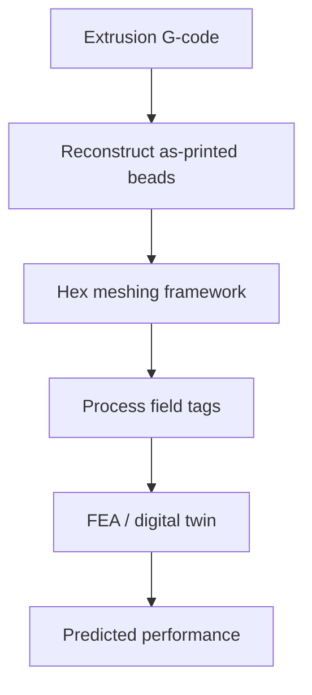

# #24 — Meshing framework for digital twins of extrusion AM (2025)

- **Family:** Process (modeling / inspection / concrete)
- **Link:** arxiv.org/abs/2509.12436
- **Source:** compendium `paper-01.pdf` / `held-papers.json`

## When to use (adaptive slicer product)
- Need an as-printed hex mesh from G-code for FEA / digital twin, not the ideal CAD mesh.
- Closing the loop after adaptive / non-planar extrusion paths.
- Validate thermal/structural predictions on the real bead layout.

## Core idea (one sentence)
Convert G-code into an as-printed hex mesh suitable for FEA digital twins.

## Algorithm (plain steps)
1. Parse extrusion G-code (paths, E, widths/heights if present).
2. Reconstruct bead solid geometry from road segments.
3. Generate a hex-dominant (or hex) mesh conforming to as-printed roads.
4. Attach process tags (time, temperature proxies if known) as field data.
5. Export mesh to FEA / twin solvers.
6. Compare twin predictions to measurements when available (#60/#62).

## Constraints / what to expect
- Twin fidelity tracks G-code completeness (missing measured widths hurt).
- Hex meshing cost grows with path length.
- Process family — consumes paths; does not create them.

## Data in
- Extrusion G-code / per-point record
- Bead cross-section assumptions or measured widths
- Material FEA properties

## Data out
- As-printed hex mesh
- Optional time/process fields for twin simulation

## Argument → proof sketch → conclusion
**Argument.** Adaptive slicer quality claims need as-printed twins, not CAD-only FEA.
**Proof sketch.** paper-01 Process: G-code to as-printed hex mesh for FEA (arxiv 2509.12436).
**Conclusion.** Run #24 after path planning (A–F MEX) when validating structural/thermal outcomes.

## Chaining
- Before: Any MEX path source (#2/#9/#17/A/B/…); keep per-point record.
- After: FEA; compare to #62 roughness or #60 inspection data.
- Do not chain with: Do not feed VPP mask schedules into this extrusion mesher without a bead model.

## Notes / inventory flags
- arXiv 2509.12436.
- Complements concrete digital chain #61 with a meshing focus for extrusion twins.
