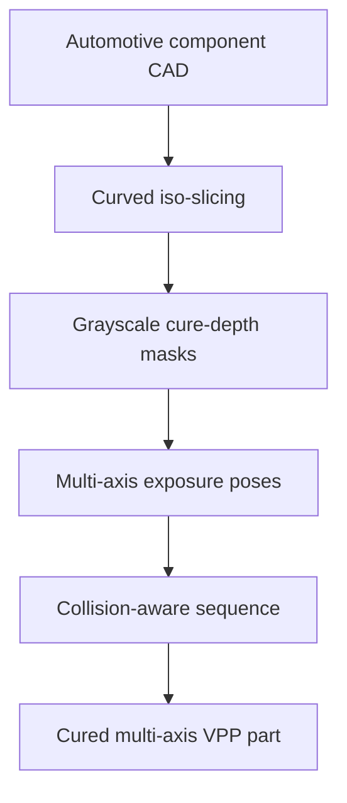

# #25 — Multi-axis AM for automotive components (2026)

- **Family:** VPP (vat / volumetric / multi-axis DLP)
- **Link:** arxiv.org/abs/2604.12236
- **Source:** compendium `paper-01.pdf` / `held-papers.json`

## When to use (adaptive slicer product)
- Automotive resin/DLP components needing curved iso-layers plus depth control.
- Multi-axis VPP cell where grayscale masks modulate cure depth.
- Bridging product demos from research multi-axis DLP toward application parts.

## Core idea (one sentence)
Combine curved iso-slicing with grayscale cure-depth masks for multi-axis automotive AM.

## Algorithm (plain steps)
1. Build curved iso-layers suited to the automotive component and multi-axis cell.
2. Generate per-layer masks aligned to those iso-surfaces.
3. Encode cure depth via grayscale (or equivalent dose) in the masks.
4. Plan multi-axis poses so each mask exposes the intended surface band.
5. Sequence exposures with collision-safe motion.
6. Post-cure and inspect critical automotive dimensions.

## Constraints / what to expect
- Application paper — validate resin systems and tolerances for automotive use.
- Grayscale depth control is material/projector dependent.
- VPP family; not FFF G-code.

## Data in
- Component CAD + keep-out / fixture model
- Multi-axis DLP kinematics, grayscale calibration

## Data out
- Curved iso-layers + grayscale masks
- Pose / exposure schedule

## Argument → proof sketch → conclusion
**Argument.** Automotive freeform resin parts need both curved layering and depth-aware dose, not only planar DLP stacks.
**Proof sketch.** paper-01 VPP: curved iso-slicing plus grayscale cure-depth masks (arxiv 2604.12236).
**Conclusion.** Pair #25 with #11’s curve-based tangent-plane thinking for multi-axis DLP products.

## Chaining
- Before: #11 trajectory/tangent framework or other curved iso generator; hardware calibration.
- After: Inspection / QA; finishing.
- Do not chain with: Do not feed masks into MEX extrusion planners.

## Notes / inventory flags
- arXiv 2604.12236.
- Cluster with #11, #14 for multi-axis / large DLP.
