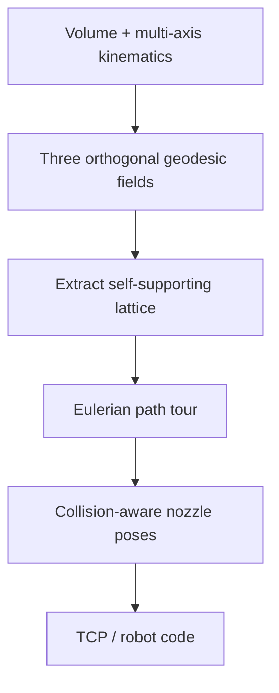

# #26 — Multi-axis support-free printing with lattice infill (2020)

- **Family:** B (multi-axis curved-layer field / deformation)
- **Link:** arxiv.org/abs/2007.00413
- **Source:** compendium `paper-01.pdf` / `held-papers.json`

## When to use (adaptive slicer product)
- Support-free multi-axis print where the *infill itself* is a self-supporting lattice, not only solid curved shells.
- Want a single continuous (Eulerian) deposition tour through the lattice for fewer travel moves.
- Same geodesic HKUST lineage as #16/#69; choose #26 when three orthogonal geodesic fields → lattice is the product goal.
- Lightweight structural volumes on robot/5-axis (decision map FieldB).

## Core idea (one sentence)
Three orthogonal geodesic fields define a self-supporting lattice that is printed as one Eulerian path on a multi-axis system.

## Algorithm (plain steps)
1. Discretize the volume; set up three mutually orthogonal geodesic (or geodesic-aligned) scalar/direction fields.
2. Extract the lattice graph from the orthogonal field intersections / iso-structures so struts are locally self-supporting under the intended build orientations.
3. Verify support-free strut angles against local overhang gates (Part F); adjust fields if needed.
4. Convert the lattice into an Eulerian path (continuous tour) for deposition.
5. Plan nozzle poses along the tour with collision checks; sequence globally.
6. Emit TCP / robot code.

## Constraints / what to expect
- Multi-axis required; lattice density and strut thickness must stay printable (bead width/thickness band).
- Eulerian tour assumes the lattice graph can be made Eulerian (or with minimal added links) — product must handle odd-degree repair without inventing paper metrics.
- Part F: collision-free global order, smooth orientation field, local overhang.
- Not a substitute for solid geodesic shells (#16/#69) when you need sealed skins — combine shell + lattice if the product needs both.

## Data in
- Volume; target lattice spacing / density parameters; kinematics and clearance.
- Optional load hints (else pure geometric self-support).

## Data out
- Self-supporting lattice geometry + single (or few) continuous toolpath tour(s).
- Tool vectors and Part F per-point record → adapters.

## Argument → proof sketch → conclusion
**Argument.** Solid curved layers remove supports but still fill volume densely; for lightweight support-free parts a lattice that prints continuously is better.
**Proof sketch.** Held idea: “Three orthogonal geodesic fields form a self-supporting lattice printed as an Eulerian path.” Approach-card B explicitly calls out self-supporting lattice infill (#26) and Eulerian lattice tour. Decision map groups #26 with Dai/geodesic support-free volume methods.
**Conclusion.** Select #26 for geodesic orthogonal lattice + Eulerian tour; chain to D for poses. Keep shell generation (#16/#69) as an optional outer skin stage if sealed surfaces are required.

## Chaining
- **Before:** G void packing / self-support TO (#50/#48) can inspire density; tet/mesh prep.
- **After:** D motion; optional E fiber only if fiber can follow lattice struts (bend-radius gate).
- **Do not chain with:** Planar sparse infill (#9 continuous sparse toolpaths) as if it provided multi-axis self-support — different family/hardware.
- **Siblings:** #16 heat-method iso-geodesics; #69 contour-parallel geodesic layers.

## Notes / inventory flags
- Same HKUST group as #16/#26/#69 (Part B note on Li et al. 2022).
- geometry-central geodesics remain the practical software anchor (Part D).
