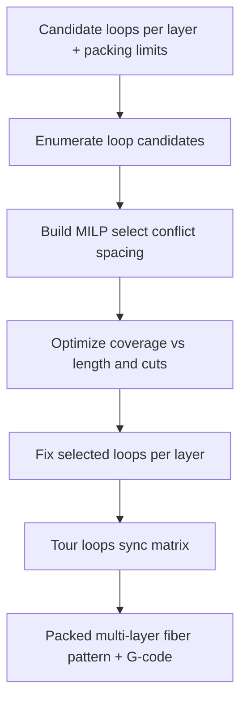

# #27 — Multi-layer carbon fiber pattern optimization (2024)

- **Family:** E (continuous fiber / anisotropy)
- **Link:** arxiv.org/abs/2404.11404
- **Source:** compendium `paper-01.pdf` / `held-papers.json`

## When to use (adaptive slicer product)
- Multi-layer continuous carbon-fiber parts where loop patterns must be packed without illegal overlaps.
- Exact / near-exact packing preferred over learned heuristics (#22) — smaller layer graphs, offline planning.
- Hole-centric or closed-loop fiber strategies (pairs well with #10 hole loops).
- Stack laminate-like fiber patterns across layers with shared packing constraints.

## Core idea (one sentence)
Layer-wise MILP packing of fiber loops.

## Algorithm (plain steps)
1. Per layer, generate candidate fiber loops (from stress isocurves #15, hole loops #10, or user templates).
2. Discretize candidates into MILP variables: select/omit loop, optional phase/offset, conflict pairs.
3. Encode constraints: no geometric crossover beyond allowed stitch, min spacing, bend-radius legality, fiber-length budget, layer-to-layer stacking rules.
4. Objective: maximize coverage / stiffness proxy (stress-weighted length) minus cut and length penalties.
5. Solve layer-wise MILP (optionally with limited look-ahead to adjacent layers); fix selected loops.
6. Sequence selected loops into a printable tour; sync matrix fill; emit fiber-aware code.

## Constraints / what to expect
- MILP cost grows with candidate count — keep generators sparse or solve layer-wise as stated.
- Assumes loop-style fiber (closed or U-turn packs); open isocurve swaths may need different encoding (#15/#52).
- Hardware cut/restart and spool length must appear as hard constraints or the schedule is infeasible on machine.
- Offline; not ideal for mid-print replan (use #22 locally).

## Data in
- Per-layer candidate fiber loops; conflict/spacing graph; stress or coverage weights; fiber length budget; bend radius; optional interlayer stacking rules.

## Data out
- Selected loop set per layer; ordered deposition sequence; packed fiber + matrix toolpaths; solver status / optimality gap for UI.

## Argument → proof sketch → conclusion
**Argument.** Ad-hoc fiber loop placement underuses continuous carbon fiber across layers; a layer-wise MILP can pack loops under spacing and budget constraints for better coverage and stiffness.
**Proof sketch.** Combinatorial packing of fiber loops via mixed-integer linear programming — held core idea. Approach-cards put #27 as the MILP packing step after field extraction in family E.
**Conclusion.** Product takeaway: after #15/#10 generate candidates, run #27 to pack multi-layer loops when instance size is modest; fall back to #22 Deep-Q when graphs explode. Then D for poses if spatial.

## Chaining
- Before: #15 stress isocurves or #10 hole-loop candidates on B/planar layers; G TO (#48/#47) can supply target load paths.
- After: D singularity-aware IK (#49/#64); optional F continuous-fill (#9) for matrix-only regions between fibers.
- Do not chain with: VPP dose fields; A ZAA-only cosmetic mode without fiber hardware.

## Notes / inventory flags
- arXiv 2404.11404; solver choice, variable encoding, and timing not in corpus — flag as implementation gap.
- Complements #22 (learned local tour) and #52 (dense spatial spacing field).
