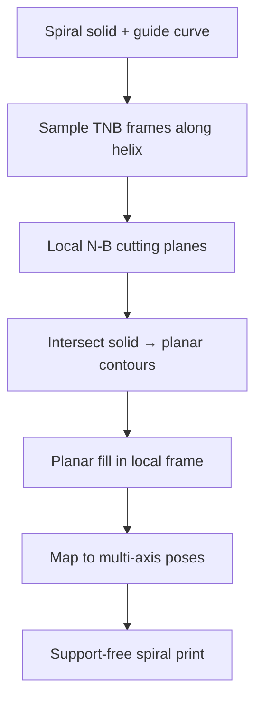

# #28 — Multi-axis spiral parts without supports (METU 2021)

- **Family:** C
- **Link:** —
- **Source:** compendium `paper-01.pdf` / `held-papers.json`

## When to use (adaptive slicer product)
Use when the part follows a helical / spiral guide (springs, screws, spiral ornaments, ducted spirals) and multi-axis hardware can keep planar slices roughly orthogonal to a moving TNB frame so overhangs never need supports. Prefer over general volume decomposition when a single guide curve captures the geometry.

## Core idea (one sentence)
Sweep planar slices in Frenet–Serret (TNB) frames along a helical guide so each layer prints locally flat in a moving frame and the spiral builds without supports.

## Algorithm (plain steps)
1. Extract or design a helical / spiral guide curve through the part (centerline of the spiral solid).
2. Sample the curve; at each sample compute the Frenet–Serret frame: tangent \(T\), principal normal \(N\), binormal \(B\).
3. Define a cutting plane spanning the \(N\)–\(B\) (or appropriate normal plane) at each sample so the plane is locally orthogonal to the advance direction.
4. Intersect the solid with successive TNB planes to obtain planar contours in the local frame.
5. Fill each contour with standard planar toolpaths (family A / F continuous fill) expressed in the local frame.
6. Map local paths back to machine space: orient the multi-axis nozzle or rotary table so the tool axis aligns with the local frame normal; advance along the guide.
7. Sequence frames continuously along the helix so deposition never leaves an unsupported overhang relative to the already-printed spiral.

## Constraints / what to expect
- Geometry must admit a clean helical guide; branched or non-spiral overhangs need RoboFDM/#70-style cuts or family B instead.
- Frenet frame can flip or become undefined at vanishing curvature — stabilize with parallel transport / Bishop frames in practice (inference for product robustness).
- Multi-axis hardware required (5-axis or robot); stock 3-axis cannot hold TNB orientations.
- Indexed vs simultaneous motion: smooth helix prefers continuous orientation change (hand off to D for singularities / C-axis wrap).
- No held numerical quality metrics in inventory — expect qualitative support elimination vs 3-axis baseline (METU AMCTURKEY 2021 abstract).

## Data in
- Spiral-capable mesh or sweep solid; guide curve (or auto-skeleton); layer height in local frame; multi-axis kinematics.

## Data out
- Ordered local planar contours + fills; per-layer TNB / tool orientation; multi-axis G-code or robot TCP path along the helix.

## Argument → proof sketch → conclusion
**Argument.** A helix’s natural advance direction is the tangent; slicing in the normal plane keeps each bead supported by the previous turn’s material, so conventional overhang supports are unnecessary.
**Proof sketch.** (Inference from held core idea + approach card C.) For a tubular neighborhood of a helix, each TNB cross-section is a planar printable disk/annulus; stacking along \(T\) reproduces the solid; local overhang angle relative to the just-printed layer stays within the self-support cone by construction of the guide. Compare to 3-axis: the same spiral would present large overhangs and need supports.
**Conclusion.** TNB-guided planar slicing is the family-C method of choice for helical parts on multi-axis hardware, avoiding both supports and a general curved volumetric field.

## Chaining
- Before: CAD sweep / guide-curve design; optional G to thicken walls for stiffness.
- After: A/F planar fill inside each TNB slice; D for continuous orientation tracking and singularity avoidance along the helix; optional E fiber along the helical geodesic.
- Do not chain with: C conical RoMEX stacks meant for different primitives; avoid B full-volume fields unless the spiral guide fails.

## Notes / inventory flags
- **Missing link** in `held-papers.json` / Part A table (dash). METU open record: Fazla, Dilberoğlu, Yaman, Dölen — AMCTURKEY 2021 abstract “Multi-axis 3D printing of spiral parts without supports.” Enrich algorithm from core_idea + approach card C only; no fabricated metrics.
