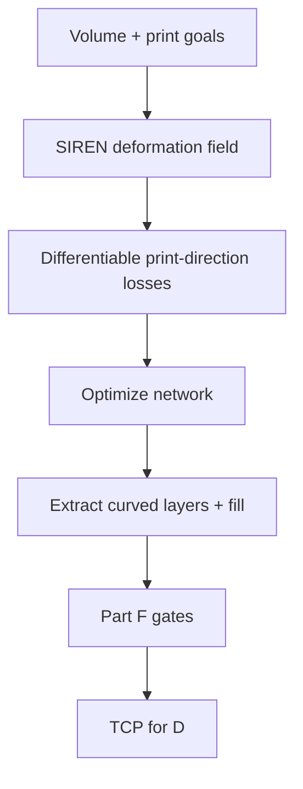

# #29 — Neural Slicer (2024)

- **Family:** B
- **Link:** doi.org/10.1145/3658212
- **Source:** compendium `paper-01.pdf` / `held-papers.json`

## When to use (adaptive slicer product)
- Multi-axis product roadmap wants learned / differentiable deformation fields instead of hand-crafted geodesic or stress PDEs.
- Print-direction losses (support-free, strength, surface-related) must back-propagate into the layer field.
- Sibling to S3 (#45) when SIREN parameterizations are preferred over quaternion deformation.
- Booklet 4.3 / Scenario 2: Neural alongside S3 / INF for support-free + multi-goal volumes.
- Prefer when the team already has GPU training loops and wants a unified loss API for print goals.
- Decision map DeformB includes Neural #29 with Reinforced / S3 / INF.

## Core idea (one sentence)
Fit SIREN deformation fields optimized under differentiable print-direction losses so iso-layers meet multi-axis printability goals.

## Algorithm (plain steps)
1. Represent the volume deformation (or layer field) with a SIREN implicit network.
2. Define differentiable losses on print direction: local overhang / support need, strength alignment, surface metrics as available.
3. Sample the volume; optimize SIREN parameters until iso-surfaces satisfy thickness band and direction losses.
4. Extract curved layers from the deformed / implicit field; generate fill paths.
5. Smooth orientation field; run Part F gates including collision-free order (Reeb #68 / INF #18 if needed).
6. Emit TCP for family D; optionally feed layers to E under fiber bend-radius limits.

## Constraints / what to expect
- Multi-axis hardware; Part F gates still apply after neural optimization — networks do not magically remove collisions.
- Training / optimization cost higher than classical geodesic (#16/#69); needs GPU-friendly product path.
- Tunnel topology may still need Reeb sequencing (#68 / INF #18) on top of the neural field.
- No dedicated Part D “Neural Slicer” repo listed; NeuralTOMO is a related co-optimization code anchor.
- Validate thickness after iso-extraction; SIREN isolines can oscillate near thin features.

## Data in
- Volume / mesh; loss weights (support, strength, surface); optional FEA; kinematic clearance for collision terms if used.

## Data out
- Optimized SIREN field; curved layers + tool vectors; TCP for D.

## Argument → proof sketch → conclusion
**Argument.** Neural Slicer is the B pick when the product bets on differentiable print-direction objectives inside a SIREN field rather than classical geodesic growth or S3 quaternion deform.
**Proof sketch.** Held core idea: SIREN deformation fields with differentiable print-direction losses. Decision map groups Neural #29 with Reinforced / S3 / INF under multi-goal 5-axis; approach card B lists SIREN / implicit neural (#29, #18, #20) as a field type.
**Conclusion.** Prefer #29 for differentiable SIREN deformation slicing; prefer #20 when dual layer/path SIRENs + explicit differentiable collision are required; prefer #18 when guidance/motion fields + Reeb sequencing are the headline.

## Chaining
- Before: optional G TO / FEA to seed losses; mesh → implicit sampling.
- After: E fiber on optimized layers; D IK (#49/#64); Reeb reorder (#68) if global order fails; #51 for residual overhang.
- Do not chain with: pure 3-axis A on Cartesian-only hardware.

## Notes / inventory flags
- DOI 10.1145/3658212; no standalone Part D repo for Neural Slicer — related: NeuralTOMO (`github.com/RyanTaoLiu/NeuralTOMO`).
