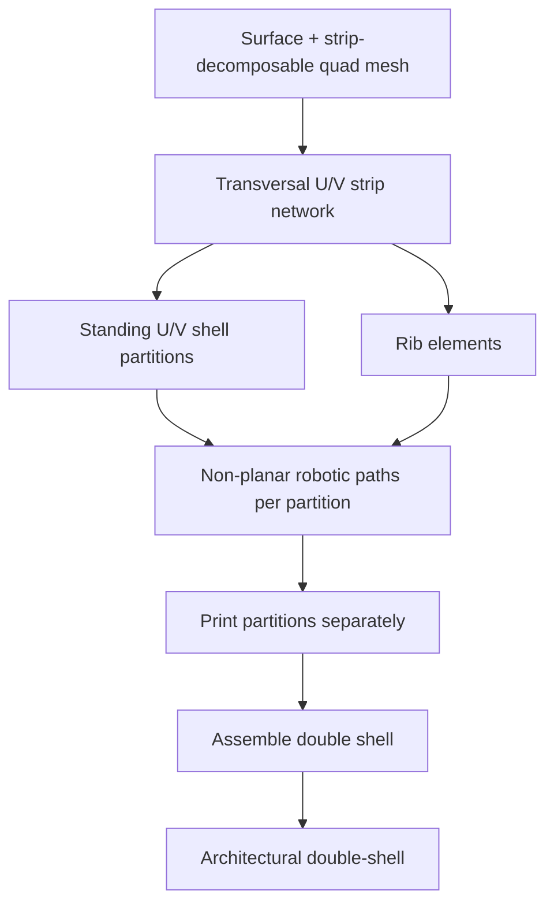

# #30 — Non-planar printing of double shells (2025)

- **Family:** C
- **Link:** arxiv.org/abs/2501.06088
- **Source:** compendium `paper-01.pdf` / `held-papers.json`

## When to use (adaptive slicer product)
Use for architectural thin double-shell structures (façade panels, concrete-casting molds, pavilion skins) fabricated on multi-axis robotic FDM. Prefer when you already have — or can build — a transversal strip network / strip-decomposable quad mesh and need U/V standing shells plus ribs printed as separate partitions then assembled.

## Core idea (one sentence)
Convert strip-decomposable quad meshes into transversal U/V standing shell partitions plus ribs, each printable non-planar on a robot, then assemble into a double-shell.

## Algorithm (plain steps)
1. Start from a target surface and an underlying transversal strip network (from existing strip-decomposition / quad-mesh methods).
2. Lift strips into standing shell partitions in the U and V transversal directions (double shell: inner and outer or crossed standing walls).
3. Derive rib elements from the strip layout to stiffen and connect the shells.
4. Convert each strip/rib into a printable partition with specifications that keep multi-axis FDM deposition feasible (access, thickness, continuity).
5. Plan non-planar robotic toolpaths per partition (standing shells printed in transversal directions, not as stacked horizontal layers).
6. Print partitions separately; assemble into the double-shell structure per the workflow’s joining scheme.
7. Validate on digital and physical demonstrators across scales and geometric complexity (RobArch 2024 / Springer 2025 lineage).

## Constraints / what to expect
- Requires robotic multi-axis FDM; not a 3-axis OPP workflow like ACAP.
- Partitions print separately — assembly tolerances, seams, and joining hardware/process dominate final quality.
- Depends on quality of the strip / quad decomposition; poor strips yield non-printable or colliding partitions.
- Aimed at lightweight thin walls and molds, not dense solids.
- Abstract reports versatility across scales; do not invent numeric strength or time metrics beyond what the paper states.

## Data in
- Design surface; strip-decomposable quad mesh / transversal strip network; shell thickness; rib policy; robot kinematics and build volume.

## Data out
- U/V standing shell partitions + ribs; per-partition non-planar toolpaths; assembly sequence / join map; robot programs per piece.

## Argument → proof sketch → conclusion
**Argument.** Double shells gain stiffness from two coupled thin walls plus ribs; printing them as transversal standing partitions lets beads follow structural directions and avoids horizontal-layer staircasing and supports typical of planar FDM shells.
**Proof sketch.** (From arXiv abstract + held core idea + approach card C.) Strip networks partition the surface into developable-enough bands; standing U/V shells are each continuously depositable on a robot; ribs from the same strips close the load path; separate print + assemble is feasible when partition specs enforce access and thickness. Demonstrators on varied scales support robustness claims qualitatively.
**Conclusion.** Double-shell transversal printing extends family-C shell decomposition from single ACAP patches to architectural U/V double skins with ribs.

## Chaining
- Before: strip/quad mesh generation (geometry pipeline); optional G for rib layout under loads.
- After: E fiber along shell geodesics on U/V walls; D for robotic trajectories per partition and between assembly fixtures.
- Do not chain with: A 3-axis mild skins as a substitute for standing transversal shells; avoid flattening into RoboFDM planar cuts if the structural intent is standing U/V beads.

## Notes / inventory flags
- Link present: `arxiv.org/abs/2501.06088` (Mitropoulou, Vaxman, Diamanti, Dillenburger; RobArch 2024 → Springer 2025).
- Enrichment from abstract only; no invented metrics.
