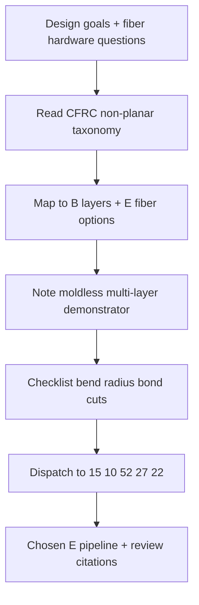

# #31 — Non-planar CFRC review (2025)

- **Family:** E (continuous fiber / anisotropy)
- **Link:** —
- **Source:** compendium `paper-01.pdf` / `held-papers.json`

## When to use (adaptive slicer product)
- Orientation / literature card: survey non-planar continuous fiber–reinforced composites (CFRC) before picking #10/#15/#52/#27.
- Product docs or decision UI that need a moldless multi-layer continuous-fiber demonstrator reference.
- When justifying why fiber on curved layers beats planar laminates for a given part class.
- Gap-finding: compare inventory E papers against the review’s cited landscape (link currently missing).

## Core idea (one sentence)
Composites review with moldless multi-layer demonstrator.

## Algorithm (plain steps)
1. Treat as a review, not a slicer algorithm: extract taxonomy of non-planar CFRC processes (moldless vs molded, planar vs curved layers, fiber feed types).
2. Map review categories onto product families: B layers + E fiber (#10/#15/#52/#27/#22), optional G orientation TO.
3. Pull the moldless multi-layer demonstrator as a reference pipeline: layer field → fiber placement → multi-layer stack without a mold.
4. Derive product checklist from review themes: bend radius, impregnation, cut/restart, interlayer bonding, distortion.
5. Route the user to concrete E algorithms (#15 field, #10 spatial loops, #52 dense RoSy, #27 MILP) based on that checklist.
6. Record missing citations / broken link for inventory follow-up (Part G style).

## Constraints / what to expect
- Not an implementable toolpath generator — orientation and validation reference only.
- Link empty in inventory; cannot fetch PDF from held metadata alone.
- Self-support / moldless claims assume process capability the user’s machine may lack.
- Demonstrator details (materials, axis count, metrics) not present in paper-01 one-liners.

## Data in
- Product question (hardware class, moldless?, multi-layer fiber?); optional competitor / citation list from the review when link is restored.

## Data out
- Annotated taxonomy → family E dispatch; checklist of CFRC constraints; citation stubs; pointer to sibling E cards.

## Argument → proof sketch → conclusion
**Argument.** Non-planar CFRC needs a shared map of process options and a moldless multi-layer existence proof so slicer products do not reinvent fiber on curves in isolation.
**Proof sketch.** Held entry classifies #31 as a composites review with a moldless multi-layer demonstrator — sufficient to place it as the E-family survey node above algorithmic papers #10/#15/#52/#27/#22.
**Conclusion.** Product takeaway: use #31 in docs and decision trees; implement paths from sibling E cards. Restore the bibliographic link when available (currently —).

## Chaining
- Before: none required (survey entry point for E).
- After: dispatch to #15 / #10 / #52 / #27 / #22; pair narrative with B Reinforced (#42) and G self-support TO (#48/#47) when discussing moldless stacks.
- Do not chain with: treating #31 as a drop-in algorithm replacing field or MILP steps.

## Notes / inventory flags
- Title cleaned: trailing em dash from JSON stripped; link empty → `—` per instructions.
- paper-01.txt Part A table confirms core idea; no DOI/arXiv in corpus — **gap: missing link**.
- Part G inventory notes other link fixes historically; #31 still unresolved.
- Flag: full review text not held; card is best-effort from one-line core idea + family E context.
