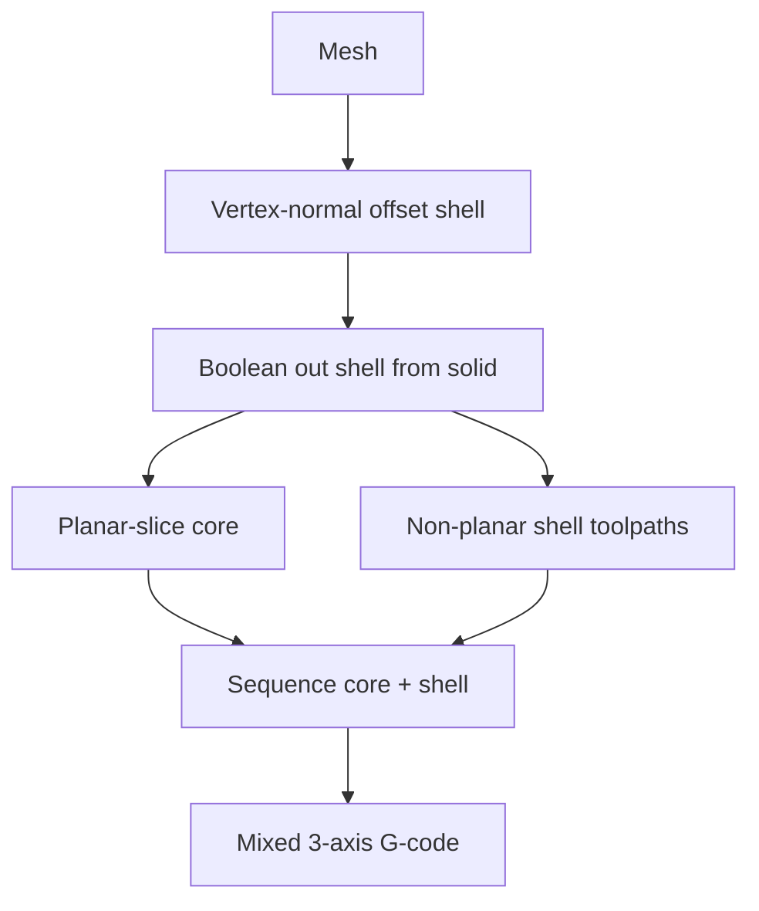

# #32 — Modeling of non-planar slicer for MEX (2024)

- **Family:** A
- **Link:** arxiv.org/abs/2411.07225
- **Source:** compendium `paper-01.pdf` / `held-papers.json`

## When to use (adaptive slicer product)
- Mixed strategy: planar structural core + non-planar outer shell on 3-axis MEX/FFF.
- Cosmetic/strength shell without curving the entire volume.
- Product toggle: “non-planar shell over planar infill.”

## Core idea (one sentence)
Mixed planar/non-planar: vertex-normal offset shell booleaned out before planar slicing.

## Algorithm (plain steps)
1. From the input mesh, build an outer shell by offsetting along vertex normals.
2. Boolean-subtract that shell from the solid so core and shell volumes are separate.
3. Planar-slice the remaining core with a standard planar slicer.
4. Generate non-planar toolpaths on the shell (surface-following / projected fill consistent with Family A).
5. Sequence shell vs core deposition and emit combined 3-axis G-code.

## Constraints / what to expect
- Shell thickness must remain printable and cone-safe where non-planar.
- Boolean robustness depends on mesh quality (offsets can self-intersect).
- Interface between planar core and non-planar shell needs bonding/overlap policy.
- Still 3-axis — not a substitute for multi-axis support-free printing.

## Data in
- Mesh; shell thickness / offset distance; planar layer height; clearance for shell paths.

## Data out
- Dual toolpath sets (planar core + non-planar shell), sequenced 3-axis G-code; shell/core masks.

## Argument → proof sketch → conclusion
**Argument.** Many parts only need a curved skin; warping or atomizing the whole volume is wasteful.
**Proof sketch.** Part A (#32) isolates a vertex-normal offset shell, booleans it out, then planar-slices the rest — matches approach-card “mixed planar core + non-planar shell.” Family A hardware stays sufficient if shell slopes pass the cone.
**Conclusion.** Product mode: offset shell → boolean → planar core + non-planar shell → G-code. Optional E fiber on the shell after; escalate to B only if shell geometry breaks 3-axis clearance.

## Chaining
- Before: mesh repair / solid classification; optional F adaptive thickness for the core.
- After: optional E fiber on the shell; standard 3-axis print.
- Do not chain with: whole-volume CurviSlicer/QuickCurve warp on the already-separated core (redundant); avoid C decomposition unless shell patches need multi-direction access.

## Notes / inventory flags
- arXiv 2411.07225; Part G notes this link was newly attached to a previously link-less row.
