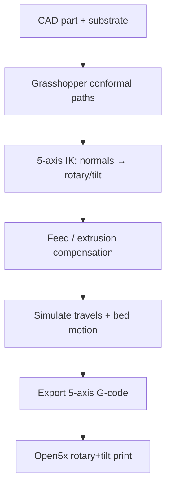

# #33 — Open5x (2022)

- **Family:** C
- **Link:** —
- **Source:** compendium `paper-01.pdf` / `held-papers.json`

## When to use (adaptive slicer product)
Use when upgrading a desktop 3-axis FFF printer with a rotary-plus-tilt bed (U/V) for accessible conformal / 3+2 printing, and the workflow should stay inside Rhino+Grasshopper for design, simulation, and G-code. Entry hardware ladder step toward multi-axis before full robots or simultaneous 5-axis gantries; foundation for conformal multi-material work (#1).

## Core idea (one sentence)
A low-cost rotary-plus-tilt retrofit plus a Grasshopper conformal slicer brings 5-axis conformal deposition to off-the-shelf desktop FFF machines.

## Algorithm (plain steps)
1. Mechanically retrofit the printer bed with rotary and tilt axes (Open5x U/V); wire into multi-axis-capable electronics (e.g. Duet).
2. In Rhino/Grasshopper: load substrate (polysurface) and part geometry in one CAD environment.
3. Generate conformal toolpaths on the substrate (surface-normal-aligned beads / layers) via the Grasshopper slicer GUI.
4. Compute 5-axis inverse kinematics (arccos / atan2 mapping from surface normals to bed rotation and tilt).
5. Apply motion/extrusion optimization: speed compensation so tip speed relative to the part stays consistent (feed scaled by distance-to-length ratio along 5-axis moves).
6. Simulate travels and bed motion in Grasshopper to preview collisions.
7. Export machine G-code (XYZ + rotary/tilt) and print on the retrofitted desktop machine.

## Constraints / what to expect
- Indexed / bed-tilting 5-axis on a desktop envelope — not a robot workspace; reach and tilt limits apply.
- Part F pitfalls: two IK solutions, pole singularity at zero tilt, C-axis wrap, nonlinear motion without TCP; calibrate rotation-center offsets and nozzle length.
- Upstream Marlin/RRF/Klipper often lack TCP — Open5x-style posts bake IK into G-code (or use Duet configs supporting the extra axes).
- Grasshopper toolchain is powerful but not fully “open slicer product” UX; GitHub hardware files are the reproducibility anchor.
- Longer nozzles help clearance when the bed tilts (as used in follow-on #1).

## Data in
- Rhino geometry (part + substrate polysurface); machine kinematic calibration (pivot offsets, nozzle length); layer/bead params; material temps/speeds.

## Data out
- Conformal toolpaths with bed rotary/tilt commands; simulated preview; desktop 5-axis G-code; optional travel/collision report from the GH preview.

## Argument → proof sketch → conclusion
**Argument.** Cost and closed GUI tooling block makers from conformal multi-axis benefits; a printable retrofit plus visual-script slicer removes that barrier while preserving CAD→path→code in one environment.
**Proof sketch.** (Inference from held core idea + approach card C + Open5x public description.) Rotary+tilt spans surface normals for conformal layers; IK maps normals to axis angles; feed compensation keeps extrusion physically correct when rotaries move; CHI’22 LBW demonstrates accessible hardware+software together. Related RotBot is nozzle-tilt hardware-native warp — complementary rung on the same ladder.
**Conclusion.** Open5x is the productizing hardware+slicer pattern for family-C conformal work on desktop machines, and the base for multi-material conformal antennas (#1).

## Chaining
- Before: F formats / mesh hygiene; design substrate in CAD.
- After: A planar fill only on untilted regions if mixed; D post for singularity-aware refinement; #1 multi-material toolchanger conformal antennas on the same kinematic pattern; optional E on conformal shells.
- Do not chain with: B full volumetric fields that ignore the bed’s rotary+tilt IK model; avoid assuming TCP on stock Marlin without a post.

## Notes / inventory flags
- **Missing link** in `held-papers.json` / Part A table (dash). Public anchors: CHI’22 EA doi.org/10.1145/3491101.3519782; arXiv 2202.11426; github.com/FreddieHong19/Open5x (Hong, Hodges, Myant, Boyle).
- Card enriched from public Open5x descriptions; no invented print-quality metrics.
