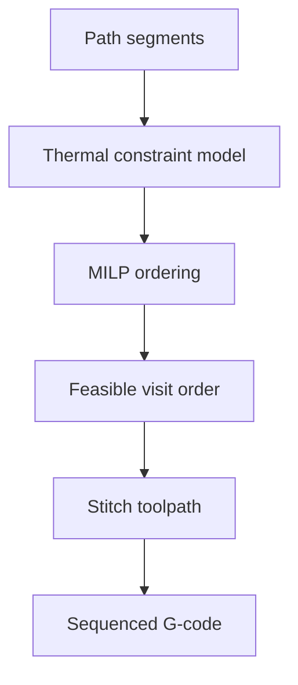

# #34 — Optimal toolpaths with thermal constraints (2020)

- **Family:** F-toolpath (general toolpath planning)
- **Link:** arxiv.org/abs/2007.09626
- **Source:** compendium `paper-01.pdf` / `held-papers.json`

## When to use (adaptive slicer product)
- Segment/region ordering must respect temperature bounds (avoid reheating too soon or printing on too-cold beads).
- Small-to-medium path graphs where MILP ordering is tractable.
- Planar or already-sliced layers needing thermal-aware sequencing.

## Core idea (one sentence)
Order toolpath segments with MILP under temperature bounds.

## Algorithm (plain steps)
1. Discretize the layer (or region) into printable segments/nodes.
2. Build a thermal model proxy (cool-down / reheat constraints between visits).
3. Formulate MILP: visit order / edges subject to temperature bounds and continuity where required.
4. Solve for a feasible (or optimal time) ordering.
5. Stitch ordered segments into toolpaths with travels/retractions as needed.
6. Emit sequenced G-code; optionally re-check thermal residuals.

## Constraints / what to expect
- MILP scales poorly to huge segment counts — use on critical regions or coarse graphs.
- Thermal proxy quality limits real-world guarantee.
- Ordering method, not a contour generator.

## Data in
- Segment set / graph
- Temperature bounds and cooling model parameters
- Time / travel cost weights

## Data out
- Thermally feasible segment order
- Sequenced toolpath / G-code

## Argument → proof sketch → conclusion
**Argument.** Even perfect geometry fails if bead temperature history is ignored; ordering is part of family F toolpath quality.
**Proof sketch.** paper-01 F-toolpath: MILP ordering under temperature bounds; approach-card F lists thermal MILP #34.
**Conclusion.** Apply #34 as a sequencing pass after #9/#53/#35 paths exist, on regions where heat matters.

## Chaining
- Before: Contours + fill candidates (#35/#9/#53).
- After: Post-processor; optional process twin #24 for validation.
- Do not chain with: Do not run MILP on unsimplified full-part polylines without coarsening.

## Notes / inventory flags
- arXiv 2007.09626.
- Related process-side checks: concrete rheology #59 is a different Process family.
