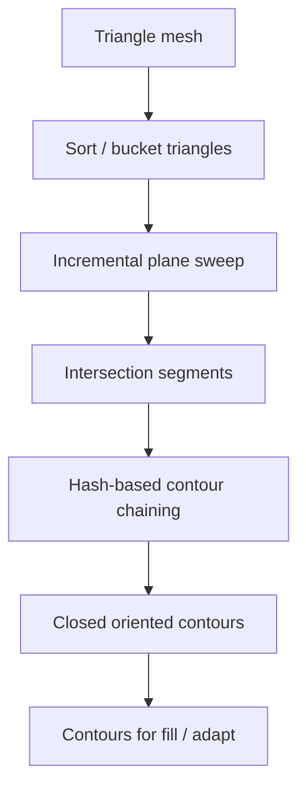

# #35 — Optimal triangle mesh slicing

- **Family:** F-planar (adaptive slicing / mesh formats)
- **Link:** —
- **Source:** compendium `paper-01.pdf` / `held-papers.json`

## When to use (adaptive slicer product)
- Core planar slicer engine needs fast, robust contour extraction from triangle meshes.
- Product must chain triangle intersections into closed loops without O(n²) naive search.
- Foundation step before adaptive thickness (#2/#3) or A skins.

## Core idea (one sentence)
Incremental sweep slicing plus hash-based contour chaining for efficient triangle-mesh contours.

## Algorithm (plain steps)
1. Sort mesh triangles and sweep a plane along Z (or the build axis).
2. Maintain the active triangle set; compute edge–plane intersections incrementally.
3. Hash endpoints / edge keys to chain intersection segments into polylines.
4. Close and orient contours; classify outer loops vs holes.
5. Optionally attach adaptive height decisions (#2/#3) using the contours.
6. Export contours to fill / toolpath modules.

## Constraints / what to expect
- Assumes manifold-enough topology; open soups need #58 half-edge repair first.
- “Optimal” here is algorithmic efficiency of sweep+hash, not multi-objective print quality.
- Empty link in inventory.

## Data in
- Triangle mesh (STL/3MF)
- Slice direction and height list (uniform or adaptive)
- Tolerance for chaining / welding

## Data out
- Closed planar contours (outer + holes)
- Segment adjacency suitable for fill

## Argument → proof sketch → conclusion
**Argument.** Every adaptive and non-planar pipeline still rests on fast planar contouring of triangle meshes.
**Proof sketch.** approach-card F algorithm sketch step 1 cites incremental sweep + hash contour chaining (#35) as the mesh slicing foundation.
**Conclusion.** Keep #35 as the default mesh→contour engine; layer #2/#3 adaptivity and A skins on top.

## Chaining
- Before: #58 mesh hygiene; #57 format ingest (3MF preferred over raw STL when available).
- After: #2/#3 adaptive heights; planar fill #9/#53; A Song/ZAA.
- Do not chain with: Do not skip repair on non-manifold soups — hashing cannot invent missing topology.

## Notes / inventory flags
- Link empty → `—`.
- Title cleaned (no trailing em-dash).
- Inventory flag: foundational; pair with 2015 saliency-preserving slicing gap noted in Part G if feature-aware heights are required.
