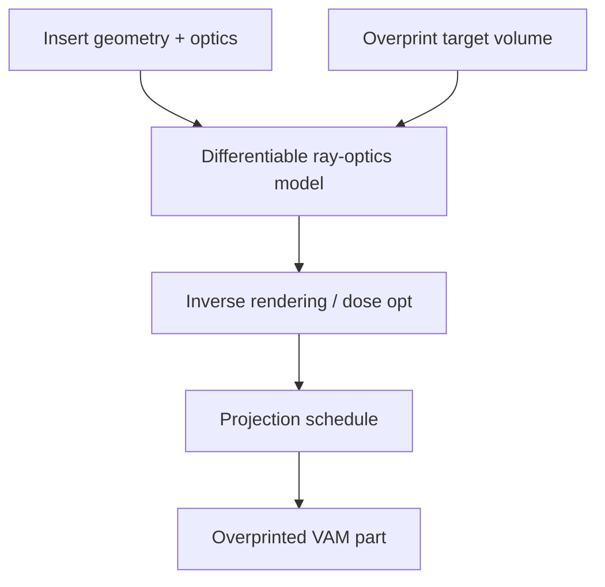

# #36 — Overprinting with tomographic VAM (2025)

- **Family:** VPP (vat / volumetric / multi-axis DLP)
- **Link:** arxiv.org/abs/2507.13842
- **Source:** compendium `paper-01.pdf` / `held-papers.json`

## When to use (adaptive slicer product)
- Volumetric additive manufacturing must cure around existing inserts / preforms.
- Product feature: overprint onto embedded components via differentiable ray-optics inverse rendering.
- Extension of CAL (#8) to non-empty vats.

## Core idea (one sentence)
Use differentiable ray-optics inverse rendering to tomographically overprint around inserts.

## Algorithm (plain steps)
1. Digitize insert / preform pose and optical properties in the vat.
2. Build a differentiable ray-optics forward model including occlusion/refraction from the insert.
3. Optimize projections so new material cures in the target overprint region only.
4. Respect dose constraints to protect the insert and avoid stray gelation.
5. Execute tomographic exposure schedule.
6. Extract hybrid insert+resin part.

## Constraints / what to expect
- Optical calibration of inserts is mandatory; wrong optics ⇒ wrong cure.
- Computationally heavier than empty-vat CAL.
- Still VPP/VAM — not FFF over-extrusion.

## Data in
- Insert mesh/pose/optics
- Target overprint volume
- Resin and projector parameters

## Data out
- Optimized projections accounting for inserts
- Hybrid cured assembly

## Argument → proof sketch → conclusion
**Argument.** Real VAM products must add material onto fixtures/electronics/structures already in the vat.
**Proof sketch.** paper-01 VPP: differentiable ray-optics inverse rendering around inserts (arxiv 2507.13842).
**Conclusion.** Use #36 whenever CAL-style systems overprint; keep #8 for empty-vat baselines.

## Chaining
- Before: #8 CAL pipeline; insert fixturing.
- After: Wash/post-cure; functional test of insert interfaces.
- Do not chain with: Do not treat as FFF ironing/over-extrusion.

## Notes / inventory flags
- arXiv 2507.13842.
- Sibling: #44 roll-to-roll CAL.
