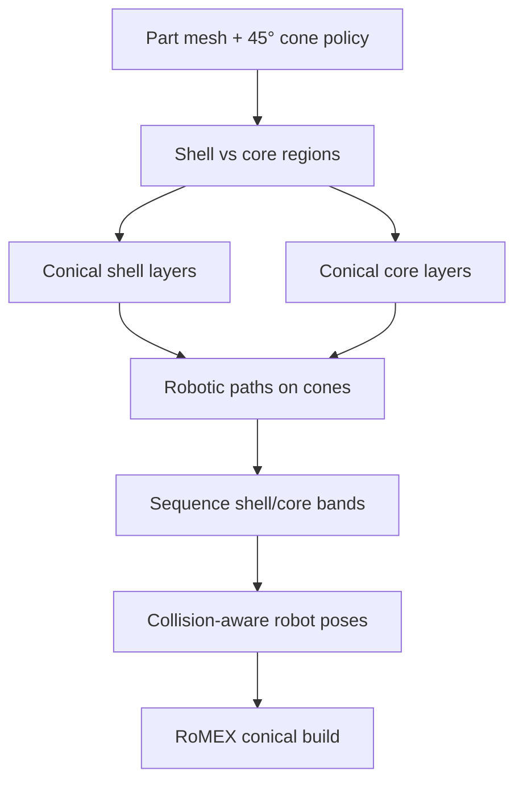

# #37 — RoMEX non-planar robotic path planning (2023)

- **Family:** C
- **Link:** —
- **Source:** compendium `paper-01.pdf` / `held-papers.json`

## When to use (adaptive slicer product)
Use when the part suits a conical deposition strategy — stacked 45° conical shell layers wrapping a core — on a robotic MEX cell, and you want hardware-native non-planar paths without a full geodesic/neural field (B) or planar cut decomposition (RoboFDM/#70). Good for rotationally biased solids and shells that benefit from a fixed cone angle.

## Core idea (one sentence)
Stack alternating 45° conical shell and core layers so robotic non-planar paths build the part with reduced supports and a simple cone-native toolpath grammar.

## Algorithm (plain steps)
1. Classify the volume into a conical shell region and an interior core region compatible with a chosen cone angle (held: 45°).
2. Generate conical shell layers: iso-curves / offsets on a 45° cone family that wrap the outer form.
3. Generate conical core layers stacked to fill the interior, keeping local overhang within the cone’s self-support regime.
4. Plan robotic toolpaths along each conical layer (contour-parallel or spiral on the cone), maintaining nozzle roughly normal to the local cone surface.
5. Alternate or sequence shell vs core deposition per the RoMEX path-planning policy so already-printed material supports the next cone band.
6. Collision-check robot poses against part, fixture, and extruder; hand off hard IK / singularity cases to family D.
7. Emit robot program (TCP + orientation) for the stacked conical schedule.

## Constraints / what to expect
- Cone angle fixed near 45° in the held description — not a free scalar field like B; geometry poorly aligned to cones will leave gaps or need fallback supports.
- Robotic MEX required; stock 3-axis cannot follow conical shells.
- Seams between shell and core bands; plan bonding and cooling.
- Related hardware-native alternative: RotBot (Wüthrich 2021) warps by distance from rotation axis, planar-slices, then back-transforms — different mechanism, same family-C “hardware owns the warp” spirit.
- No held quantitative metrics (missing link) — describe outcomes qualitatively only.

## Data in
- Mesh; cone angle (default 45°); shell thickness vs core policy; robot kinematic model and clearance.

## Data out
- Ordered conical shell and core layers; per-layer tool vectors; robot TCP/joint program; optional residual support flags where the cone family cannot cover.

## Argument → proof sketch → conclusion
**Argument.** A 45° cone sits at a classical FDM self-support boundary; depositing along conical isosurfaces keeps local overhang printable while the robot continuously reorients, avoiding both planar supports and a heavyweight volumetric field solve.
**Proof sketch.** (Inference from held core idea + approach card C.) Shell layers on the cone surface are developable enough for continuous extrusion; core layers stacked under the same angle inherit support from below; sequencing shell↔core preserves access. Compared to RoboFDM’s planar cuts, the cone stack is continuous in angle rather than piecewise indexed.
**Conclusion.** RoMEX-style conical shell+core stacking is a hardware-native family-C path for robotic MEX when the part matches a conical grammar.

## Chaining
- Before: G to bias the design toward conical/self-supporting silhouettes; F mesh repair.
- After: D for robot IK, singularity cones, and timing; optional E fiber along conical geodesics on the shell.
- Do not chain with: A slope-limited 3-axis skins as a replacement (hardware mismatch); avoid simultaneous B field on the same volume unless cones fail.

## Notes / inventory flags
- **Missing link** in `held-papers.json` / Part A table (dash). Card built from core_idea (“Stacked 45° conical shell and core layers”) + approach card C; do not invent metrics.
- Related: RotBot (Wüthrich 2021) cited in approach card C as related hardware-native warp.
