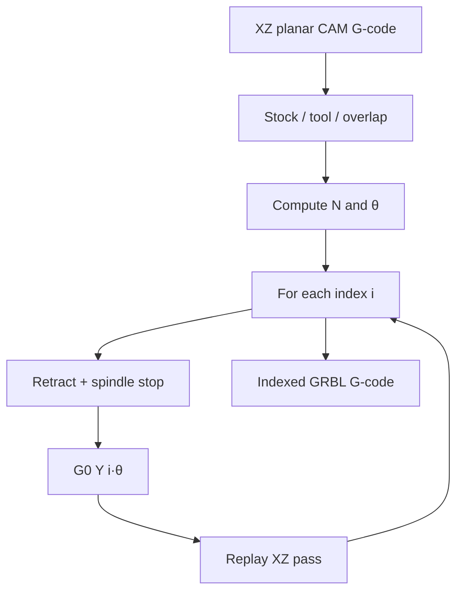

# #38 — Indexed rotary post-processor for GRBL (2025)

- **Family:** D
- **Link:** arxiv.org/abs/2509.11433
- **Source:** compendium `paper-01.pdf` / `held-papers.json`

## When to use (adaptive slicer product)
- Low-cost **GRBL** desktop CNC (education, makerspace, prototyping) that has a spare axis channel and a mechanical rotary chuck but **vanilla GRBL has no true 4th-axis / TCP**.
- Parts are solids of revolution or multi-sided indexed work — **3+1 stop-and-rotate**, not simultaneous 4/5-axis freeform.
- Product needs a software-only path from Fusion/Mastercam planar XZ toolpaths → GRBL G-code with Y used as indexed angle — no firmware fork.

## Core idea (one sentence)
Post-process a planar XZ CAM toolpath into many discrete angular passes by injecting `G0 Yθ` index moves (with spindle stop and Z retract) so a GRBL machine emulates an indexed rotary axis in software.

## Algorithm (plain steps)
1. In CAM, orient the revolved part with axis along X; reduce to an XZ cross-section thinner than the tool diameter; generate a 3D-parallel (or similar) planar toolpath at reduced feed/stepover (~75% of milling norms).
2. Export GRBL-style G-code; note tool diameter and stock diameter (comments or UI).
3. Compute pass count and angular step: effective cut width \(w=\alpha\cdot D_{\mathrm{tool}}\) (overlap \(\alpha\approx 0.8\)); \(N=\lceil\pi D_{\mathrm{toolpath}}/w\rceil\); \(\theta=360^\circ/N\).
4. Parse G-code: keep X/Z moves; strip existing Y; for each index \(i=0\ldots N-1\): emit safe retract + spindle stop, `G0 Y(i·θ)`, restore spindle/feed, replay XZ pass.
5. Optionally estimate radial scallop / max deviation from \(\theta\) to guide resolution vs time trade-off.
6. Preview 2D path + revolved 3D reconstruction in GUI or browser UI; write final GRBL file.
7. Hardware: map rotary stepper (e.g. NEMA 23 + belt + chuck) to the controller’s Y output at known gear ratio (1:1 keeps post-processor angles literal).
8. Run; calibrate stock diameter and backlash; accept faceted surface as indexed artifact.

## Constraints / what to expect
- **Not** continuous 4-axis: visible facets/toolmarks; finer \(N\) improves finish but grows time and file size (example: N≈80 at ~4.5° for Ø22 mm stock).
- Reported dimensional errors on test parts are indicative only (~wood −0.20 mm, copper +0.25 mm) — depend on machine, tool, material.
- No real-time TCP, no coordinated XYZC interpolation, no dynamic rotary torque compensation.
- Y axis is consumed by rotary — machine cannot use Y as linear travel while indexing this way.
- Non-1:1 pulley ratios need scale factors in the post-processor.
- Safety interlocks (retract, spindle stop) during index are mandatory to avoid crashes.

## Data in
- Planar XZ G-code from CAM; stock diameter; tool diameter; overlap factor; optional feed overrides; rotary gear ratio.

## Data out
- GRBL-compatible G-code with interleaved `Y` index moves; 2D/3D preview; pass count and \(\theta\); optional scallop estimate.

## Argument → proof sketch → conclusion
**Argument.** True 4-axis desktops are costly; vanilla GRBL lacks rotary kinematics; hardware/controller swaps defeat the low-cost stack — so indexed rotary must be emulated in post at G-code level.
**Proof sketch.** Derive \(N,\theta\) from tool/stock geometry; rewrite planar passes with safe index moves on Y; validate on wood and copper with GUI/web previews; show faceting vs \(N\) trade-off without firmware changes.
**Conclusion.** Software-only indexed post-processing is the pragmatic D path for GRBL shops that need rotary parts without leaving the GRBL ecosystem.

## Chaining
- Before: conventional CAM planar profile for a revolved solid (Fusion 360 etc.); mechanical rotary on Y.
- After: GRBL execution; manual finish if facets matter; escalate to LinuxCNC xyzac-trt / Marlin2ForPipetBot TCP or #49 singularity-aware planning when simultaneous multi-axis printing is required.
- Do not chain with: FRIK (#64) or printing-while-moving (#39) as if they were GRBL posts; B/C freeform toolvectors expecting continuous 5-axis; treating indexed passes as equivalent to TCP simultaneous motion.

## Notes / inventory flags
- arXiv 2509.11433; Python post-processor + web UI (Zenodo / Vercel links in paper).
- Explicitly **indexed / stop-and-rotate**, aligned with Part F “3+2 indexed” mode — not simultaneous 5-axis.
- Family D software contrast: use this on GRBL; use Marlin2ForPipetBot / LinuxCNC trt kins / TOPP-RA when real multi-axis printing is the goal.
