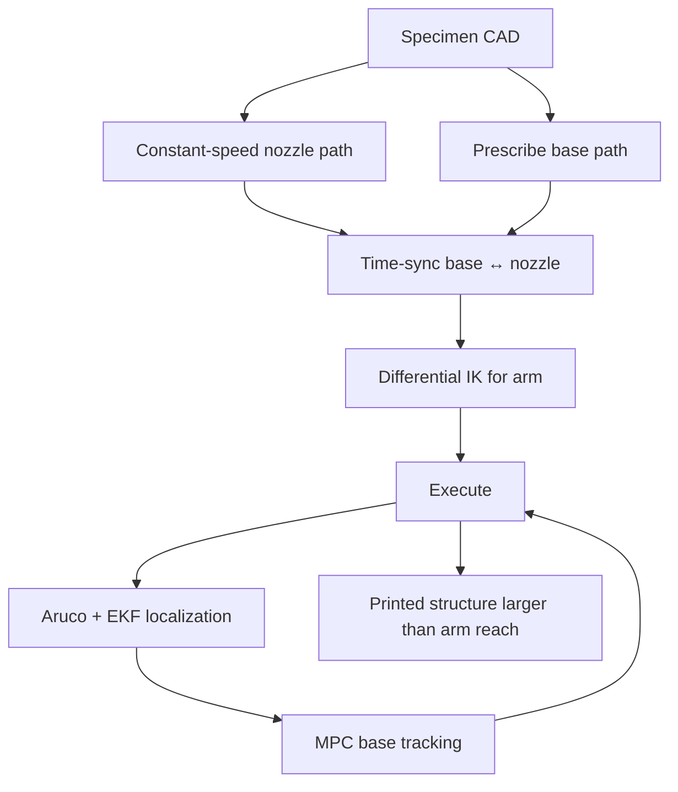

# #39 — Printing-while-moving (2018)

- **Family:** D
- **Link:** arxiv.org/abs/1809.07940
- **Source:** compendium `paper-01.pdf` / `held-papers.json`

## When to use (adaptive slicer product)
- Large-scale concrete / construction AM where the structure exceeds arm reach and **stop-and-print mobile bases** would force seams, size limits, or escape-path constraints.
- Holonomic (or similarly controllable) mobile base + 6-DoF arm; need continuous bead while the base drives.
- Product must fuse localization (fiducials/vision) with MPC base tracking so interlayer nozzle error stays ~≤1 cm (collapse threshold cited by authors).

## Core idea (one sentence)
Coordinate a prescribed mobile-base path with a constant-speed nozzle path, solve arm joints by differential IK, and close the loop with Aruco-EKF localization plus MPC so printing continues while the base moves.

## Algorithm (plain steps)
1. From the 3D specimen design, generate the layer-wise nozzle path at constant tip speed (material rate coupled to tip speed).
2. Prescribe a collision-aware base trajectory that keeps the specimen inside the arm workspace and avoids base–part collisions (authors use a simplified manual/engineered base path).
3. Time-synchronize base and nozzle paths (same progress parameter along both).
4. With base pose known as a function of time, solve arm joints by differential IK; do not switch IK solution classes mid-print (continuous extrusion constraint).
5. Localize the base online: onboard camera sees ground Aruco markers → per-marker SE(2) estimates → delay-compensate by propagating controls → fuse with odometry via **EKF**.
6. Track the planned base trajectory with **MPC** under velocity limits (world-frame \(v_x,v_y,\omega\)).
7. Arm closed-loop position control tracks the planned joints (industrial arm assumed highly accurate relative to the base).
8. After timing (TOPP-RA-class or constant nozzle speed), emit coordinated base + arm commands; monitor interlayer registration.

## Constraints / what to expect
- Demonstrated: 210×45×10 cm concrete part with an 87 cm-reach arm (Denso VS-087 on Clearpath Ridgeback); ~9 min 16 s for 10 layers at 10 cm/s, 1 cm nozzle.
- Precision/accuracy assessment (Optitrack, air print): base segment mean error ~2.2 mm, max ~9.9 mm; path accuracy ~9.8 mm — enough for 10 concrete layers in their tests.
- Sharp base corners excite camera vibration, nozzle shake, and tracking error — prefer smooth base paths.
- Ground unevenness squeezes beads and amplifies vibration; arm can only partially reject disturbance.
- Planning is **not** globally optimal: a bad base prescription can make differential IK fail; multi-robot tethered extensions are harder.
- Part F: extrusion follows tip speed relative to the part, not axis/base wheel speed.

## Data in
- Layered nozzle polylines + feed; kinematic models of base (holonomic SE(2)) and arm; marker map in world frame; camera–base extrinsics; MPC weights and velocity limits; material pump sync.

## Data out
- Synchronized base SE(2) trajectory + arm joint trajectory; EKF pose stream; printed large single-piece structure; optional mocap validation logs.

## Argument → proof sketch → conclusion
**Argument.** Gantry and fixed-arm printers cannot exceed their envelope; print-upon-arrival mobiles still limit single-take size and force the robot to escape the build. Continuous printing-while-moving removes that envelope limit if localization and control keep interlayer error small.
**Proof sketch.** Engineer a reachable base path; differential-IK the arm; EKF-fuse delayed Aruco measurements with controls; MPC-track under input constraints; verify repeatability with external mocap; print a concrete specimen longer than arm reach in one take.
**Conclusion.** Mobile AM for construction needs a D-stack of coordinated planning + EKF localization + MPC, not only a bigger gantry.

## Chaining
- Before: planar or mildly non-planar construction slices (F/A); vertex paths from environment-aware PGF (#63); multi-robot task split from cooperative survey (#54).
- After: TOPP-RA / constant-tip-speed timing; pump/extrusion sync; optional secondary finishing robots.
- Do not chain with: singularity-aware Cartesian 5-axis posts (#49) as a drop-in (different kinematics); indexed GRBL rotary (#38); assuming stationary-print mobile DCP-style workflows suffice for arbitrary single-piece length.

## Notes / inventory flags
- arXiv 1809.07940; IROS 2019 version also cited in later literature; NTU / SC3DP (Tiryaki, Zhang, Pham).
- Hardware: Clearpath Ridgeback + Denso VS-087 + Kinect + ground Aruco.
- Related prior: Zhang et al. multi-robot print-upon-arrival (Automation in Construction 2018).
