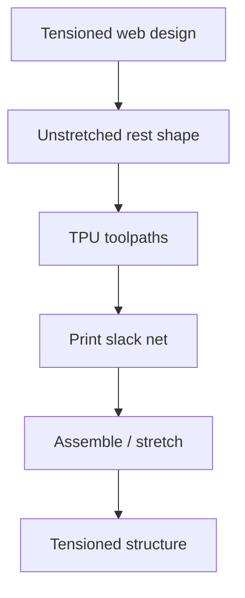

# #40 — Tension in spiderweb-inspired networks (2025)

- **Family:** F-toolpath (general toolpath planning)
- **Link:** arxiv.org/abs/2509.05855
- **Source:** compendium `paper-01.pdf` / `held-papers.json`

## When to use (adaptive slicer product)
- Designing printable TPU (or similar) networks that should carry tension only after assembly/stretch.
- Product features for pre-slack lattices / web-inspired soft structures.
- Path geometry is the mechanism — not standard solid infill.

## Core idea (one sentence)
Print the unstretched TPU net so tension appears on assembly.

## Algorithm (plain steps)
1. Design the target tensioned network (spiderweb-inspired topology).
2. Compute an unstretched / printed rest shape that is slack on the bed.
3. Generate continuous or segmented toolpaths for the rest-shape net in TPU.
4. Print flat (or mildly non-planar if needed) without pretension.
5. Assemble / stretch onto fixtures so geometric tension activates.
6. Verify load paths against the intended web mechanics.

## Constraints / what to expect
- Material must allow large elastic stretch (TPU-class).
- Function appears post-assembly — QC must include stretch step.
- Niche toolpath family member; not general sparse infill.

## Data in
- Target web topology / tension pattern
- TPU print parameters, stretch/assembly fixtures

## Data out
- Rest-shape toolpaths / G-code
- Assembly stretch instructions / targets

## Argument → proof sketch → conclusion
**Argument.** Some functional structures should not be printed in their loaded geometry; encoding pretension in rest-shape paths is a toolpath product feature.
**Proof sketch.** paper-01 / efg-owned core idea: prints the unstretched TPU net so tension appears on assembly (arxiv 2509.05855).
**Conclusion.** Expose as a specialized network design mode under F-toolpath; keep separate from solid adaptive slicing.

## Chaining
- Before: Network design; material calibration for TPU.
- After: Assembly; optional inspection (#60-style sensing if scaled to construction nets).
- Do not chain with: Do not confuse with E continuous *fiber* tensioning — this is elastomeric net pretension via rest shape.

## Notes / inventory flags
- arXiv 2509.05855.
- Family F-toolpath per inventory.
