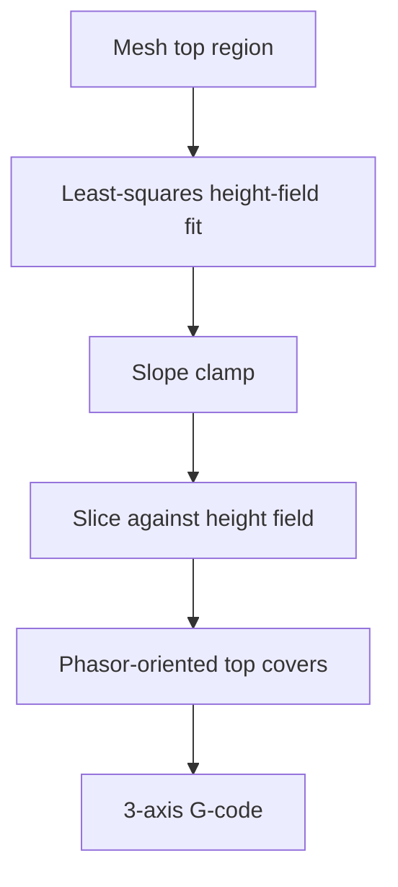

# #41 — QuickCurve (2024)

- **Family:** A
- **Link:** arxiv.org/abs/2406.03966
- **Source:** compendium `paper-01.pdf` / `held-papers.json`

## When to use (adaptive slicer product)
- Fast height-field slicing surface for mild non-planar tops/covers on 3-axis.
- Need an explicit slope clamp in the surface fit (clearance-aware).
- Want oriented top covers (phasor) rather than only vertical Z snaps.

## Core idea (one sentence)
Single least-squares height-field slicing surface with slope clamp; phasor-oriented top covers.

## Algorithm (plain steps)
1. From the target top region, fit a single least-squares height-field slicing surface.
2. Enforce a slope clamp on the height field so gradients stay within printable limits.
3. Slice / generate layers against that height field (constant-offset style in the field).
4. Orient top-cover toolpaths using a phasor field for coherent directionality.
5. Emit 3-axis G-code for the curved top covers / layers.

## Constraints / what to expect
- Single height field: limited to height-field topology (no arbitrary overhangs or tunnels).
- Slope clamp encodes clearance; violating it is out of scope for this method.
- Slight curves only on 3-axis; compare Double QuickCurve (#71) when both top and bottom matter.
- Phasor covers assume a consistent orientation field on the top.

## Data in
- Mesh (top region); max slope / clamp; layer thickness band; optional orientation preferences.

## Data out
- Height-field surface; layered toolpaths with phasor-oriented top covers; 3-axis G-code.

## Argument → proof sketch → conclusion
**Argument.** Product needs a lightweight whole-top curve that is faster to specify than a full QP volume warp, with a hard slope knob for the cone.
**Proof sketch.** Part A (#41): least-squares height field + slope clamp yields a printable slicing surface; phasor-oriented covers address top fill direction. Decision map groups #41/#71 with CurviSlicer for mild whole-part curve on 3-axis.
**Conclusion.** Use QuickCurve for single-sided height-field tops; switch to #71 when top and bottom fields are both optimized; escalate to B if height-field topology fails.

## Chaining
- Before: region selection / top masking; optional F planar core underneath.
- After: 3-axis G-code; optional comparison A/B test vs CurviSlicer (#13).
- Do not chain with: Song ZAA (#7) on the same cover (competing top extrusions); Atomizer (#67) unless replacing the layer model entirely.

## Notes / inventory flags
- Predecessor to Double QuickCurve (#71).
- arXiv 2406.03966.
