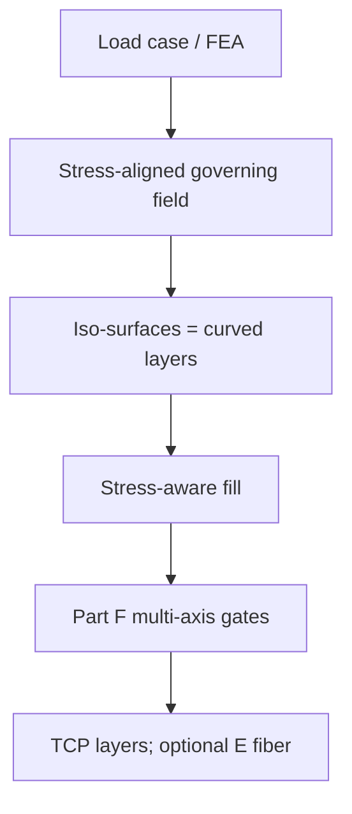

# #42 — Reinforced FDM (2020)

- **Family:** B
- **Link:** doi.org/10.1145/3414685.3417834
- **Source:** compendium `paper-01.pdf` / `held-papers.json`

## When to use (adaptive slicer product)
- Strength-critical part on a multi-axis cell: bead / layer direction should follow principal stress.
- Overhangs and load paths both matter (booklet Scenario 2 — bracket with load path + overhangs).
- You want iso-surfaces of a stress-aligned field to *be* the layers (not just decorate planar layers with fiber).
- Optional handoff to family E continuous fiber on those same layers.
- Prefer when FEA is already in the product pipeline and mechanical KPI outranks pure cosmetics.
- Decision map: “Strength-critical curved layers → B: Reinforced FDM #42 (+ E if fiber).”

## Core idea (one sentence)
Build a stress-aligned governing scalar field whose iso-surfaces are the printable curved layers.

## Algorithm (plain steps)
1. Run FEA (or ingest a user stress field) on the design domain under the load case.
2. Construct a governing scalar field aligned with principal stress / anisotropy goals.
3. Extract iso-surfaces of that field as curved layers inside the thickness band.
4. Smooth / clamp layers that violate bounded curvature or local overhang.
5. Fill layers (geodesic / spiral / stress-aligned stripes); smooth tool orientations.
6. Gate on Part F: collision-free order (pair with #16/#68 if needed); emit TCP for D.
7. Optionally pass layer geometry + stress field to family E for continuous-fiber packing under bend-radius limits.

## Constraints / what to expect
- Multi-axis hardware for full curved layers; Part F gates including fiber bend radius if E follows.
- Strength gains track field alignment quality — garbage FEA ⇒ misaligned layers.
- Does not by itself solve tunnel collision order (pair with #16/#68 sequencing if needed).
- Public code: `github.com/GuoxinFang/ReinforcedFDM` (Part D).
- Keep Part F per-point record so E and D adapters stay swappable.

## Data in
- Mesh / volume; load case and FEA stress (or design field); thickness band; kinematics / clearance.

## Data out
- Stress-aligned curved layers; fill polylines + tool vectors; optional field for E; TCP for D.

## Argument → proof sketch → conclusion
**Argument.** Reinforced FDM is the B winner when mechanical performance is the primary product KPI and layers themselves should carry load direction.
**Proof sketch.** Held core idea: stress-aligned governing field; iso-surfaces are the layers. Decision map and booklet Scenario 2 explicitly recommend #42 (+ optional E, then D). Approach card B and E both list ReinforcedFDM as the software anchor for field layers.
**Conclusion.** Pipeline: optional G TO → B #42 → optional E fiber → D IK. Prefer S3 #45 / Neural #29 when support-free + surface must be co-optimized with strength; prefer pure geodesic #16/#69 when no FEA is available.

## Chaining
- Before: G self-support TO (#48/#47) and/or FEA; orientation field from TO can seed the governing field.
- After: E fiber (#15/#10/#52/#27); D singularity-aware / FRIK (#49/#64); #68/#16 if order fails; #51 for residual overhang.
- Do not chain with: pure 3-axis A when hardware is Cartesian-only and full curved stress layers are required.

## Notes / inventory flags
- Code: github.com/GuoxinFang/ReinforcedFDM (Part D).
- Related co-opt: NeuralTOMO (`github.com/RyanTaoLiu/NeuralTOMO`) for topology + layers + orientations.
