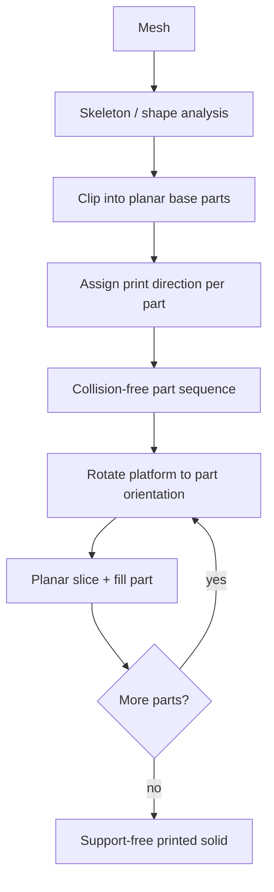

# #43 — RoboFDM (2017)

- **Family:** C
- **Link:** doi.org/10.1109/ICRA.2017.7989140
- **Source:** compendium `paper-01.pdf` / `held-papers.json`

## When to use (adaptive slicer product)
Use when the part has large overhangs that a stock 3-axis clearance cone cannot cover, and you prefer cutting the volume into support-free planar chunks over building a full curved-layer field (family B). Fits a robot arm that reorients a rotating build platform so each chunk prints nearly planar, then chains to family A planar fill inside each chunk and family D for collision-aware trajectories between orientations.

## Core idea (one sentence)
Decompose the mesh into planar-printable, support-free parts whose print directions are realized by rotating the accumulation platform under a fixed extruder.

## Algorithm (plain steps)
1. Analyze the input mesh (skeleton / shape analysis) to propose candidate base planes that clip the volume into segments.
2. Coarse-decompose into candidate parts; fine-tune clip planes so each part is self-supporting when printed along the normal of its planar base (overhang angle within process limits).
3. Assign a print direction (platform orientation) to each part during decomposition.
4. Order parts into a collision-free fabrication sequence: later parts attach to already-printed faces without the robot or platform intersecting prior geometry.
5. For each part in order: rotate the platform to the assigned orientation; planar-slice and fill that part (family A style) onto the current base.
6. Sample robot (e.g. UR3) reachable frames with nozzle orientation fixed; place the nozzle so a bounding box around the tip maximizes reachable frames for the working envelope.
7. Emit robot/platform motion plus extruded paths; advance to the next part until the model is complete.

## Constraints / what to expect
- Needs a 6-DOF arm (or equivalent) holding the build platform plus a fixed extruder; not a stock Cartesian bed.
- Seams at clip planes; bonding between successive directions must be planned.
- Indexed reorientation between parts is simpler than simultaneous 5-axis but less freeform than family B curved fields.
- Collision checks against already-printed geometry and robot workspace dominate sequencing.
- Calibration of rotation centers and nozzle length matters (Part F); errors grow with tilt.

## Data in
- Watertight mesh (STL/3MF); overhang/self-support angle; robot kinematics and nozzle clearance model; filament/process limits (e.g. PLA FDM).

## Data out
- Ordered sub-bodies with per-part base plane / print direction; planar toolpaths per part; robot + platform motion sequence (indexed orientations); optional residual-support report if a part cannot be made fully support-free.

## Argument → proof sketch → conclusion
**Argument.** Large overhangs under a single fixed print direction force sacrificial supports; if each sub-volume can be oriented so its local overhang stays within the self-support cone, supports become unnecessary for that chunk.
**Proof sketch.** (Inference from held sources / approach card C.) Clip the solid by planes into parts that are self-supporting along their base normals; prove a collision-free order exists by attaching each next part only to already-fabricated faces while the robot keeps the nozzle clear of prior geometry; planar fill inside each oriented chunk inherits standard FDM layer validity. Related hardware-native warp (RotBot) is cited as an alternative that deforms then slices rather than cutting.
**Conclusion.** Multi-directional planar decomposition on a rotating platform removes most supports for freeform solids without requiring a full curved-layer field, at the cost of seams and robot motion planning (hand off to D).

## Chaining
- Before: G topology opt if the design still needs self-support trimming; F adaptive planar thickness policy for per-chunk layer height.
- After: A planar fill inside each chunk; D singularity-aware / FRIK trajectories between platform orientations.
- Do not chain with: B full-volume curved fields as a simultaneous alternative on the same chunk (pick C decomp *or* B field); avoid stacking another C cut pass that re-cuts already indexed seams without a bonding plan.

## Notes / inventory flags
- Link present: `doi.org/10.1109/ICRA.2017.7989140` (ICRA 2017; Wu, Dai, Fang, Liu, Wang).
- Related: RotBot (Wüthrich 2021) cited in approach card C as hardware-native warp-by-distance-from-rotation-axis, slice, back-transform — complementary, not a substitute for RoboFDM’s cut-and-reorient pipeline.
