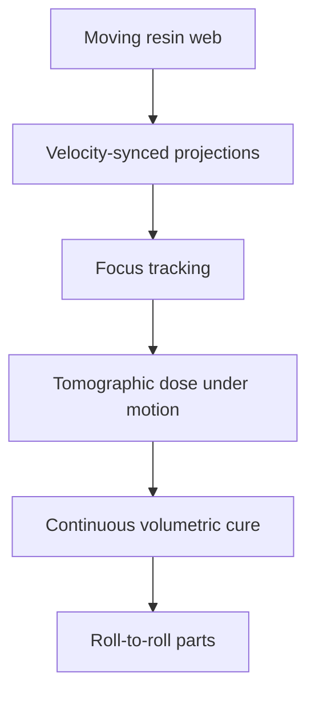

# #44 — Roll-to-roll tomographic VAM (2024)

- **Family:** VPP (vat / volumetric / multi-axis DLP)
- **Link:** arxiv.org/abs/2402.10955
- **Source:** compendium `paper-01.pdf` / `held-papers.json`

## When to use (adaptive slicer product)
- Continuous-web volumetric production instead of batch vat CAL.
- Need focus tracking while the web moves through tomographic exposure.
- Scaling CAL (#8) toward roll-to-roll manufacturing.

## Core idea (one sentence)
Run continuous-web CAL with focus tracking for roll-to-roll tomographic VAM.

## Algorithm (plain steps)
1. Specify repeating or continuous part patterns along a moving web.
2. Adapt tomographic projection timing to web velocity.
3. Track focal plane / optics as the web advances.
4. Optimize dose under motion blur and tracking constraints.
5. Expose continuously; separate / finish downstream.
6. Monitor sync errors between motion and projections.

## Constraints / what to expect
- Motion sync and focus tracking dominate yield.
- Pattern design must tolerate continuous process constraints.
- Manufacturing-line scope beyond desktop slicers.

## Data in
- Web speed, optics, resin
- Pattern / part volume along web

## Data out
- Synced projection schedule + focus commands
- Continuous cured web segments

## Argument → proof sketch → conclusion
**Argument.** Batch CAL does not meet continuous manufacturing; roll-to-roll tomographic VAM is the held scale-up path.
**Proof sketch.** paper-01 VPP: continuous-web CAL with focus tracking (arxiv 2402.10955).
**Conclusion.** Use #44 for continuous VAM lines; #8/#36 for batch vat and overprint.

## Chaining
- Before: #8 dose optimization basics; web handling engineering.
- After: Web cutting / post-cure / inspection.
- Do not chain with: Do not map to FFF belt-printer G-code without a new process model.

## Notes / inventory flags
- arXiv 2402.10955.
- VPP cluster with #8 and #36.
