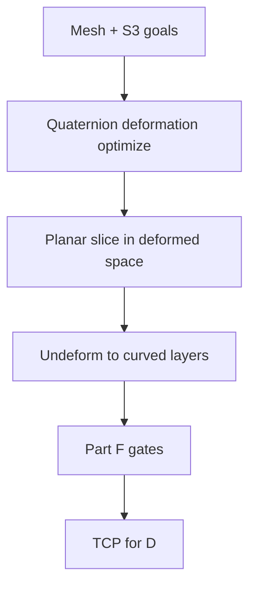

# #45 — S3-Slicer (2022)

- **Family:** B
- **Link:** doi.org/10.1145/3550454.3555516
- **Source:** compendium `paper-01.pdf` / `held-papers.json`

## When to use (adaptive slicer product)
- Multi-axis job must jointly hit support-free, strength, and surface-quality goals (S3 = three objectives).
- Deforming the part (quaternion-driven) so that planar slicing in deformed space yields printable curved layers in model space is acceptable.
- Product wants a reference open-source deformation slicer rather than a from-scratch geodesic field.
- Booklet Scenario 2 alternative to Reinforced when surface + support-free co-rank with strength.
- Prefer when the team can tune objective weights instead of committing to stress-only or geodesic-only fields.
- Decision map DeformB: Reinforced #42 / S3 #45 / Neural #29 / INF #18.

## Core idea (one sentence)
Drive a quaternion rotation-based deformation so planar slices in deformed space become support-free, strong, surface-aware curved layers after undeform.

## Algorithm (plain steps)
1. Ingest mesh + objective weights (support-free, strength, surface).
2. Optimize a quaternion rotation-driven deformation field over the volume.
3. Planar-slice in the deformed space (standard thickness / fill tooling can be reused).
4. Map slices and toolpaths back through the inverse deformation to model space → curved layers and tool vectors.
5. Re-validate thickness band and curvature in model space (deformation can distort local h).
6. Check Part F gates (local overhang, smooth orientations, collision-free order); pair with #68/#16 if order collides.
7. Emit TCP; hand to family D for IK / robot code.

## Constraints / what to expect
- Multi-axis kinematics required after undeform (tool vectors vary).
- Deformation can distort thickness — re-validate thickness band in model space.
- Collision-free global order still needed; pair with #68/#16 or D if undeformed order collides.
- Code: `github.com/zhangty019/S3_DeformFDM` (Part D / decision map).
- Not a drop-in for stock 3-axis; booklet Scenario 1 explicitly warns against escalating to Dai/S3 without hardware.

## Data in
- Mesh; objective weights (support / strength / surface); optional stress field; kinematic model.

## Data out
- Deformation field; curved layers + tool vectors in model space; TCP for D.

## Argument → proof sketch → conclusion
**Argument.** S3-Slicer wins when the adaptive slicer must trade off three goals in one deformation rather than committing to stress-only (#42) or geodesic-only (#16/#69) fields.
**Proof sketch.** Held core idea: quaternion rotation-driven deformation for support-free, strength, and surface. Decision map routes “strength + surface + support-free” to Reinforced / S3 / Neural / INF; booklet Scenario 2 names S3 alongside Neural as co-target options. Part D lists S3_DeformFDM.
**Conclusion.** Prefer #45 for multi-objective deformation slicing with available code; prefer #42 when stress iso-layers alone suffice; prefer Neural #29 / INF #18 when differentiable neural fields are the product direction.

## Chaining
- Before: optional G TO (#48/#47); FEA if strength weight is high.
- After: optional E fiber on undeformed layers; D motion/IK (#49/#64); #68 if tunnel order fails; #51 for residual overhang.
- Do not chain with: pure 3-axis A on Cartesian-only hardware (undeformed paths need tilt).

## Notes / inventory flags
- Code: github.com/zhangty019/S3_DeformFDM (Part D).
