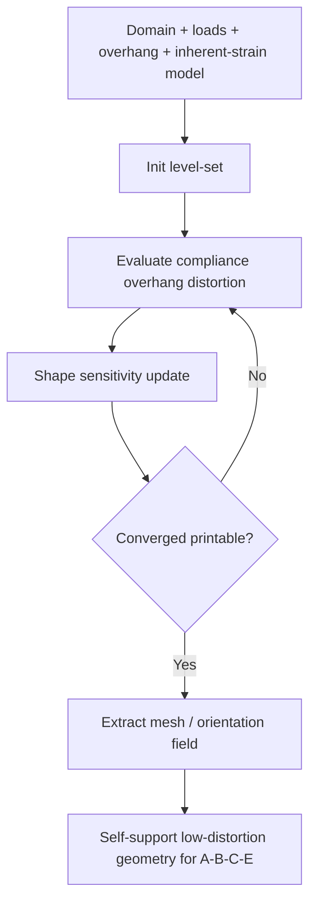

# #47 — Self-support TO considering distortion (2022)

- **Family:** G (topology / DfAM)
- **Link:** arxiv.org/abs/2208.14246
- **Source:** compendium `paper-01.pdf` / `held-papers.json`

## When to use (adaptive slicer product)
- Design-stage DfAM: optimize topology so the part is closer to self-supporting *and* less prone to process distortion before spending multi-axis slice budget.
- Metal / high-shrink processes where inherent-strain distortion couples to overhang decisions.
- When #48-style overhang-only SIMP is not enough — need distortion terms in the same loop.
- Upstream of B Reinforced / S3 / Neural layers or E fiber when printable geometry must come first.

## Core idea (one sentence)
Level-set TO with overhang and inherent-strain terms.

## Algorithm (plain steps)
1. Define design domain, loads/BCs, overhang angle limit (build direction), and an inherent-strain / process distortion model.
2. Represent shape with a level-set; initialize from a feasible seed or uniform field.
3. Include compliance (or stress) objective plus penalties/constraints for local overhang and predicted distortion (inherent-strain).
4. Iterate level-set updates (shape sensitivity) until printable self-support and distortion targets are met.
5. Extract optimized boundary / density; mesh for the slicer.
6. Optionally export an orientation / load path field into B (#42) or E fiber planners.

## Constraints / what to expect
- Optimizes geometry, not toolpaths — still needs family A–E to manufacture.
- Self-support assumptions are usually planar-layer overhang unless re-posed for multi-axis build directions.
- Inherent-strain model quality dominates distortion predictions; calibrate to process.
- Heavier than #48 SIMP overhang-only; expect longer TO runtimes.

## Data in
- Design domain mesh/voxels; loads and supports; build direction; overhang angle; inherent-strain or equivalent process model; volume fraction.

## Data out
- Optimized printable mesh / level-set; optional orientation field; distortion and overhang residual reports for UI.

## Argument → proof sketch → conclusion
**Argument.** Overhang-only TO ignores process distortion that still forces supports or scrap; coupling inherent-strain with overhang in a level-set TO yields geometries that print more reliably.
**Proof sketch.** Level-set topology optimization with explicit overhang and inherent-strain terms — held core idea. Approach-cards and decision-map place #47 with #48/#50 as family G feeding A/B/C/E.
**Conclusion.** Product takeaway: prefer #47 over #48 when distortion matters (metal/high-shrink); then hand geometry to B/C or mild A skins, optional E fiber. Do not skip the slicer family after TO.

## Chaining
- Before: CAD design domain + process calibration (inherent-strain).
- After: B Reinforced / S3 / Neural (#42/#45/#29); C decomposition if still multi-directional; A if only mild skins remain; E if continuous fiber (#15/#52).
- Do not chain with: jumping straight to D motion without a layer/toolpath family; treating TO mesh as final G-code.

## Notes / inventory flags
- arXiv 2208.14246; booklet Scenario 2 cites G optional self-support TO (#48/#47) → B → optional E → D.
- Exact inherent-strain formulation and overhang angle defaults not in corpus — take from process profile.
