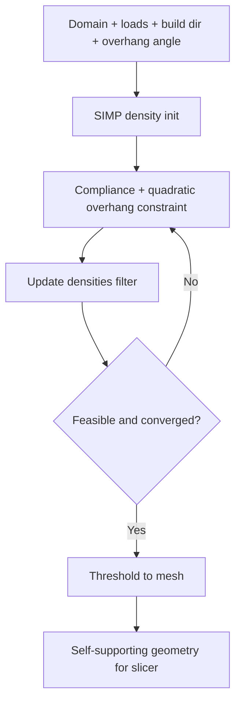

# #48 — Self-supporting topology optimization (2017)

- **Family:** G (topology / DfAM)
- **Link:** arxiv.org/abs/1708.07364
- **Source:** compendium `paper-01.pdf` / `held-papers.json`

## When to use (adaptive slicer product)
- Early DfAM: force the topology to respect a maximum overhang angle so planar (or chosen-direction) printing needs fewer supports.
- Simpler / faster alternative to #47 when process distortion is not the driver — quadratic overhang constraint in SIMP is enough.
- Lightweight brackets and frames before choosing A skins vs B curved layers.
- Seed geometry for later E fiber or B stress layers.

## Core idea (one sentence)
SIMP with quadratic overhang constraint.

## Algorithm (plain steps)
1. Discretize the design domain (voxels/elements); set loads, BCs, volume fraction, and build direction.
2. Run SIMP density optimization for compliance (or similar) with filtering.
3. Add a quadratic overhang constraint (or penalty) so element densities that violate the overhang angle relative to neighbors are driven toward void or supported configurations.
4. Iterate until structural objective and overhang feasibility converge.
5. Threshold density to a printable mesh; optionally smooth.
6. Pass mesh to the adaptive slicer (A/B/C) and optional orientation cues to E.

## Constraints / what to expect
- Geometry-only; does not generate toolpaths.
- Overhang model is typically for *planar* layers along a fixed build direction — re-pose if the product will use multi-axis B/C.
- No inherent-strain / distortion term — use #47 when warping dominates.
- Density thresholding can reintroduce tiny overhangs; verify with a support-check pass.

## Data in
- Design domain; loads/BCs; volume fraction; build direction; max overhang angle; SIMP penalization / filter radius.

## Data out
- Optimized density field and thresholded mesh; overhang violation map; optional crude member orientation for downstream fiber/layers.

## Argument → proof sketch → conclusion
**Argument.** Classical TO ignores printability; embedding a quadratic overhang constraint in SIMP yields topologies that are closer to support-free under planar-layer assumptions.
**Proof sketch.** SIMP + quadratic overhang constraint is the held method class for #48; approach-cards list it as the canonical self-supporting TO entry, with #47 adding distortion and #50 packing voids.
**Conclusion.** Product takeaway: default G step when users want fewer supports before slicing — #48 → verify overhang → B/C/A as needed → optional E. Escalate to #47 if distortion scrap is the pain.

## Chaining
- Before: CAD domain and chosen build orientation (or orientation optimization loop outside this card).
- After: B field layers (#42/#66/#45); C cuts/shells; A mild skins; E fiber (#15/#52) using member directions; booklet pipeline G → B → E → D.
- Do not chain with: expecting #48 output to remove the need for D on robots; fiber packing (#27) before geometry exists.

## Notes / inventory flags
- arXiv 1708.07364; example slug in the task prompt matches this title.
- Quadratic overhang details (exact polynomial form) not in corpus — implement from paper when coding.
- Complements #50 (void packing) when the goal is hollowing rather than member layout.
